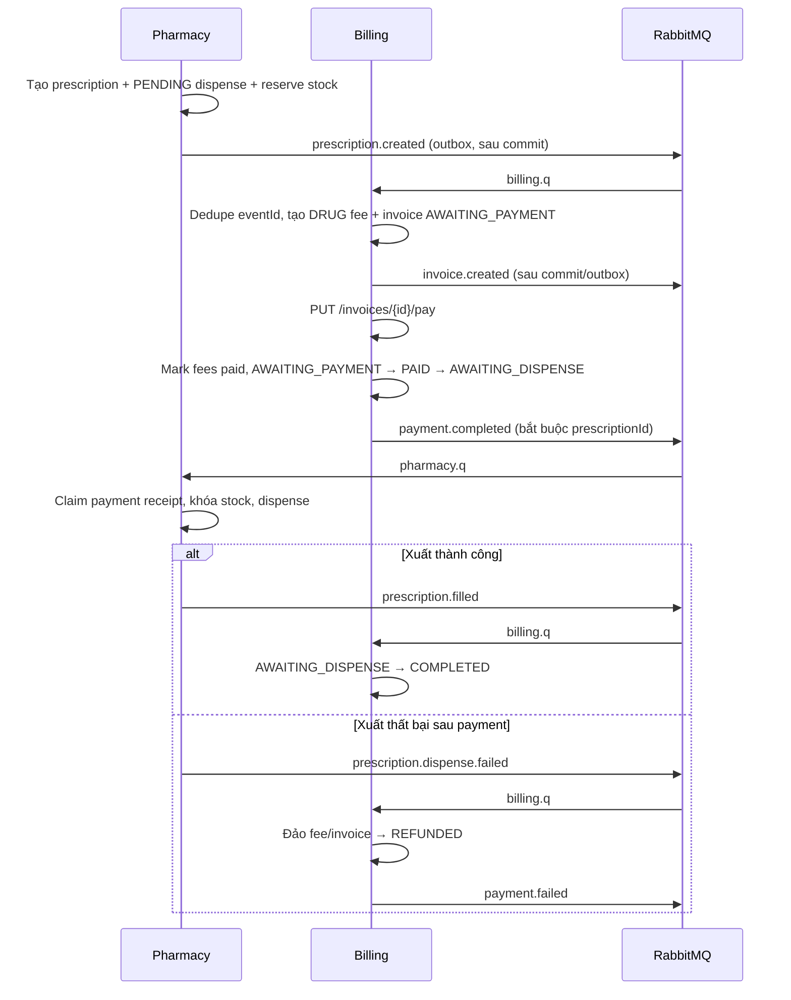

# HANDOFF — Billing ↔ Pharmacy: luồng kê đơn → thanh toán → xuất thuốc

**Người nhận:** người phụ trách `billing-service`  
**Ngày cập nhật:** 2026-09-16
**Phạm vi:** hợp đồng nghiệp vụ và kế hoạch follow-up code giữa `billing-service` và
`pharmacy-service`. Tài liệu này không thay thế các backend-spec; nó ghi lại cách ráp hai bounded
context mà không truy cập database của nhau.

## 1. Nguồn sự thật và nguyên tắc bắt buộc

Đối chiếu trước khi sửa code:

- [Billing backend-spec](../../docs/eproject_general_plan/backend-spec/06-billing.md)
- [Pharmacy backend-spec](../../docs/eproject_general_plan/backend-spec/05-pharmacy.md)
- [RabbitMQ conventions](../../docs/ai/06-events-rabbitmq.md)
- [Billing service rules](../../docs/ai/services/billing.md)
- [Pharmacy cross-service handoff](../../docs/HANDOFF-pharmacy-t16-cross-service.md)

Quy tắc không được phá vỡ:

1. Mỗi service chỉ đọc database của chính mình. Billing không query bảng thuốc/phiếu xuất; Pharmacy
   không query bảng hóa đơn. Liên kết chỉ bằng UUID trong event.
2. Event dùng JSON contract, không import class của service phát event. Mọi event có envelope
   `eventId`, `occurredAt`, `correlationId`.
3. Consumer phải idempotent theo `eventId`; bảng `PROCESSED_EVENT` phải được ghi trong cùng
   transaction với side effect. Nếu transaction rollback hoặc lỗi hạ tầng, phải ném exception để
   RabbitMQ retry/DLQ, không đánh dấu đã xử lý trước.
4. Publish bền vững qua transactional outbox. Billing ghi event cùng transaction nghiệp vụ;
   dispatcher chỉ gửi row đã commit và chờ publisher confirm.
5. Không tự suy diễn `invoiceId`, `dispenseId`, giá thuốc hoặc trạng thái thanh toán từ payload
   thiếu dữ liệu. Payload sai/thiếu field là lỗi contract, cần retry hoặc DLQ có lý do rõ ràng.
6. `payment.failed` chỉ là **đảo sổ sách** trong Billing; hệ thống hiện chưa tích hợp payment
   gateway nên không được mô tả là đã hoàn tiền qua ngân hàng.

## 1.1. Bản đồ code hiện tại để follow-up

| Trách nhiệm | Billing | Pharmacy |
|---|---|---|
| Nhận `prescription.created` | `application/service/FeeAccrualService` → `onPrescriptionCreated` | `application/service/PrescriptionApplicationService` phát qua `PharmacyEventPublisherPort` |
| Thanh toán invoice | `application/service/BillingApplicationService.pay` | Không gọi ngược; chờ event |
| Phát `payment.completed` | `infrastructure/messaging/BillingEventPublisherAdapter` | `messaging/consumer/PaymentCompletedConsumer` |
| Xử lý payment/dispense | Không sở hữu tồn kho | `application/service/PaymentApplicationService` → `DispenseApplicationService` |
| Thành công/thất bại | `application/service/SagaCompensationService` | `DispenseTransactionService` + `RecordDispenseFailureService` |
| Dedupe | `ProcessedEventPort`/`PROCESSED_EVENT` | `ProcessedEventPort` + payment receipt claim |
| Giao event bền vững | Transactional outbox + claim/lease/backoff/quarantine | Transactional outbox + claim/lease/backoff |

Khi thay đổi một contract, sửa record/consumer/test ở Billing và fixture phía Pharmacy trong cùng
chuỗi thay đổi. Không copy class Java giữa hai module.

## 2. Sơ đồ luồng nghiệp vụ chuẩn



Một event có thể được giao lại hoặc giao trùng. Kết quả cuối phải giống xử lý đúng một lần.

## 3. Hợp đồng event dùng chung

Exchange chuẩn: `mediflow.events` (topic). Queue Billing: `billing.q`; DLQ: `billing.dlq`.
Queue Pharmacy: `pharmacy.q`; DLQ: `pharmacy.dlq`.

### 3.1 `prescription.created` — Pharmacy → Billing

Phát sau khi Pharmacy commit việc tạo đơn, các dòng thuốc snapshot, phiếu `PENDING` và reservation.

| Field | Bắt buộc | Ý nghĩa/kiểm tra |
|---|---:|---|
| `eventId` | Có | UUID dedupe tại Billing |
| `occurredAt` | Có | thời điểm tạo đơn |
| `correlationId` | Có | giữ nguyên cho toàn saga |
| `prescriptionId` | Có | khóa business duy nhất của saga |
| `patientId` | Có | Billing dùng làm owner của fee/invoice |
| `recordId` | Có thể null | tham chiếu hồ sơ, không query ngược Pharmacy |
| `departmentId` | Có | không được null; report và fee bắt buộc có khoa |
| `totalAmount` | Có | tổng tiền Pharmacy đã snapshot, `BigDecimal >= 0` |
| `items[]` | Có | `drugId`, `drugName`, `quantity`, `price`; dùng đối chiếu/audit |

Billing phải:

1. claim/dedupe `eventId` và kiểm tra `invoiceRepo.findByPrescription(prescriptionId)`;
2. tạo một `Fee(DRUG)` với `sourceRefId = prescriptionId`, `departmentId = event.departmentId`,
   amount lấy từ tổng đã chốt của event;
3. tạo `Invoice` với `prescriptionId`, gắn fee, trạng thái `AWAITING_PAYMENT`;
4. giữ unique partial index cho `FEE(fee_type, source_ref_id)` và `INVOICE(prescription_id)`;
5. ghi `PROCESSED_EVENT` sau khi fee + invoice commit, rồi phát `invoice.created`.

Không tạo hóa đơn thứ hai khi nhận lại cùng `eventId` hoặc cùng `prescriptionId`. Nếu payload có
`departmentId = null`, tổng âm, quantity/price không hợp lệ hoặc tổng dòng không khớp chính sách
đối chiếu, từ chối event với lỗi contract ổn định; không đặt giá mặc định.

### 3.2 `payment.completed` — Billing → Pharmacy

Đây là tín hiệu duy nhất kích hoạt xuất thuốc tự động.

```json
{
  "eventId": "11111111-1111-1111-1111-111111111111",
  "occurredAt": "2026-09-14T10:00:00Z",
  "correlationId": "fixture-payment-001",
  "invoiceId": "22222222-2222-2222-2222-222222222222",
  "patientId": "33333333-3333-3333-3333-333333333333",
  "departmentId": "44444444-4444-4444-4444-444444444444",
  "prescriptionId": "55555555-5555-5555-5555-555555555555",
  "totalAmount": 125000.00,
  "paymentMethod": "CASH"
}
```

Billing chỉ phát event sau khi transaction thanh toán đã commit:

- khóa invoice (`findByIdForUpdate`), từ chối thanh toán lặp (`BILLING_ALREADY_PAID`);
- `Fee.markPaid()` cho toàn bộ fee của invoice;
- saga `AWAITING_PAYMENT → PAID → AWAITING_DISPENSE`;
- giữ nguyên `invoiceId`, `prescriptionId`, `patientId`, `departmentId`, `correlationId`;
- `paymentMethod` serialize bằng chuỗi enum `CASH | TRANSFER | INSURANCE`.

`prescriptionId` **bắt buộc đối với invoice DRUG/saga**. Invoice thường có thể phát
`prescriptionId = null` cho notification/report; Pharmacy phải bỏ qua invoice thường, không được
đoán đơn thuốc.

Pharmacy sẽ kiểm tra `patientId` và `departmentId` khớp prescription, claim durable payment
receipt theo `eventId`, sau đó gọi cùng use case dispense. Billing không cần và không được chờ
response đồng bộ từ Pharmacy.

### 3.3 `prescription.filled` — Pharmacy → Billing

Pharmacy phát sau khi transaction dispense thành công và phiếu chuyển `DISPENSED`.

Payload hiện hành gồm `eventId`, `occurredAt`, `correlationId`, `prescriptionId`, `patientId`,
`departmentId`, `totalAmount`, `dispensedItems[]`. Payload **không có `dispenseId`**.

Billing xử lý:

1. dedupe `eventId`;
2. tìm và khóa invoice theo `prescriptionId`;
3. chỉ cho phép `AWAITING_DISPENSE → COMPLETED`;
4. lưu và đánh dấu processed.

**Đã chốt (2026-09-16):** Billing bỏ hẳn khái niệm `dispenseId` — không có cột, không có trường
DTO, không gán từ `prescriptionId` hay UUID mới. Nếu sau này Pharmacy bổ sung `dispenseId` vào
contract `prescription.filled`, đây là thay đổi contract mới, cần mở lại theo mục 8 (cập nhật
producer/consumer/fixture/test/tài liệu trong cùng một chuỗi thay đổi), không chỉ thêm field ngầm.

### 3.4 `prescription.dispense.failed` — Pharmacy → Billing

Pharmacy phát sau khi nhánh dispense thất bại đã được ghi bền vững (`DISPENSE_FAILED`/`FAILED`).

Các field gồm `eventId`, `occurredAt`, `correlationId`, `prescriptionId`, `invoiceId` (có thể null),
`patientId`, `reason`, `failedItems[]` (`drugId`, `drugName`, `requestedQty`, `availableQty`).

Billing phải dùng `prescriptionId` để tìm invoice của mình; `invoiceId` chỉ là thông tin đối chiếu,
không phải lý do để query sang Pharmacy. Với invoice tồn tại:

- khóa invoice;
- `Invoice.refund()` → `isPaid=false`, saga `AWAITING_DISPENSE → REFUNDED`;
- `Fee.refund()` cho các fee gắn invoice (gỡ `invoiceId` theo domain rule);
- ghi processed trong cùng transaction;
- publish `payment.failed` sau commit với `invoiceId`, `patientId`, `reason`, cùng `correlationId`.

Nếu chưa có invoice, ghi log cảnh báo và mark event processed (không có aggregate Billing để bù).
Nếu invoice đã `REFUNDED`/`COMPLETED`, xử lý idempotent hoặc báo invalid transition; không đảo tiền
lần hai. `reason` phải giữ mã ổn định, không đưa thông tin nhạy cảm vào log/event.

## 4. State machine Billing phải khớp Pharmacy

| Billing `sagaStatus` | Sự kiện/lệnh | Trạng thái tiếp theo | Pharmacy kỳ vọng |
|---|---|---|---|
| `NONE` | invoice thường | `NONE` | không xuất thuốc |
| `AWAITING_PAYMENT` | `PUT /invoices/{id}/pay` thành công | `AWAITING_DISPENSE` (qua `PAID`) | nhận `payment.completed` |
| `AWAITING_PAYMENT` | `prescription.cancelled` / `prescription.expired` | `REFUNDED` | đơn kết thúc, không còn được thanh toán |
| `AWAITING_DISPENSE` | `prescription.filled` | `COMPLETED` | phiếu đã `DISPENSED` |
| `AWAITING_DISPENSE` | `prescription.dispense.failed` | `REFUNDED` | phiếu đã ghi thất bại |
| `AWAITING_DISPENSE` | `prescription.cancelled` / `prescription.expired` | `REFUNDED` | Billing đảo sổ và phát `payment.failed` |
| `COMPLETED` | event filled lặp | giữ nguyên | không dispense lại |
| `REFUNDED` | event failed lặp | giữ nguyên | không bù trừ lần hai |

Mọi chuyển tiếp khác phải ném `BILLING_INVALID_SAGA_TRANSITION` và để RabbitMQ retry/DLQ theo
chính sách; không silently mark processed.

## 5. Kế hoạch follow-up code cho Billing (theo thứ tự)

### B-01 — Chốt contract và fixture

- Dùng record DTO riêng tại `application/event`, không phụ thuộc package Pharmacy.
- Thêm fixture JSON cho bốn event của Pharmacy và một fixture `payment.completed` mà Pharmacy đọc.
- Assert field bắt buộc, nullability, enum chữ hoa, `BigDecimal`, timezone và correlation propagation.
- `dispenseId` đã chốt bỏ hẳn (2026-09-16, xem mục 3.3) — nếu quyết định này đổi lại sau này,
  cập nhật đồng thời spec, fixture, DTO và test hai service.

### B-02 — Hoàn thiện consumer và topology

- `BillingEventConsumer` định tuyến theo routing key trên một queue `billing.q`.
- Giữ binding tám key: `prescription.created`, `prescription.filled`,
  `prescription.dispense.failed`, `prescription.cancelled`, `prescription.expired`,
  `medicalrecord.created`, `lab.result.created`, `appointment.status.changed`.
- Deserialize lỗi hoặc application exception phải được ném ra; không nuốt exception.
- Xác nhận `billing.q` có DLX `mediflow.events.dlx` và `billing.dlq` có binding đúng routing key.

### B-03 — Đảm bảo payment publish đáng tin cậy

Đã hoàn thành trong Billing:

1. bảng `BILLING_EVENT_OUTBOX` nằm trong migration `V2`;
2. publisher chỉ ghi outbox trong transaction thanh toán/compensation;
3. dispatcher có claim/lease, publisher confirm, retry backoff, quarantine và metrics;
4. retry giữ nguyên `eventId`; API ADMIN chỉ replay event đã quarantine.

Không chuyển việc publish vào trong transaction trước commit và không rollback nghiệp vụ chỉ vì
RabbitMQ tạm thời không khả dụng.

### B-04 — Đảm bảo concurrency và idempotency

- Lock invoice trước `pay`, `onPrescriptionFilled`, `onDispenseFailed`.
- Dùng insert-only `PROCESSED_EVENT`; duplicate event không được ghi đè marker cũ.
- Giữ partial unique index cho `uq_fee_source` và `uq_invoice_prescription`.
- Viết test hai consumer xử lý cùng `prescription.created`, cùng `prescription.dispense.failed` và
  payment retry; mỗi side effect chỉ xuất hiện một lần.

### B-05 — Tích hợp qua RabbitMQ thật

Với Testcontainers PostgreSQL + RabbitMQ, bắt buộc kiểm thử:

- Pharmacy `prescription.created` → Billing tạo đúng một invoice `AWAITING_PAYMENT`;
- Billing pay → Pharmacy nhận `payment.completed` với đúng `prescriptionId`;
- Pharmacy dispense thành công → Billing `COMPLETED`;
- Pharmacy dispense thất bại → Billing `REFUNDED` + publish `payment.failed`;
- redelivery cùng event id không nhân đôi fee/invoice/compensation;
- broker outage sau commit không làm mất nghiệp vụ; message phải retry/outbox;
- poison payload retry hữu hạn rồi vào DLQ.

Không coi unit test mock `RabbitTemplate` là bằng chứng E2E.

## 6. Ma trận test chấp nhận

| Kịch bản | Assertion tối thiểu | Tầng |
|---|---|---|
| `prescription.created` lần đầu | 1 DRUG fee, 1 invoice, `AWAITING_PAYMENT` | Billing application |
| `prescription.created` lặp | không thêm fee/invoice | Billing + PostgreSQL |
| Payment đúng | fees paid, `AWAITING_DISPENSE`, event có prescriptionId | Billing application/contract |
| Payment invoice thường | event có `prescriptionId=null`; Pharmacy bỏ qua | contract |
| Payment context sai | Pharmacy từ chối, không trừ kho | Pharmacy application |
| Filled lặp | invoice chỉ chuyển `COMPLETED` một lần | Billing application |
| Dispense failed | fees/invoice đảo sổ, `payment.failed` giữ correlation | Billing application |
| Failed lặp | không đảo lần hai, không publish duplicate | Billing + PostgreSQL |
| Crash sau send | Rabbit redelivery, Pharmacy receipt/event claim idempotent | Rabbit integration |
| Broker outage | transaction Billing vẫn commit; event còn pending/retry | outbox integration |

## 7. Checklist bàn giao trước khi mở PR

- [ ] Các DTO/event và fixture khớp đúng bảng contract ở mục 3.
- [ ] Không có import `pharmacy-service`, JPA Pharmacy hoặc URL database Pharmacy trong Billing.
- [ ] Mọi public class/method mới có Javadocs và `@param`/`@return` phù hợp.
- [x] `@Transactional` bao trùm side effect + processed marker; publish qua outbox.
- [ ] Lock invoice và unique/index DB đã có test concurrency.
- [ ] Có test deserialize payload thiếu/null/enum sai và DLQ path.
- [ ] Có Testcontainers test cho cả PostgreSQL và RabbitMQ; skipped vì thiếu Docker = chưa đạt gate.
- [ ] Chạy:
  `mvn -q -pl backend/billing-service -am test`
  và `mvn -q -pl backend/billing-service -am verify`.
- [ ] Cập nhật `THELOC-INTEGRATION-FOLLOWUP.md`, plan và changelog cùng PR.
- [ ] E2E qua Gateway chỉ được đánh dấu pass sau khi Billing + Pharmacy + Gateway chạy cùng
  contract version; không dùng test nội bộ để thay thế.

## 8. Liên hệ và nguyên tắc xử lý blocker

Nếu thiếu field do producer Pharmacy hoặc Gateway, tạo issue/HANDOFF và chốt contract trước; không
thêm field giả, không mặc định invoice/giá/nhân viên, không truy cập DB service khác. Mọi thay đổi
event là thay đổi version contract: cập nhật producer, consumer, fixture, test và tài liệu trong
cùng một chuỗi PR hoặc ghi rõ compatibility path.
