# MediFlow — ERD Toàn Hệ Thống

> Tài liệu này là deliverable cho **Task 2.3 — ERD + DDL** (deadline 20/08).
> Gồm **1 bản đồ liên kết toàn hệ thống** (mục 0 — cách các bảng nối với nhau) và **10 góc nhìn**
> của toàn hệ thống (mục 1–10). Tất cả được dựng từ DDL chuẩn trong
> [`../backend-spec/`](../backend-spec/README.md).

## Ký hiệu dùng chung (legend)

| Ký hiệu | Ý nghĩa |
|---|---|
| `A -->|FK| B` | Quan hệ **khóa ngoại thật** (cùng DB — JOIN được) |
| `A -.->|col| B` | **Tham chiếu xuyên service** — chỉ là cột UUID, KHÔNG có FK, không JOIN được (lấy qua API/event) |
| `A ==>|event| B` | **Event qua RabbitMQ** (topic exchange `mediflow.events`), consumer idempotent qua bảng khử trùng lặp |
| `SAGA` | Billing là saga orchestrator: `AWAITING_PAYMENT → PAID → AWAITING_DISPENSE → COMPLETED / REFUNDED` |

### Quy ước tên

- Bảng: `UPPER_SNAKE` tiếng Anh; cột: `snake_case` tiếng Việt.
- **Ngoại lệ branch C** (pharmacy / billing / report): bảng dùng tên **tiếng Anh** (`DRUG`, `FEE`,
  `INVOICE`, `DISPENSE_SLIP`, `PRESCRIPTION`, `DAILY_VISIT_REPORT`, `MONTHLY_REVENUE_REPORT`, `DRUG_STATISTIC`).
- PK luôn là `UUID`; tiền = `BigDecimal`; enum = `VARCHAR`; mọi bảng có `created_at` / `updated_at`.

---

## 0. Bản đồ liên kết toàn hệ thống (how every table links)

Toàn bộ **25 bảng nghiệp vụ** của 8 service trên một bức tranh: mũi tên đậm nét = khóa ngoại thật
(cùng DB, JOIN được), nét đứt = cột `UUID` trần tham chiếu sang service khác (không có FK, không JOIN —
lấy dữ liệu qua API/event), nét đậm `==>` = event qua RabbitMQ.


> Bảng khử trùng lặp `SU_KIEN_DA_XU_LY` / `PROCESSED_EVENT` tồn tại ở 5 service (lab, pharmacy, billing,
> notification, report) — được bỏ khỏi hình để khỏi rối; chúng là cơ chế consumer idempotent, không phải
> quan hệ nghiệp vụ.

### 0.1 Khóa ngoại thật — cùng service (JOIN được)

| Bảng nguồn → Bảng đích | Cột | Bản số | Ghi chú |
|---|---|---|---|
| `NHAN_VIEN` → `KHOA` | `ma_khoa` | N:1 | khoa nơi NV làm việc |
| `KHOA` → `NHAN_VIEN` | `truong_khoa` | 1:N | **vòng** — thêm sau khi cả 2 bảng tồn tại |
| `TAI_KHOAN` → `NHAN_VIEN` | `ma_nhan_vien` | N:1 | null với tài khoản PATIENT |
| `HO_SO_BA` → `LICH_HEN` | `ma_lich_hen` | N:1 | cùng transaction, không dùng event |
| `CHUAN_DOAN` → `HO_SO_BA` | `ma_ho_so` | N:1 | ON DELETE CASCADE |
| `KET_QUA_DINH_KEM` → `HO_SO_BA` | `ma_ho_so` | N:1 | kết quả lab/đơn gắn về hồ sơ |
| `KET_QUA_XN` → `XET_NGHIEM` | `ma_xn` | N:1 | ON DELETE CASCADE |
| `PRESCRIPTION_LINE` → `PRESCRIPTION` | `prescription_id` | N:1 | ON DELETE CASCADE |
| `PRESCRIPTION_LINE` → `DRUG` | `drug_id` | N:1 | giá là **ảnh chụp** vào `unit_price` |
| `DISPENSE_SLIP` → `PRESCRIPTION` | `prescription_id` | **1:1** | UNIQUE — mỗi đơn đúng 1 phiếu |
| `FEE` → `INVOICE` | `invoice_id` | N:1 | cùng service billing |

### 0.2 Tham chiếu xuyên service — UUID trần (không FK)

| Bảng | Cột | Trỏ sang | Nghĩa |
|---|---|---|---|
| `LICH_HEN` | `ma_benh_nhan` | patient · `BENH_NHAN` | ai đặt lịch |
| `LICH_HEN` | `ma_bac_si` | org · `NHAN_VIEN` | bác sĩ khám |
| `LICH_HEN` | `ma_khoa` | org · `KHOA` | khoa khám |
| `HO_SO_BA` | `ma_benh_nhan` | patient · `BENH_NHAN` | bệnh nhân được khám |
| `HO_SO_BA` | `ma_bac_si` | org · `NHAN_VIEN` | bác sĩ khám |
| `HO_SO_BA` | `ma_khoa` | org · `KHOA` | khoa khám |
| `XET_NGHIEM` | `ma_ho_so` | clinical · `HO_SO_BA` | chỉ định thuộc hồ sơ nào |
| `XET_NGHIEM` | `ma_benh_nhan` | patient · `BENH_NHAN` | của bệnh nhân nào |
| `XET_NGHIEM` | `ma_khoa_chi_dinh` | org · `KHOA` | khoa chỉ định |
| `PRESCRIPTION` | `record_id` | clinical · `HO_SO_BA` | kê cho hồ sơ nào |
| `PRESCRIPTION` | `patient_id` | patient · `BENH_NHAN` | cho bệnh nhân nào |
| `PRESCRIPTION` | `doctor_id` | org · `NHAN_VIEN` | bác sĩ kê |
| `PRESCRIPTION` | `department_id` | org · `KHOA` | khoa kê |
| `DISPENSE_SLIP` | `dispensed_by` | org · `NHAN_VIEN` | dược sĩ xuất |
| `FEE` | `patient_id` | patient · `BENH_NHAN` | nợ của ai |
| `FEE` | `record_id` | clinical · `HO_SO_BA` | phát sinh từ hồ sơ nào |
| `FEE` | `department_id` | org · `KHOA` | thuộc khoa nào (bắt buộc) |
| `FEE` | `source_ref_id` | lab · `XET_NGHIEM` / pha · `PRESCRIPTION` | nguồn sinh phí (`fee_type=LAB`/`DRUG`) |
| `INVOICE` | `patient_id` | patient · `BENH_NHAN` | hóa đơn của ai |
| `INVOICE` | `prescription_id` | pha · `PRESCRIPTION` | đơn khởi động saga (UNIQUE) |
| `INVOICE` | `dispense_id` | pha · `DISPENSE_SLIP` | phiếu xuất đi kèm |
| `THONG_BAO` | `ma_benh_nhan` | patient · `BENH_NHAN` | báo cho ai |
| `DAILY_VISIT_REPORT` | `department_id` | org · `KHOA` | nullable = toàn viện |
| `MONTHLY_REVENUE_REPORT` | `department_id` | org · `KHOA` | nullable = toàn viện |
| `DRUG_STATISTIC` | `drug_id` | pha · `DRUG` | thống kê thuốc nào |

### 0.3 Vòng đời saga kê đơn → xuất thuốc (các event nối liền nhau)

```
PRESCRIPTION ──prescription.created──► INVOICE(AWAITING_PAYMENT)
INVOICE ──payment.completed──► DISPENSE_SLIP(pharmacy xuất) + XET_NGHIEM(markPaid)
DISPENSE_SLIP ──prescription.filled──► INVOICE(COMPLETED)
DISPENSE_SLIP ──prescription.dispense.failed──► INVOICE(REFUNDED) → payment.failed → THONG_BAO
```

Toàn bộ event (ai publish, ai consume) xem [sơ đồ 06](#6-bản-đồ-sự-kiện-event-map).

---

## 1. Tổng quan toàn hệ thống

8 bounded context, luồng dữ liệu chính và các cột UUID xuyên service nối chúng.


---

## 2. Quy trình khám bệnh

Một lượt khám đi từ đặt lịch → hồ sơ → chỉ định → xét nghiệm/đơn thuốc → kết quả quay về `KET_QUA_DINH_KEM`.


---

## 3. Saga thanh toán – cấp thuốc

State machine của `INVOICE.saga_status` + các bước compensation (`prescription.dispense.failed` → `REFUNDED`).


---

## 4. Vòng đời bệnh nhân

Một `BENH_NHAN` trải qua các mốc: lịch hẹn → hồ sơ → chỉ định → đơn/xét nghiệm → hóa đơn → thông báo.


---

## 5. Tổ chức theo khoa

`KHOA` làm trục — mọi hoạt động khám/chỉ định/kê đơn/hóa đơn/báo cáo đều quy về một khoa.


---

## 6. Bản đồ sự kiện (event map)

Toàn bộ event đi trên `mediflow.events`, ai publish, ai consume (đường `==>`).


---

## 7. Dược – tồn kho

Vòng đời thuốc: nhập kho → giá chụp vào `PRESCRIPTION_LINE.unit_price` → xuất trừ kho khi `DISPENSED` → thống kê + cảnh báo hết thuốc (`stock.low`).


---

## 8. Báo cáo – read model

Report service xây read model từ 6 event nguồn, khử trùng lặp bằng `PROCESSED_EVENT`.


---

## 9. Xác thực – phân quyền (RBAC)

JWT ký tại gateway, mỗi service chặn lại bằng `@PreAuthorize` (default deny). 9 vai trò.


---

## 10. Hồ sơ bệnh án đầy đủ

`HO_SO_BA` là gốc — toàn bộ nội dung lâm sàng + xét nghiệm + kê đơn + tài chính gom về hồ sơ.


---

## Tái tạo sơ đồ

Source Mermaid nằm trong [`diagrams/*.mmd`](diagrams/). Render lại bằng bất kỳ công cụ Mermaid nào
(CLI, mermaid.ink, hoặc MCP `mermaidchart` đã khai báo trong `.mcp.json`):

```bash
# mermaid-cli
npx -y @mermaid-js/mermaid-cli -i diagrams/erd-01-tong-quan.mmd -o diagrams/erd-01-tong-quan.svg
```

Mỗi `.mmd` đã render sẵn 2 định dạng: `diagrams/*.svg` (vector, mở bằng trình duyệt) và `diagrams/*.png` (raster, dễ nhúng Word).
