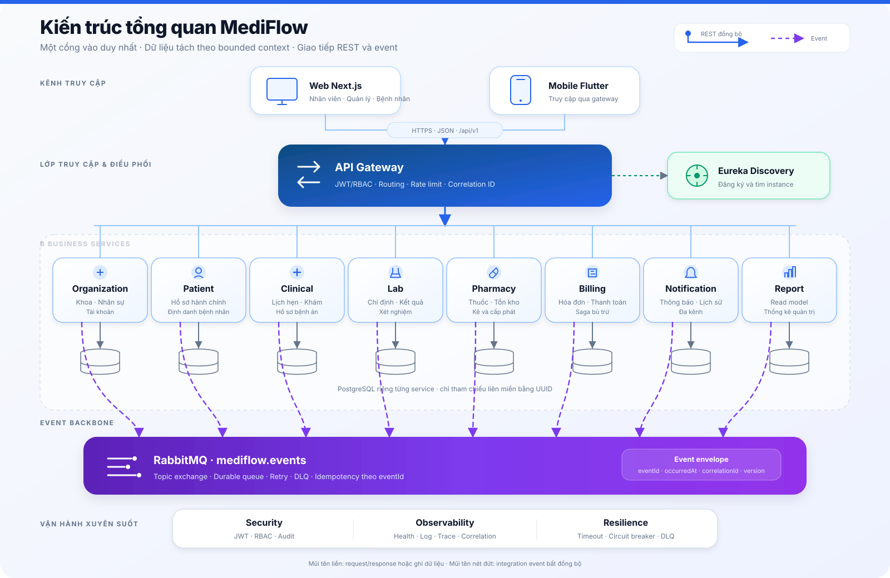
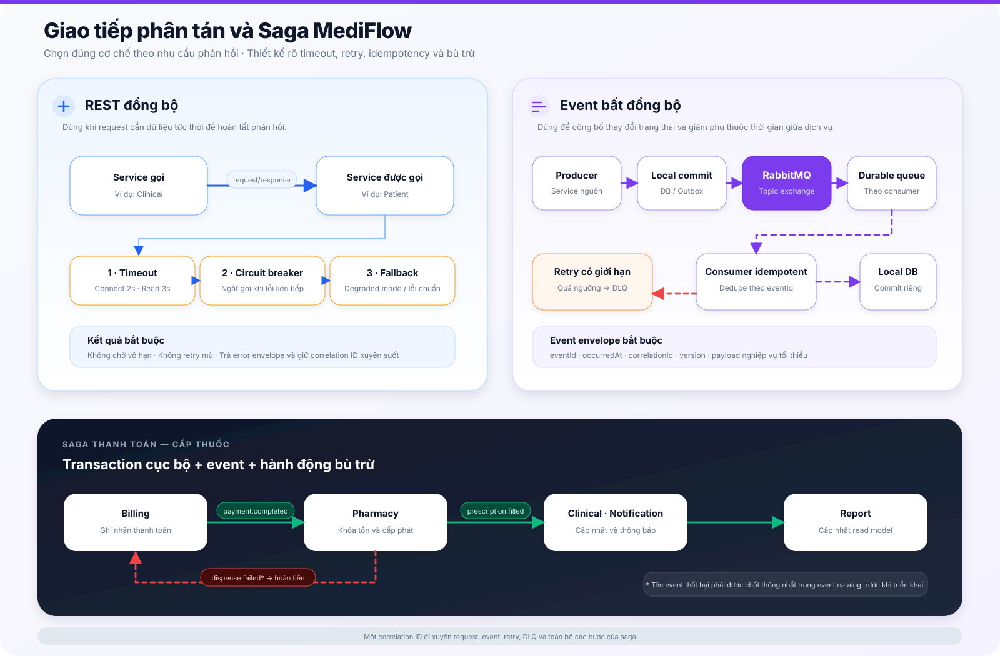

# GIAI ĐOẠN 1 - XÁC ĐỊNH VẤN ĐỀ, GIẢI PHÁP, CRS VÀ BỘ BIỂU MẪU

**Dự án:** MediFlow - Hệ thống quản lý phân tán bệnh viện/phòng khám  
**Phiên bản:** 0.9-draft  
**Ngày tổng hợp:** 02/09/2026  
**Phạm vi:** Khởi động và đặc tả yêu cầu  
**Trạng thái:** Bản nháp phục vụ rà soát; chưa thay thế tài liệu đã được nhóm và giáo viên ký duyệt.

## 1. Xác định vấn đề

### 1.1 Bối cảnh

Bệnh viện/phòng khám phải phối hợp liên tục giữa tiếp nhận, khám bệnh, xét nghiệm, dược, thu ngân, thông báo và quản lý. Khi thông tin nằm ở nhiều biểu mẫu hoặc hệ thống rời rạc, nhân viên phải nhập lại dữ liệu, khó biết trạng thái mới nhất của hồ sơ và khó truy trách nhiệm khi xảy ra sai lệch.

MediFlow được đề xuất để quản lý chuỗi nghiệp vụ này trên một nền tảng thống nhất về trải nghiệm, nhưng phân tách rõ trách nhiệm và dữ liệu của từng miền nghiệp vụ theo kiến trúc microservices.

### 1.2 Các vấn đề cần giải quyết

| Mã | Vấn đề hiện tại | Ảnh hưởng | Nhu cầu cần đáp ứng |
|---|---|---|---|
| PRO-01 | Thông tin bệnh nhân có thể bị nhập trùng hoặc thiếu nhất quán | Sai nhận diện, mất thời gian đối chiếu | Một hồ sơ bệnh nhân thống nhất, có ràng buộc dữ liệu và lịch sử cập nhật |
| PRO-02 | Lịch hẹn, tiếp nhận và trạng thái khám không được theo dõi xuyên suốt | Chậm phục vụ, khó điều phối bác sĩ/phòng khám | Quản lý lịch hẹn và trạng thái theo quy trình rõ ràng |
| PRO-03 | Hồ sơ khám, chẩn đoán, xét nghiệm và đơn thuốc tách rời | Bác sĩ thiếu thông tin khi ra quyết định | Liên kết nghiệp vụ bằng định danh và sự kiện, không truy cập chéo database |
| PRO-04 | Kết quả xét nghiệm được chuyển thủ công hoặc thông báo chậm | Chậm chẩn đoán và điều trị | Theo dõi yêu cầu, kết quả và thông báo trạng thái tự động |
| PRO-05 | Tồn kho thuốc và cấp phát có nguy cơ sai lệch hoặc xuất trùng | Thiếu thuốc, âm kho, thất thoát | Khóa tồn kho khi xuất, chống xử lý trùng và cảnh báo tồn thấp |
| PRO-06 | Thu phí, thanh toán và cấp thuốc là quy trình nhiều bước | Có thể đã thu tiền nhưng chưa cấp thuốc hoặc ngược lại | Saga thanh toán-cấp thuốc, có trạng thái và bù trừ khi thất bại |
| PRO-07 | Thông báo cho bệnh nhân phụ thuộc thao tác thủ công | Bỏ lỡ lịch hẹn, kết quả hoặc trạng thái thanh toán | Thông báo chủ động và thông báo phát sinh từ event |
| PRO-08 | Báo cáo quản trị được tổng hợp thủ công | Số liệu chậm, khó kiểm tra nguồn gốc | Read model báo cáo theo sự kiện, truy vết được dữ liệu nguồn |
| PRO-09 | Quyền truy cập chưa tách rõ theo vai trò và phạm vi dữ liệu | Rò rỉ dữ liệu y tế hoặc thao tác vượt quyền | JWT, RBAC, ownership check và audit trail |
| PRO-10 | Hệ thống phân tán có thể lỗi từng phần, gửi event trùng hoặc mất liên kết truy vết | Lỗi dây chuyền và dữ liệu không nhất quán | Timeout, circuit breaker, idempotency, DLQ và correlation ID |

### 1.3 Đối tượng liên quan

- Ban quản trị hệ thống và quản lý bệnh viện/phòng khám.
- Bác sĩ, điều dưỡng, kỹ thuật viên xét nghiệm và dược sĩ.
- Thu ngân và bộ phận tài chính.
- Bệnh nhân sử dụng Web/Mobile để xem thông tin được cấp quyền.
- Nhân sự vận hành, hỗ trợ kỹ thuật, kiểm thử và kiểm toán.

### 1.4 Phạm vi giải quyết trong phiên bản đầu

- Quản lý tổ chức, khoa/phòng, nhân viên và tài khoản.
- Quản lý bệnh nhân, lịch hẹn, hồ sơ bệnh án và chẩn đoán.
- Quản lý yêu cầu/kết quả xét nghiệm.
- Quản lý danh mục thuốc, tồn kho, đơn thuốc và cấp phát.
- Quản lý hóa đơn, thanh toán và quy trình bù trừ.
- Gửi thông báo và lập báo cáo quản trị.
- Web Next.js và Mobile Flutter chỉ truy cập hệ thống thông qua API Gateway.

Các tích hợp thanh toán thật, bảo hiểm/y tế quốc gia, PACS/DICOM, thiết bị xét nghiệm và triển khai đa vùng chưa thuộc phạm vi đã chốt của phiên bản đầu.

## 2. Giải pháp đề xuất

### 2.1 Mục tiêu giải pháp

- Số hóa chuỗi nghiệp vụ từ tiếp nhận đến hoàn tất thanh toán/cấp thuốc.
- Cung cấp dữ liệu đúng vai trò, đúng phạm vi và có thể truy vết.
- Tách các miền nghiệp vụ để phát triển, kiểm thử và mở rộng độc lập.
- Hạn chế lỗi dây chuyền khi một dịch vụ tạm thời không khả dụng.
- Đồng nhất hợp đồng API, event, phản hồi lỗi và trải nghiệm Web/Mobile.

### 2.2 Kiến trúc đề xuất

*Hình 1. Kiến trúc tổng quan: client chỉ đi qua API Gateway; tám business service sở hữu dữ liệu riêng và trao đổi integration event qua RabbitMQ.*

*Hình 2. Quy tắc lựa chọn REST/Event, xử lý lỗi phân tán và saga thanh toán-cấp thuốc.*

Quy ước trên sơ đồ:

- Mũi tên xanh liền biểu diễn request/response REST hoặc luồng xử lý cần phản hồi tức thời.
- Mũi tên tím nét đứt biểu diễn integration event bất đồng bộ.
- Mũi tên xanh lá biểu diễn nhánh saga thành công; mũi tên đỏ nét đứt biểu diễn nhánh lỗi/bù trừ.
- Khối bo góc là ứng dụng/dịch vụ; hình trụ là database; thanh tím là event backbone.

#### Bản dùng khi chèn vào Microsoft Word

| Hình | SVG vector tương thích Word | PNG dự phòng 2× |
|---|---|---|
| Kiến trúc tổng quan | [Word-safe SVG](assets/kien-truc-tong-quan-mediflow-word-safe.svg) | [PNG 3200 × 2080](assets/kien-truc-tong-quan-mediflow-word-safe.png) |
| REST, Event và Saga | [Word-safe SVG](assets/luong-rest-event-va-saga-word-safe.svg) | [PNG 3200 × 2100](assets/luong-rest-event-va-saga-word-safe.png) |

Nên chèn bằng **Insert → Pictures → This Device**. Bản Word-safe dùng màu đặc, thuộc tính màu/nét được nội tuyến và không dùng gradient, bóng đổ hoặc opacity. Nếu phiên bản Word vẫn hiển thị SVG khác màu, dùng PNG 2× để giữ hình thức chính xác.

- Gateway là điểm vào duy nhất, chịu trách nhiệm xác thực ban đầu, routing và kiểm soát lưu lượng.
- Eureka hỗ trợ service discovery cho giao tiếp nội bộ.
- Mỗi service sở hữu database riêng; cấm join hoặc khóa ngoại xuyên service.
- REST dùng khi cần phản hồi tức thời để hoàn thành request; phải có timeout và circuit breaker.
- Event dùng để thông báo thay đổi trạng thái; consumer phải idempotent theo `eventId`.
- Billing điều phối saga thanh toán-cấp thuốc; thất bại phải có bù trừ thay vì transaction phân tán.

### 2.3 Các thành phần nghiệp vụ

| Thành phần | Trách nhiệm chính | Dữ liệu sở hữu |
|---|---|---|
| Organization Service | Khoa/phòng, nhân viên, tài khoản và vai trò | Department, staff, account |
| Patient Service | Hồ sơ hành chính bệnh nhân | Patient |
| Clinical Service | Lịch hẹn, hồ sơ bệnh án và chẩn đoán | Appointment, medical record, diagnosis |
| Lab Service | Yêu cầu và kết quả xét nghiệm | Lab request, lab result |
| Pharmacy Service | Thuốc, tồn kho, đơn thuốc và cấp phát | Medicine, inventory, prescription, dispense slip |
| Billing Service | Khoản phí, hóa đơn, thanh toán và trạng thái saga | Charge, invoice/payment |
| Notification Service | Nội dung, kênh và lịch sử gửi thông báo | Notification |
| Report Service | Read model và số liệu tổng hợp | Daily visit, revenue, medicine statistics |

### 2.4 Nguyên tắc thiết kế

- Bảo mật mặc định từ chối: endpoint chỉ mở khi có quyền được khai báo rõ.
- Không trả entity database qua API; dùng DTO và response envelope thống nhất.
- Thay đổi trạng thái nghiệp vụ phải tạo sự kiện phù hợp sau khi transaction cục bộ commit.
- Mọi request/event phải có correlation ID để truy vết xuyên dịch vụ.
- Dữ liệu tiền tệ dùng số thập phân chính xác; định danh dùng UUID; thời gian event dùng UTC.
- Mọi quy tắc nghiệp vụ và failure path phải có tiêu chí chấp nhận và test tương ứng.

## 3. Đặc tả yêu cầu người dùng (CRS)

### 3.1 Nhóm người dùng và nhu cầu

| Nhóm người dùng cấp cao | Vai trò hệ thống | Nhu cầu chính |
|---|---|---|
| Quản trị | `ADMIN`, `MANAGER` | Quản lý tổ chức, tài khoản, theo dõi vận hành và xem báo cáo |
| Nhân sự chuyên môn | `DOCTOR`, `NURSE`, `LAB_TECH`, `PHARMACIST`, `CASHIER` | Thực hiện nghiệp vụ đúng chuyên môn và chỉ truy cập dữ liệu cần thiết |
| Khách hàng/người bệnh | `PATIENT` | Xem thông tin cá nhân, lịch hẹn, thông báo và kết quả được phép công bố |
| Hệ thống | `SYSTEM` | Xác thực nội bộ, xử lý event, tác vụ tự động và bù trừ |

> Ba actor tổng quát trong kế hoạch ban đầu (`Administrator`, `Customer`, `Staff/Expert`) được giữ làm nhóm trình bày. Chín vai trò ở trên là danh mục RBAC chi tiết dùng trong đặc tả và triển khai.

### 3.2 Yêu cầu theo từng lớp người dùng

Các yêu cầu được nhóm theo bốn lớp người dùng để thể hiện rõ trách nhiệm, phạm vi dữ liệu và kết quả mà từng lớp mong đợi. Trong các bảng dưới đây, **Bắt buộc** là yêu cầu cần có để quy trình nghiệp vụ hoạt động; **Nên có** là yêu cầu nâng cao trải nghiệm hoặc năng lực quản trị.

#### Lớp 1 - Quản trị và quản lý

Lớp này chịu trách nhiệm thiết lập hệ thống, quản lý nguồn lực và theo dõi hoạt động toàn viện hoặc trong phạm vi khoa được giao.

| Vai trò | Nhu cầu và chức năng | Kết quả mong đợi | Ưu tiên |
|---|---|---|---|
| `ADMIN` | Đăng nhập; quản lý khoa/phòng; tạo, cập nhật và chuyển khoa nhân viên | Cơ cấu tổ chức và thông tin nhân sự được lưu chính xác, có thể tìm kiếm và truy vết thay đổi | Bắt buộc |
| `ADMIN` | Tạo tài khoản, gán vai trò, kích hoạt hoặc vô hiệu tài khoản | Chỉ tài khoản hợp lệ và đang hoạt động mới đăng nhập; người dùng không thể thao tác vượt quyền | Bắt buộc |
| `ADMIN` | Tra cứu và giám sát các nghiệp vụ bệnh nhân, khám, xét nghiệm, dược và viện phí theo quyền quản trị | Có thể hỗ trợ xử lý sự cố mà không làm mất lịch sử hoặc phá vỡ quy trình nghiệp vụ | Bắt buộc |
| `MANAGER` | Tra cứu cơ cấu khoa/phòng, nhân viên và hoạt động của đơn vị phụ trách | Dữ liệu hiển thị đúng phạm vi quản lý, có lọc và phân trang | Bắt buộc |
| `ADMIN`, `MANAGER` | Xem báo cáo lượt khám, doanh thu và sử dụng thuốc theo thời gian/khoa | Báo cáo phản ánh dữ liệu đã tổng hợp và truy vết được về nguồn | Nên có |

#### Lớp 2 - Nhân viên nghiệp vụ và chuyên môn

Đây là lớp trực tiếp thực hiện quy trình khám chữa bệnh. Mỗi vai trò chỉ được thao tác trên phần nghiệp vụ cần thiết cho công việc của mình.

| Vai trò | Nhu cầu và chức năng | Kết quả mong đợi | Ưu tiên |
|---|---|---|---|
| `NURSE` | Tìm kiếm bệnh nhân; tiếp nhận hồ sơ mới; cập nhật thông tin hành chính theo quyền | Không tạo trùng định danh; dữ liệu bắt buộc được kiểm tra trước khi lưu | Bắt buộc |
| `NURSE` | Tạo lịch hẹn, theo dõi trạng thái tiếp nhận và hỗ trợ điều phối bệnh nhân | Lịch được gắn đúng bệnh nhân, khoa, bác sĩ và thời gian; chỉ chuyển qua trạng thái hợp lệ | Bắt buộc |
| `DOCTOR` | Tra cứu bệnh nhân, lịch hẹn và lịch sử bệnh án phục vụ khám | Bác sĩ xem được dữ liệu cần thiết nhưng không tự ý sửa hồ sơ hành chính của bệnh nhân | Bắt buộc |
| `DOCTOR` | Lập hồ sơ bệnh án, ghi chẩn đoán, chỉ định xét nghiệm và kê đơn | Mỗi dữ liệu chuyên môn được liên kết đúng bệnh nhân, bác sĩ, khoa và lần khám | Bắt buộc |
| `LAB_TECH` | Tiếp nhận chỉ định, cập nhật trạng thái và nhập kết quả xét nghiệm | Kết quả hợp lệ được lưu, công bố đúng quy trình và gửi tới các bên cần nhận | Bắt buộc |
| `PHARMACIST` | Tra cứu danh mục thuốc, quản lý tồn kho và tiếp nhận đơn đã đủ điều kiện cấp phát | Tồn kho phản ánh đúng số lượng khả dụng; có cảnh báo khi tồn thấp | Bắt buộc |
| `PHARMACIST` | Khóa tồn và cấp phát thuốc sau khi nhận xác nhận thanh toán | Không âm kho, không xuất trùng; thất bại được trả về để hệ thống thực hiện bù trừ | Bắt buộc |
| `CASHIER` | Tạo hóa đơn từ các khoản phí chưa thanh toán và tra cứu hóa đơn bệnh nhân | Tổng tiền chính xác, không đưa một khoản phí vào nhiều hóa đơn | Bắt buộc |
| `CASHIER` | Ghi nhận thanh toán và theo dõi trạng thái hoàn tất hoặc hoàn tiền | Thanh toán thành công được công bố; lỗi cấp phát dẫn đến trạng thái bù trừ rõ ràng | Bắt buộc |

#### Lớp 3 - Bệnh nhân

Lớp bệnh nhân sử dụng Web hoặc Mobile để theo dõi thông tin cá nhân và nhận thông báo. Mọi dữ liệu phải được giới hạn theo quyền sở hữu.

| Vai trò | Nhu cầu và chức năng | Kết quả mong đợi | Ưu tiên |
|---|---|---|---|
| `PATIENT` | Đăng nhập và sử dụng Web/Mobile thông qua API Gateway | Phiên đăng nhập hợp lệ; client không gọi trực tiếp các service nội bộ | Bắt buộc |
| `PATIENT` | Xem thông tin cá nhân, lịch hẹn và trạng thái được phép công bố | Chỉ xem được dữ liệu thuộc hồ sơ của chính mình | Bắt buộc |
| `PATIENT` | Xem kết quả hoặc thông tin y tế đã được nhân viên chuyên môn cho phép công bố | Nội dung nhạy cảm không hiển thị trước khi đủ điều kiện nghiệp vụ và phân quyền | Bắt buộc |
| `PATIENT` | Nhận và tra cứu thông báo về lịch hẹn, xét nghiệm, thanh toán hoặc cấp thuốc | Thông báo được lưu lịch sử, dễ đọc và không bị tạo trùng khi event được gửi lại | Nên có |

#### Lớp 4 - Hệ thống, vận hành và kiểm thử

Lớp này không đại diện cho người dùng nghiệp vụ thông thường, nhưng cần thiết để hệ thống phân tán vận hành an toàn và có thể kiểm chứng.

| Vai trò | Nhu cầu và chức năng | Kết quả mong đợi | Ưu tiên |
|---|---|---|---|
| `SYSTEM` | Xác minh tài khoản nội bộ, xử lý event và thực hiện tác vụ tự động | Các service giao tiếp theo hợp đồng, có correlation ID và không xử lý trùng về mặt nghiệp vụ | Bắt buộc |
| `SYSTEM` | Điều phối saga thanh toán-cấp thuốc và thực hiện bù trừ khi một bước thất bại | Quy trình kết thúc ở trạng thái hoàn tất hoặc hoàn tiền/thất bại có thể truy vết | Bắt buộc |
| Nhân sự vận hành | Theo dõi health, log, trace, hàng đợi và DLQ của các dịch vụ | Xác định được service và bước gây lỗi; hệ thống không chờ vô hạn hoặc lỗi dây chuyền | Bắt buộc |
| Nhóm phát triển/QA | Kiểm chứng quy tắc nghiệp vụ, phân quyền và các failure path | Có test cho validation, RBAC, idempotency, retry/DLQ và cả hai nhánh saga | Bắt buộc |

#### Yêu cầu chung cho mọi lớp người dùng

- Giao diện phải có trạng thái loading, empty, success và error rõ ràng.
- Mọi thao tác chỉ được thực hiện sau khi backend xác minh danh tính, vai trò và phạm vi dữ liệu.
- Thông báo lỗi phải dễ hiểu với người dùng nhưng không làm lộ thông tin kỹ thuật hoặc dữ liệu nhạy cảm.
- Các thao tác làm thay đổi trạng thái phải có thời gian, người thực hiện và correlation ID để phục vụ audit.
- Web và Mobile sử dụng cùng hợp đồng API qua Gateway; việc ẩn nút trên giao diện không thay thế kiểm tra quyền ở backend.

## 4. Bộ biểu mẫu ban đầu theo các luồng nghiệp vụ lớn

Phần này gộp Use Case, Task và Process theo từng luồng nghiệp vụ lớn để thể hiện rõ: **ai thực hiện**, **mục tiêu cần đạt**, **công việc phải làm** và **cách hệ thống xử lý**.

### 4.1 Luồng lớn 1 - Quản trị, tiếp nhận bệnh nhân và xếp lịch khám

Luồng này bắt đầu từ việc thiết lập cơ cấu vận hành, tiếp nhận bệnh nhân và kết thúc khi lịch khám hợp lệ đã được tạo hoặc cập nhật.

| Vai trò | Use Case | Task | Process |
|---|---|---|---|
| Tất cả người dùng | Đăng nhập hệ thống | Nhập thông tin đăng nhập để truy cập đúng chức năng theo vai trò | Gateway tiếp nhận yêu cầu → dịch vụ tổ chức xác minh tài khoản → hệ thống cấp JWT và thông tin vai trò → các yêu cầu sau được kiểm tra quyền truy cập |
| Quản trị viên (ADMIN) | Quản lý khoa/phòng | Tạo mới, cập nhật và tra cứu khoa/phòng | Nhập thông tin khoa → kiểm tra dữ liệu bắt buộc và trùng lặp → lưu tại dịch vụ tổ chức → công bố sự kiện thay đổi để các thành phần liên quan đồng bộ |
| Quản trị viên (ADMIN) | Quản lý nhân viên và tài khoản | Tạo hoặc cập nhật hồ sơ nhân viên; phân khoa, gán vai trò; kích hoạt hoặc vô hiệu tài khoản | Kiểm tra khoa và vai trò hợp lệ → lưu hồ sơ nhân viên, tài khoản → cập nhật trạng thái truy cập → ghi nhận thay đổi phục vụ kiểm tra và truy vết |
| Quản lý (MANAGER) | Tra cứu cơ cấu và nhân sự | Lọc danh sách khoa/phòng, nhân viên theo phạm vi phụ trách | Hệ thống xác định phạm vi dữ liệu theo vai trò → truy vấn có phân trang → trả danh sách hoặc chi tiết được phép xem |
| Điều dưỡng (NURSE) | Tra cứu và tiếp nhận bệnh nhân | Tìm bệnh nhân theo mã hoặc thông tin định danh; tạo hồ sơ mới nếu chưa tồn tại; cập nhật khi thông tin thay đổi | Kiểm tra định dạng và định danh trùng → tạo/cập nhật hồ sơ tại dịch vụ bệnh nhân → sinh mã bệnh nhân duy nhất → phát `patient.created` hoặc `patient.updated` |
| Điều dưỡng (NURSE) | Tạo và quản lý lịch hẹn | Chọn bệnh nhân, khoa, bác sĩ, ngày giờ khám; cập nhật hoặc hủy lịch khi cần | Xác minh các định danh liên quan → kiểm tra thời gian và trạng thái hợp lệ → lưu lịch tại dịch vụ lâm sàng → phát `appointment.created` hoặc `appointment.status.changed` |
| Bác sĩ (DOCTOR) | Xem lịch khám được phân công | Tra cứu danh sách bệnh nhân theo ngày và trạng thái lịch hẹn | Hệ thống kiểm tra quyền và mã bác sĩ → lọc lịch theo bác sĩ, ngày, khoa → trả danh sách phục vụ khám bệnh |
| Bệnh nhân (PATIENT) | Xem lịch khám cá nhân | Đăng nhập và xem lịch hẹn, trạng thái hoặc thay đổi liên quan | Hệ thống kiểm tra quyền sở hữu dữ liệu → chỉ trả lịch gắn với bệnh nhân hiện tại → hiển thị trạng thái và thông báo liên quan |

### 4.2 Luồng lớn 2 - Khám bệnh, xét nghiệm và kê đơn

Luồng này bắt đầu khi bệnh nhân đến lượt khám và kết thúc khi bác sĩ hoàn thành hồ sơ khám, kết quả xét nghiệm và đơn thuốc cần thiết.

| Vai trò | Use Case | Task | Process |
|---|---|---|---|
| Điều dưỡng (NURSE) | Xác nhận bệnh nhân đến khám | Kiểm tra lịch hẹn và chuyển bệnh nhân sang trạng thái chờ khám | Tra cứu lịch → xác nhận đúng bệnh nhân và thời gian → cập nhật trạng thái hợp lệ → phát sự kiện thay đổi trạng thái lịch |
| Bác sĩ (DOCTOR) | Tra cứu hồ sơ bệnh nhân | Xem thông tin hành chính, lịch sử khám và dữ liệu cần thiết trước khi khám | Hệ thống kiểm tra quyền → lấy dữ liệu qua API của dịch vụ sở hữu → tổng hợp trên giao diện; không truy cập chéo cơ sở dữ liệu giữa các dịch vụ |
| Bác sĩ (DOCTOR) | Lập hồ sơ bệnh án | Ghi triệu chứng, dấu hiệu lâm sàng, kết luận khám và thông tin điều trị | Kiểm tra bệnh nhân, lịch hẹn và dữ liệu bắt buộc → tạo/cập nhật hồ sơ tại dịch vụ lâm sàng → phát `medicalrecord.created` khi tạo mới |
| Bác sĩ (DOCTOR) | Ghi chẩn đoán | Thêm chẩn đoán vào hồ sơ bệnh án đang xử lý | Kiểm tra hồ sơ tồn tại và quyền cập nhật → lưu chẩn đoán → phát sự kiện thay đổi nghiệp vụ tương ứng |
| Bác sĩ (DOCTOR) | Chỉ định xét nghiệm | Chọn loại xét nghiệm, nhập ghi chú và gửi yêu cầu cho bộ phận xét nghiệm | Kiểm tra hồ sơ bệnh án → tạo yêu cầu tại dịch vụ xét nghiệm → gắn các định danh liên quan → phát `lab.request.created` |
| Kỹ thuật viên xét nghiệm (LAB_TECH) | Tiếp nhận và xử lý xét nghiệm | Nhận yêu cầu, xác nhận mẫu và cập nhật trạng thái thực hiện | Tra cứu yêu cầu → kiểm tra chuyển trạng thái → cập nhật tiến độ → lưu thời gian và người thực hiện |
| Kỹ thuật viên xét nghiệm (LAB_TECH) | Nhập kết quả xét nghiệm | Nhập chỉ số, kết luận và xác nhận công bố kết quả | Kiểm tra cấu trúc và giá trị kết quả → lưu kết quả → hoàn tất yêu cầu → phát `lab.result.created` cho dịch vụ lâm sàng, thông báo và báo cáo |
| Bác sĩ (DOCTOR) | Xem và đánh giá kết quả xét nghiệm | Mở kết quả mới, đối chiếu với hồ sơ và cập nhật kết luận điều trị | Dịch vụ lâm sàng nhận thông tin qua API hoặc sự kiện phù hợp → hiển thị đúng hồ sơ → bác sĩ cập nhật chẩn đoán hoặc hướng điều trị |
| Bác sĩ (DOCTOR) | Kê đơn thuốc | Tra cứu thuốc; nhập liều dùng, số lượng và hướng dẫn sử dụng | Kiểm tra thuốc và các dòng đơn → chụp giá tại thời điểm kê → lưu đơn tại dịch vụ dược → phát `prescription.created` để tạo khoản phí liên quan |
| Hệ thống (SYSTEM) | Thông báo kết quả nghiệp vụ | Tự động tạo thông báo khi có lịch hẹn, kết quả xét nghiệm hoặc thay đổi quan trọng | Nhận sự kiện → kiểm tra trùng theo `eventId` → tạo nội dung đúng người nhận → gửi qua kênh được cấu hình → lưu kết quả gửi |

### 4.3 Luồng lớn 3 - Thanh toán, cấp thuốc và hoàn tất dịch vụ

Luồng này bắt đầu khi các khoản phí đã hình thành và kết thúc khi thanh toán, cấp thuốc, thông báo và dữ liệu báo cáo được xử lý đầy đủ.

| Vai trò | Use Case | Task | Process |
|---|---|---|---|
| Thu ngân (CASHIER) | Tạo và tra cứu hóa đơn | Tổng hợp các khoản phí của bệnh nhân, kiểm tra chi tiết và lập hóa đơn | Dịch vụ viện phí nhận dữ liệu phí từ các sự kiện nghiệp vụ → chống ghi nhận trùng → tổng hợp các khoản chưa thanh toán → tạo hóa đơn và phát `invoice.created` |
| Thu ngân (CASHIER) | Ghi nhận thanh toán | Chọn hóa đơn, phương thức thanh toán và xác nhận số tiền đã thu | Kiểm tra hóa đơn chưa được thanh toán và số tiền hợp lệ → ghi nhận giao dịch → chuyển hóa đơn sang đã thanh toán → phát `payment.completed` |
| Hệ thống (SYSTEM) | Điều phối cấp thuốc sau thanh toán | Khởi động quy trình cấp thuốc khi nhận được thanh toán hợp lệ | Dịch vụ viện phí phát sự kiện → dịch vụ dược kiểm tra đơn thuốc và trạng thái thanh toán → bắt đầu bước giữ tồn, trừ kho và cấp phát; toàn bộ luồng dùng cùng correlation ID |
| Dược sĩ (PHARMACIST) | Kiểm tra đơn trước khi cấp thuốc | Đối chiếu đơn, bệnh nhân, khoản thanh toán, số lượng và tồn kho | Hệ thống xác minh đơn đủ điều kiện → khóa bản ghi tồn kho cần cập nhật → cảnh báo khi thiếu tồn, đơn đã cấp hoặc dữ liệu không nhất quán |
| Dược sĩ (PHARMACIST) | Cấp phát thuốc | Xác nhận số lượng thực cấp và hoàn tất đơn thuốc | Trừ tồn kho trong giao dịch nguyên tử → không cho phép tồn âm hoặc cấp trùng → cập nhật đơn đã cấp → phát `prescription.filled` |
| Hệ thống (SYSTEM) | Bù trừ khi cấp thuốc thất bại | Ghi nhận lỗi thiếu tồn hoặc lỗi xử lý và yêu cầu hoàn tác giao dịch liên quan | Dịch vụ dược phát sự kiện thất bại theo catalog thống nhất → dịch vụ viện phí nhận sự kiện và hoàn tiền hoặc chuyển trạng thái phù hợp → lưu đầy đủ lịch sử saga và nguyên nhân |
| Bệnh nhân / Điều dưỡng | Theo dõi thông báo | Xem thông báo thanh toán, kết quả và tình trạng cấp thuốc | Dịch vụ thông báo nhận sự kiện → tạo thông báo đúng chủ sở hữu → gửi và lưu trạng thái → giao diện Web/Mobile hiển thị kết quả |
| Quản trị viên / Quản lý | Xem báo cáo vận hành | Lọc số lượt khám, doanh thu và thuốc sử dụng theo thời gian hoặc khoa | Dịch vụ báo cáo nhận sự kiện từ các dịch vụ nghiệp vụ → cập nhật mô hình dữ liệu đọc → xử lý sự kiện trùng hoặc đến muộn → trả báo cáo đúng phạm vi quyền |
| Vận hành / Kiểm thử (OPS/QA) | Truy vết và xử lý sự cố | Tra cứu request, event, trạng thái dịch vụ và hàng đợi lỗi | Dùng correlation ID để nối toàn bộ bước xử lý → kiểm tra health, retry và DLQ → xác định dịch vụ, bước lỗi, dữ liệu ảnh hưởng và phương án khôi phục |

### 4.4 Các yêu cầu phi chức năng cho hệ thống phân tán

- Mọi API, ngoại trừ đăng nhập, làm mới token và health check, phải yêu cầu JWT hợp lệ.
- Mỗi endpoint phải khai báo quyền truy cập; người dùng sai vai trò nhận phản hồi 403; bệnh nhân chỉ được xem dữ liệu thuộc sở hữu của mình.
- Mật khẩu phải được băm; secret phải lấy từ môi trường; không ghi token, mật khẩu hoặc dữ liệu định danh y tế đầy đủ vào log.
- Gateway phải giới hạn tối đa 100 request/phút trên mỗi địa chỉ IP khách và trả phản hồi 429 rõ ràng khi vượt ngưỡng.
- Lời gọi REST liên dịch vụ phải có connect timeout 2 giây, read timeout 3 giây, circuit breaker và phương án fallback phù hợp.
- API danh sách phải phân trang với mặc định 20 và tối đa 100 bản ghi mỗi trang.
- Nhóm phải chốt và kiểm thử ngưỡng p95, p99, số người dùng đồng thời và throughput mục tiêu cho từng nhóm API.
- Mỗi microservice phải sở hữu cơ sở dữ liệu riêng; không join, tạo khóa ngoại hoặc truy cập repository xuyên dịch vụ.
- Sự kiện chỉ được công bố sau khi giao dịch cục bộ hoàn tất; consumer phải xử lý idempotent theo `eventId`.
- Exchange và queue phải durable; message lỗi phải được retry có giới hạn và chuyển vào DLQ riêng khi vượt quá số lần cho phép.
- Mọi sự kiện phải có tối thiểu `eventId`, `occurredAt`, `correlationId`, tên sự kiện, routing key, phiên bản và payload rõ ràng.
- Consumer phải xử lý an toàn sự kiện trùng, đến chậm hoặc sai thứ tự; dữ liệu tổng hợp phải có khả năng rebuild khi cần.
- Quy trình nhiều dịch vụ phải dùng saga và có hành động bù trừ khi một bước quan trọng thất bại.
- Thao tác xuất kho phải dùng khóa ghi hoặc cơ chế kiểm soát tương tranh tương đương; không để tồn kho âm hoặc cấp thuốc hai lần.
- Nhóm phải chốt uptime, cửa sổ bảo trì, RTO và RPO cho toàn hệ thống và từng dịch vụ quan trọng.
- Request, event, log và các bước saga phải dùng chung correlation ID để truy vết đầu cuối.
- Mỗi dịch vụ phải cung cấp `/actuator/health`; Gateway và dịch vụ khám phá phải theo dõi được trạng thái instance.
- Nhóm phải xác định trường audit bắt buộc, thời gian lưu log, ngưỡng cảnh báo và quyền truy cập dữ liệu giám sát.
- API phải dùng phiên bản `/api/v1`, response envelope thống nhất; thay đổi phá vỡ tương thích phải chuyển sang phiên bản mới.
- Mỗi quy tắc nghiệp vụ và nhánh lỗi phải có kiểm thử; consumer cần kiểm thử event trùng, retry, DLQ và bù trừ saga; endpoint cần kiểm thử phân quyền.
- Web và Mobile phải có đầy đủ trạng thái loading, empty, success và error, đồng thời hiển thị thông báo dễ hiểu trong bối cảnh lâm sàng.
- Nhóm phải chốt mức WCAG, kích thước màn hình, thiết bị, trình duyệt, hệ điều hành và ngôn ngữ được hỗ trợ.
- Mỗi cơ sở dữ liệu phải có lịch sao lưu, kiểm tra phục hồi định kỳ và người chịu trách nhiệm xử lý sự cố.
- Cấu hình phải tách khỏi mã nguồn; migration cơ sở dữ liệu phải có phiên bản; instance chỉ được nhận traffic sau khi health check đạt.

## 5. Tài liệu tham chiếu và minh chứng

- [SRS phục hồi Giai đoạn 1](../giai-doan-1-srs.md).
- [Báo cáo giải trình Giai đoạn 1](bao-cao-giai-trinh.md).
- [Kiểm kê source và quality gate](../source-audit.md).
- [Rà soát ERD, DDL và event](../erd-ddl-events-audit.md).
- [Backend specification](../../eproject_general_plan/backend-spec/README.md).
- [Quy chuẩn kiến trúc và triển khai](../../ai/README.md).

## 6. Xác nhận nội bộ

| Vai trò | Người xác nhận | Phạm vi xác nhận | Ngày | Kết quả |
|---|---|---|---|---|
| Nhóm trưởng/Backend | Phạm Đăng Vinh | Phạm vi, giải pháp, CRS và kiến trúc |  |  |
| Frontend/Mobile | Trần Hoàng Anh | Nhu cầu người dùng, Use Case và khả năng thể hiện trên GUI |  |  |
| Database/QA | Lê Quang Huy | Process, dữ liệu, NFR và khả năng kiểm thử |  |  |
| Database/Frontend | Nguyễn Hoàng Phúc | Task, biểu mẫu và truy vết chéo |  |  |
