# GIAI ĐOẠN 2 - THIẾT KẾ GIAO DIỆN, CƠ SỞ DỮ LIỆU VÀ KIẾN TRÚC HỆ THỐNG

**Dự án:** MediFlow - Hệ thống quản lý bệnh viện
**Giai đoạn:** Giai đoạn 2 - Thiết kế
**Nền tảng:** Web Next.js và Mobile Flutter
**Kiến trúc:** Spring Boot Microservices, PostgreSQL, RabbitMQ
**Phiên bản tài liệu:** 0.1 - Bản thiết kế phục vụ rà soát
**Ngày cập nhật:** 03/09/2026

## Mục đích tài liệu

Tài liệu xác lập ngôn ngữ giao diện dùng chung, mô hình dữ liệu, kiến trúc sơ bộ và các luồng nghiệp vụ chính của MediFlow. Đây là đường cơ sở để nhóm đối chiếu thiết kế Web/Mobile với API, database, event và nghiệp vụ trước khi triển khai đồng loạt.

> **Phạm vi Giai đoạn 2:** hoàn thành thiết kế và tài liệu hóa. Các sơ đồ, DDL và hợp đồng event trong tài liệu thể hiện trạng thái thiết kế; không đồng nghĩa toàn bộ chức năng đã được lập trình và kiểm thử tích hợp.

---

## 1. Quy chuẩn giao diện người dùng (GUI Standards)

MediFlow sử dụng một hệ thống thiết kế thống nhất cho Web và Mobile. Giao diện ưu tiên khả năng đọc nhanh, giảm thao tác nhầm trong môi trường lâm sàng và luôn thể hiện rõ trạng thái nghiệp vụ. Việc ẩn chức năng theo vai trò chỉ hỗ trợ trải nghiệm; backend vẫn là nơi bắt buộc kiểm tra quyền truy cập.

### 1.1. Quy chuẩn bảng màu (Color Palette)

| Nhóm màu | Mã màu | Tên token đề xuất | Phạm vi sử dụng |
|---|---|---|---|
| Xanh chủ đạo | `#0F766E` | `primary` | Nút hành động chính, mục điều hướng đang chọn, liên kết nghiệp vụ chính |
| Xanh chủ đạo đậm | `#115E59` | `primary-dark` | Trạng thái hover, pressed và vùng nhấn mạnh |
| Xanh thông tin | `#2563EB` | `info` | Thông tin hướng dẫn, liên kết và trạng thái đang xử lý |
| Xanh thành công | `#15803D` | `success` | Hoàn tất, đã thanh toán, đã cấp thuốc, kết quả hợp lệ |
| Cam cảnh báo | `#B45309` | `warning` | Đang chờ, sắp hết thuốc, dữ liệu cần kiểm tra |
| Đỏ nguy hiểm | `#B91C1C` | `danger` | Lỗi, thất bại, hủy, cảnh báo y tế hoặc thao tác phá hủy |
| Nền ứng dụng | `#F8FAFC` | `canvas` | Nền chung của trang và màn hình |
| Nền nội dung | `#FFFFFF` | `surface` | Biểu mẫu, bảng, dialog và vùng nội dung chính |
| Chữ chính | `#0F172A` | `text-primary` | Tiêu đề và nội dung cần đọc rõ |
| Chữ phụ | `#64748B` | `text-muted` | Mô tả, chú thích và thông tin thứ cấp |
| Đường viền | `#CBD5E1` | `border` | Input, bảng, đường phân cách và trạng thái chưa chọn |
| Nền vô hiệu | `#E2E8F0` | `disabled` | Điều khiển không thể thao tác |

Quy tắc sử dụng màu:

- Không dùng màu làm tín hiệu duy nhất; trạng thái phải có thêm nhãn chữ hoặc biểu tượng.
- Chữ thường phải đạt độ tương phản tối thiểu 4.5:1; chữ lớn tối thiểu 3:1.
- `danger` chỉ dùng cho lỗi, cảnh báo quan trọng và hành động không dễ hoàn tác.
- Màu trạng thái phải được ánh xạ thống nhất với enum backend trên mọi màn hình.
- Web định nghĩa token trong `globals.css`; Mobile ánh xạ cùng token trong `app_colors.dart`.

### 1.2. Quy chuẩn kiểu chữ (Typography)

Font ưu tiên là **Inter**. Web dùng fallback `Arial, sans-serif`; Mobile dùng font hệ thống khi Inter chưa được đóng gói. Không dùng quá hai họ font trong toàn bộ sản phẩm.

| Cấp chữ | Web | Mobile | Trọng lượng | Mục đích |
|---|---:|---:|---:|---|
| Display | 32 px / 40 px | 30 sp / 38 sp | 700 | Tiêu đề dashboard hoặc trang tổng quan đặc biệt |
| Heading 1 | 28 px / 36 px | 26 sp / 34 sp | 700 | Tiêu đề màn hình |
| Heading 2 | 22 px / 30 px | 22 sp / 30 sp | 600 | Tiêu đề nhóm chức năng |
| Heading 3 | 18 px / 26 px | 18 sp / 26 sp | 600 | Tiêu đề card, dialog hoặc phần dữ liệu |
| Body | 16 px / 24 px | 16 sp / 24 sp | 400 | Nội dung chính và biểu mẫu |
| Body compact | 14 px / 20 px | 14 sp / 20 sp | 400 | Bảng dữ liệu, danh sách dày |
| Label | 14 px / 20 px | 14 sp / 20 sp | 500-600 | Nhãn input, nút và tab |
| Caption | 12 px / 18 px | 12 sp / 18 sp | 400 | Ghi chú và metadata |

Quy tắc trình bày:

- Cỡ chữ nội dung không nhỏ hơn 14 px/sp.
- Tiêu đề dùng sentence case; không viết hoa toàn bộ đoạn dài.
- Số tiền, mã hồ sơ và chỉ số xét nghiệm dùng tabular numbers khi nền tảng hỗ trợ.
- Một dòng văn bản dài trên Web không vượt quá khoảng 75 ký tự để duy trì khả năng đọc.
- Không truyền tải thông tin y tế quan trọng bằng kiểu chữ mờ, nghiêng hoặc kích thước caption.

### 1.3. Quy chuẩn bố cục (Header/Footer Layout)

#### Web Next.js

| Thành phần | Quy chuẩn |
|---|---|
| Header | Cao 64 px, cố định phía trên; hiển thị tên trang, cơ sở/khoa hiện tại, thông báo, người dùng, vai trò và đăng xuất |
| Sidebar | Rộng 256 px khi mở, 72 px khi thu gọn; menu thay đổi theo vai trò nhưng không thay thế kiểm tra quyền ở backend |
| Main content | Giới hạn hợp lý ở 1440 px, padding 24-32 px; danh sách có bộ lọc phía trên và phân trang phía dưới |
| Footer | Cao tối thiểu 40 px; hiển thị phiên bản, trạng thái hệ thống và thông tin hỗ trợ; không che bảng hoặc nút hành động |
| Breakpoint | Mobile `< 768 px`, tablet `768-1279 px`, desktop `≥ 1280 px` |

Khung bố cục Web:

```text
┌────────────────────── Header: Tiêu đề | Khoa | Thông báo | Người dùng ─┐
│ Sidebar   │ Breadcrumb / hành động chính                              │
│ theo role │ Bộ lọc và tìm kiếm                                        │
│           │ Nội dung: bảng / form / timeline / biểu đồ                │
│           │ Phân trang hoặc hành động cuối biểu mẫu                   │
├───────────┴────────────────────────────────────────────────────────────┤
│ Footer: Phiên bản | Trạng thái hệ thống | Hỗ trợ                      │
└────────────────────────────────────────────────────────────────────────┘
```

#### Mobile Flutter

| Thành phần | Quy chuẩn |
|---|---|
| AppBar | Cao 56 dp; hiển thị tiêu đề, nút quay lại khi cần và tối đa hai hành động quan trọng |
| Nội dung | Padding ngang 16 dp; danh sách dùng card/row dễ chạm; form chia thành nhóm ngắn |
| Bottom navigation | Cao khoảng 64 dp, tối đa 5 mục theo vai trò; chức năng phụ đưa vào mục “Thêm” |
| Hành động chính | Dùng nút cố định cuối màn hình hoặc Floating Action Button; không che dữ liệu |
| Safe area | Tôn trọng tai thỏ, thanh điều hướng và bàn phím ảo |

#### Quy tắc dùng chung

- Spacing theo bội số 4: `4, 8, 12, 16, 24, 32, 48`.
- Bo góc mặc định 8 px/dp; focus ring tối thiểu 2 px trên Web.
- Button có đủ `default`, `hover/pressed`, `focus`, `disabled` và `loading`.
- Màn hình dữ liệu có đủ `loading`, `empty`, `success`, `error` và `forbidden`.
- Lỗi validation nằm sát trường nhập; lỗi cần hành động không chỉ hiển thị bằng toast.
- Thao tác hủy lịch, xóa dữ liệu, thanh toán và cấp thuốc phải có bước xác nhận.

---

## 2. Thiết kế mô hình cơ sở dữ liệu (Database Design)

MediFlow áp dụng nguyên tắc **database-per-service**. Mỗi microservice sở hữu dữ liệu của mình; không truy vấn, join hoặc tạo khóa ngoại sang database của dịch vụ khác. Tham chiếu xuyên dịch vụ chỉ lưu UUID và được xác minh bằng REST hoặc đồng bộ bằng event.

### 2.1. Các bảng chính

Baseline hiện hành gồm **20 bảng nghiệp vụ** và **5 bảng khử trùng lặp sự kiện**, tổng cộng **25 bảng** trong tám database.

| Microservice / Database | Bảng chính | Chức năng |
|---|---|---|
| Organization / `mediflow_organization` | `DEPARTMENT` | Danh mục khoa/phòng và trưởng khoa |
|  | `STAFF` | Hồ sơ bác sĩ, điều dưỡng, kỹ thuật viên và nhân sự |
|  | `ACCOUNT` | Tài khoản đăng nhập, vai trò và trạng thái truy cập |
| Patient / `mediflow_patient` | `PATIENT` | Chỉ mục bệnh nhân duy nhất và thông tin hành chính |
| Clinical / `mediflow_clinical` | `APPOINTMENT` | Lịch hẹn, khoa, bác sĩ, bệnh nhân và trạng thái khám |
|  | `MEDICAL_RECORD` | Hồ sơ bệnh án của lượt khám |
|  | `DIAGNOSIS` | Chẩn đoán thuộc hồ sơ bệnh án |
| Lab / `mediflow_lab` | `LAB_TEST` | Yêu cầu xét nghiệm và tiến độ xử lý |
|  | `LAB_RESULT` | Kết quả thuộc một yêu cầu xét nghiệm |
|  | `PROCESSED_EVENT` | Khử trùng lặp sự kiện đã tiêu thụ |
| Pharmacy / `mediflow_pharmacy` | `DRUG` | Danh mục thuốc, giá và tồn kho |
|  | `PRESCRIPTION` | Đơn thuốc gắn với bệnh nhân và hồ sơ |
|  | `PRESCRIPTION_LINE` | Thuốc, liều dùng, số lượng và giá chụp tại thời điểm kê |
|  | `DISPENSE_SLIP` | Phiếu cấp phát thuốc, một phiếu cho một đơn |
|  | `STOCK_RESERVATION` | Giữ tồn kho trong luồng thanh toán - cấp thuốc |
|  | `PROCESSED_EVENT` | Khử trùng lặp sự kiện đã tiêu thụ |
| Billing / `mediflow_billing` | `FEE` | Khoản phí phát sinh từ khám, xét nghiệm hoặc thuốc |
|  | `INVOICE` | Hóa đơn, thanh toán và trạng thái saga |
|  | `PROCESSED_EVENT` | Khử trùng lặp sự kiện đã tiêu thụ |
| Notification / `mediflow_notification` | `NOTIFICATION` | Nội dung, người nhận, kênh và trạng thái gửi |
|  | `PROCESSED_EVENT` | Khử trùng lặp sự kiện đã tiêu thụ |
| Report / `mediflow_report` | `DAILY_VISIT_REPORT` | Read model số lượt khám theo ngày/khoa |
|  | `MONTHLY_REVENUE_REPORT` | Read model doanh thu theo tháng/khoa |
|  | `DRUG_STATISTIC` | Read model thống kê sử dụng thuốc |
|  | `PROCESSED_EVENT` | Khử trùng lặp sự kiện đã tiêu thụ |

### 2.2. Các quan hệ đối tượng

#### Quan hệ nội bộ có khóa ngoại

| Quan hệ | Bản số | Quy tắc |
|---|---|---|
| `STAFF.department_id` → `DEPARTMENT.department_id` | N:1 | Một nhân viên thuộc một khoa; một khoa có nhiều nhân viên |
| `ACCOUNT.staff_id` → `STAFF.staff_id` | 0..1:1 | Tài khoản nhân viên tham chiếu hồ sơ nhân viên; tài khoản bệnh nhân có thể không có liên kết này |
| `DEPARTMENT.department_head_id` → `STAFF.staff_id` | 0..1:0..1 | Một khoa có thể có một trưởng khoa; nhân viên được chọn phải thuộc chính khoa đó |
| `DIAGNOSIS` → `MEDICAL_RECORD` | N:1 | Một hồ sơ có nhiều chẩn đoán; chẩn đoán không tồn tại độc lập |
| `LAB_RESULT` → `LAB_TEST` | N:1 | Một yêu cầu xét nghiệm có thể có một hoặc nhiều kết quả theo thiết kế loại xét nghiệm |
| `PRESCRIPTION_LINE` → `PRESCRIPTION` | N:1 | Một đơn có ít nhất một dòng thuốc |
| `PRESCRIPTION_LINE` → `DRUG` | N:1 | Một thuốc xuất hiện trong nhiều đơn; giá được chụp vào dòng đơn |
| `DISPENSE_SLIP` → `PRESCRIPTION` | 1:1 | Mỗi đơn chỉ được cấp phát một lần |
| `STOCK_RESERVATION` → `PRESCRIPTION` | N:1 | Các lần giữ tồn thuộc một đơn và có trạng thái vòng đời rõ ràng |
| `FEE` → `INVOICE` | N:0..1 | Khoản phí chưa lập hóa đơn có `invoice_id` rỗng; sau đó thuộc tối đa một hóa đơn |

#### Tham chiếu xuyên microservice bằng UUID

| Đối tượng nguồn | UUID tham chiếu | Dịch vụ sở hữu dữ liệu đích |
|---|---|---|
| `APPOINTMENT`, `MEDICAL_RECORD` | `patient_id` | Patient service |
| `APPOINTMENT`, `MEDICAL_RECORD` | `doctor_id`, `department_id` | Organization service |
| `LAB_TEST` | `record_id`, `patient_id`, `department_id` | Clinical, Patient, Organization |
| `PRESCRIPTION` | `record_id`, `patient_id`, `doctor_id`, `department_id` | Clinical, Patient, Organization |
| `DISPENSE_SLIP` | `dispensed_by` | Organization service |
| `FEE` | `patient_id`, `record_id`, `department_id`, `source_ref_id` | Patient, Clinical, Organization, Lab/Pharmacy |
| `INVOICE` | `patient_id`, `prescription_id`, `dispense_id` | Patient và Pharmacy |
| `NOTIFICATION` | `patient_id` | Patient service |
| Các bảng báo cáo | `department_id`, `drug_id` | Organization và Pharmacy |

Quy tắc toàn vẹn xuyên dịch vụ:

- Không tạo foreign key vật lý giữa hai database.
- Dữ liệu cần xác nhận ngay phải gọi REST qua tên dịch vụ được Eureka phân giải, có timeout và circuit breaker.
- Dữ liệu phục vụ đồng bộ, thông báo và báo cáo được truyền bằng integration event.
- Consumer lưu `eventId` vào bảng khử trùng lặp trước hoặc trong cùng giao dịch cập nhật dữ liệu.

#### Quy ước đọc hai lớp sơ đồ

- **Đường liền:** quan hệ PK–FK vật lý trong cùng database.
- **Đường nét đứt ghi “UUID logic” hoặc “REST validation”:** tham chiếu xuyên service, không phải foreign key.
- **Đường nét đứt ghi routing key:** integration event truyền qua RabbitMQ.
- **`PROCESSED_EVENT`:** sổ chống xử lý trùng cục bộ; `event_id` không tham chiếu một bảng trung tâm.

### 2.3. ERD

Mỗi service được trình bày bằng hai lớp: **ERD vật lý** cho cấu trúc database và **ERD–luồng dữ liệu** cho tham chiếu UUID, REST validation cùng event vào/ra. Cách tách này giữ đúng nguyên tắc database-per-service mà vẫn giải thích được dữ liệu di chuyển trong các quy trình nghiệp vụ.

#### 2.3.1. Organization database

**Dữ liệu sở hữu:** `DEPARTMENT`, `STAFF`, `ACCOUNT`.

**Luồng chính:** quản trị viên quản lý khoa, nhân viên và tài khoản; Clinical xác minh `doctor_id`/`department_id`; Organization phát `department.created`, `staff.created`, `staff.department.changed`, trong đó Report tiêu thụ sự kiện điều chuyển khoa.

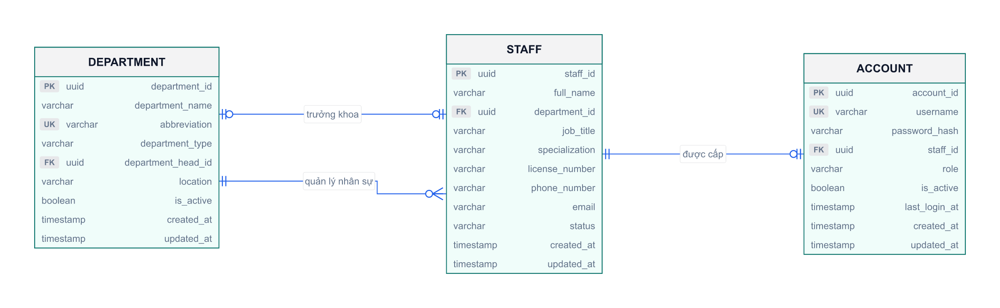

[SVG dùng cho Word](assets/diagrams/word-svg/02-erd-organization.svg) · [PNG 2400 px](assets/diagrams/png/02-erd-organization.png) · [Nguồn Mermaid](assets/diagrams/src/02-erd-organization.mmd)

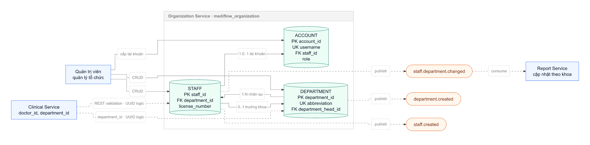

[SVG dùng cho Word](assets/diagrams/word-svg/18-erd-flow-organization.svg) · [PNG 2400 px](assets/diagrams/png/18-erd-flow-organization.png) · [Nguồn Mermaid](assets/diagrams/src/18-erd-flow-organization.mmd)

#### 2.3.2. Patient database

**Dữ liệu sở hữu:** `PATIENT`.

**Luồng chính:** tiếp nhận tạo/cập nhật thông tin hành chính; Clinical xác minh bệnh nhân bằng REST; Lab, Pharmacy, Billing và Notification lưu `patient_id` dưới dạng UUID logic; Patient phát `patient.created`, `patient.updated`.

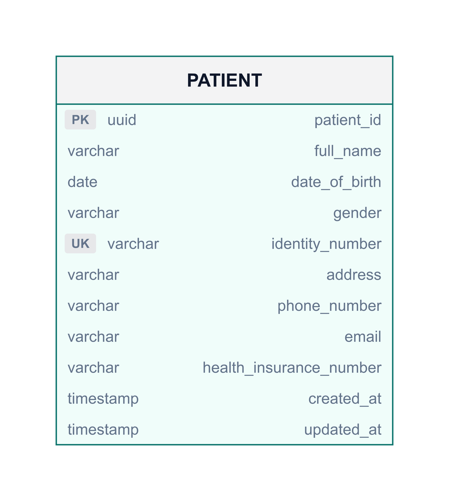

[SVG dùng cho Word](assets/diagrams/word-svg/03-erd-patient.svg) · [PNG 2400 px](assets/diagrams/png/03-erd-patient.png) · [Nguồn Mermaid](assets/diagrams/src/03-erd-patient.mmd)

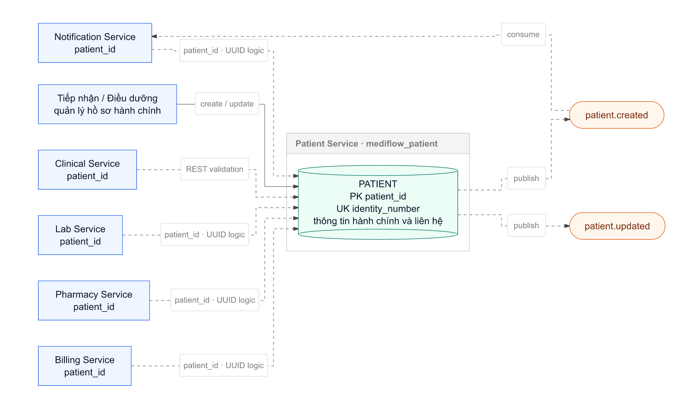

[SVG dùng cho Word](assets/diagrams/word-svg/19-erd-flow-patient.svg) · [PNG 2400 px](assets/diagrams/png/19-erd-flow-patient.png) · [Nguồn Mermaid](assets/diagrams/src/19-erd-flow-patient.mmd)

#### 2.3.3. Clinical database

**Dữ liệu sở hữu V1:** `APPOINTMENT`, `MEDICAL_RECORD`, `DIAGNOSIS`.

**Luồng chính:** xác minh Patient/Organization; tạo lịch hẹn, hồ sơ và chẩn đoán; nhận `lab.result.created`, `prescription.filled`; phát `appointment.created`, `appointment.status.changed`, `medicalrecord.created`, `diagnosis.added`.

> `ATTACHED_RESULT` và sổ khử trùng lặp trong sơ đồ luồng là phần mở rộng V2 đã được backend spec yêu cầu cho việc nhận kết quả ngoài. Chúng không được tính vào ba bảng vật lý V1 hiện hành.

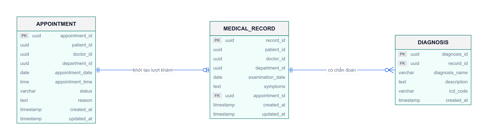

[SVG dùng cho Word](assets/diagrams/word-svg/04-erd-clinical.svg) · [PNG 2400 px](assets/diagrams/png/04-erd-clinical.png) · [Nguồn Mermaid](assets/diagrams/src/04-erd-clinical.mmd)

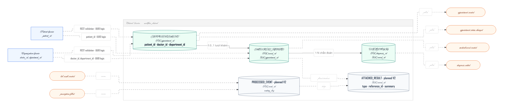

[SVG dùng cho Word](assets/diagrams/word-svg/20-erd-flow-clinical.svg) · [PNG 2400 px](assets/diagrams/png/20-erd-flow-clinical.png) · [Nguồn Mermaid](assets/diagrams/src/20-erd-flow-clinical.mmd)

#### 2.3.4. Lab database

**Dữ liệu sở hữu:** `LAB_TEST`, `LAB_RESULT`, `PROCESSED_EVENT`.

**Luồng chính:** nhận `medicalrecord.created` và `payment.completed`; liên kết logic tới Clinical, Patient, Organization; tạo chỉ định/kết quả; phát `lab.request.created`, `lab.result.created` cho các consumer liên quan.

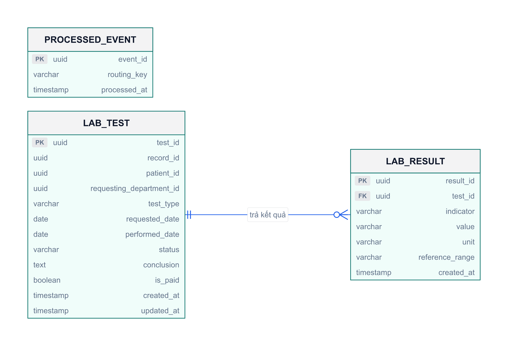

[SVG dùng cho Word](assets/diagrams/word-svg/05-erd-lab.svg) · [PNG 2400 px](assets/diagrams/png/05-erd-lab.png) · [Nguồn Mermaid](assets/diagrams/src/05-erd-lab.mmd)

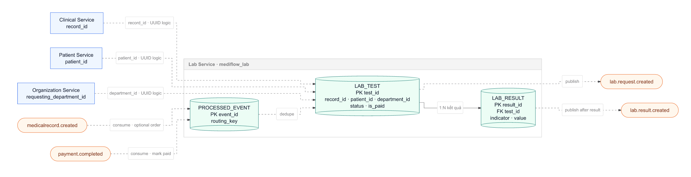

[SVG dùng cho Word](assets/diagrams/word-svg/21-erd-flow-lab.svg) · [PNG 2400 px](assets/diagrams/png/21-erd-flow-lab.png) · [Nguồn Mermaid](assets/diagrams/src/21-erd-flow-lab.mmd)

#### 2.3.5. Pharmacy database

**Dữ liệu sở hữu:** `DRUG`, `PRESCRIPTION`, `PRESCRIPTION_LINE`, `DISPENSE_SLIP`, `STOCK_RESERVATION`, `PROCESSED_EVENT`.

**Luồng chính:** nhận lệnh kê đơn và `payment.completed`; giữ/trừ tồn kho; phát `prescription.created`, `prescription.filled`, `prescription.dispense.failed`, `stock.low`; nhánh thất bại kích hoạt bù trừ tại Billing.

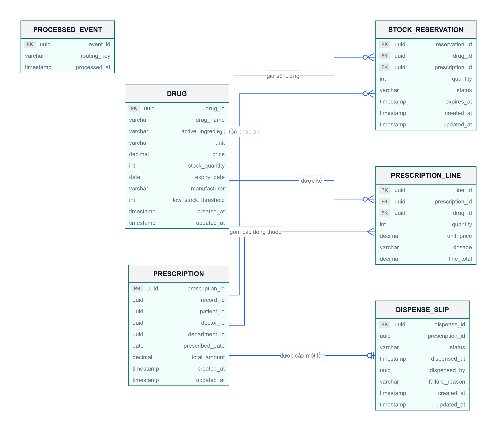

[SVG dùng cho Word](assets/diagrams/word-svg/06-erd-pharmacy.svg) · [PNG 2400 px](assets/diagrams/png/06-erd-pharmacy.png) · [Nguồn Mermaid](assets/diagrams/src/06-erd-pharmacy.mmd)

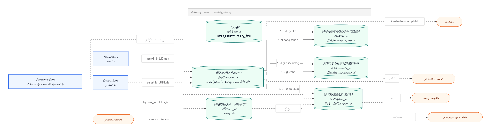

[SVG dùng cho Word](assets/diagrams/word-svg/22-erd-flow-pharmacy.svg) · [PNG 2400 px](assets/diagrams/png/22-erd-flow-pharmacy.png) · [Nguồn Mermaid](assets/diagrams/src/22-erd-flow-pharmacy.mmd)

#### 2.3.6. Billing database

**Dữ liệu sở hữu:** `FEE`, `INVOICE`, `PROCESSED_EVENT`.

**Luồng chính:** nhận sáu event từ Clinical, Lab và Pharmacy để tạo phí hoặc chuyển saga; lập/thanh toán hóa đơn; phát `invoice.created`, `payment.completed`, `payment.failed`. Tất cả liên kết tới bệnh nhân, hồ sơ, khoa, đơn thuốc và phiếu xuất đều là UUID logic.

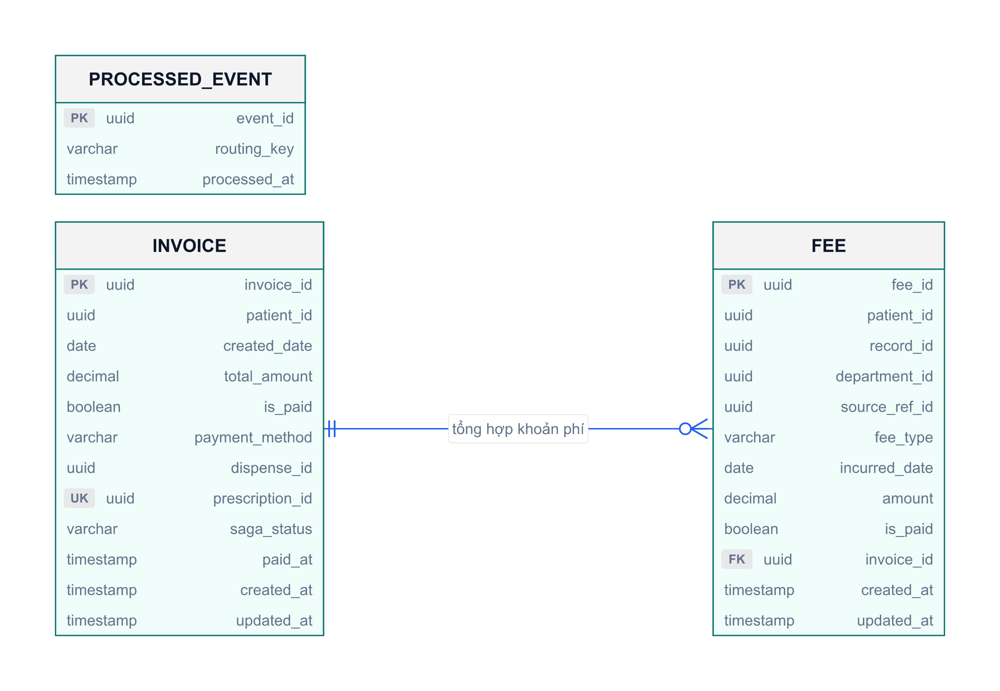

[SVG dùng cho Word](assets/diagrams/word-svg/07-erd-billing.svg) · [PNG 2400 px](assets/diagrams/png/07-erd-billing.png) · [Nguồn Mermaid](assets/diagrams/src/07-erd-billing.mmd)

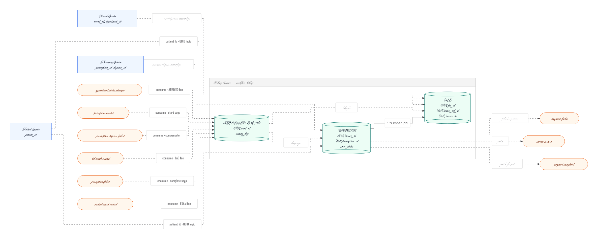

[SVG dùng cho Word](assets/diagrams/word-svg/23-erd-flow-billing.svg) · [PNG 2400 px](assets/diagrams/png/23-erd-flow-billing.png) · [Nguồn Mermaid](assets/diagrams/src/23-erd-flow-billing.mmd)

#### 2.3.7. Notification database

**Dữ liệu sở hữu:** `NOTIFICATION`, `PROCESSED_EVENT`.

**Luồng chính:** một queue nhận `patient.created`, `appointment.created`, `lab.result.created`, `prescription.filled`, `payment.completed`, `payment.failed`; consumer chống trùng, lưu thông báo, chọn Email/SMS/In-app và phát `notification.sent` với trạng thái cuối.

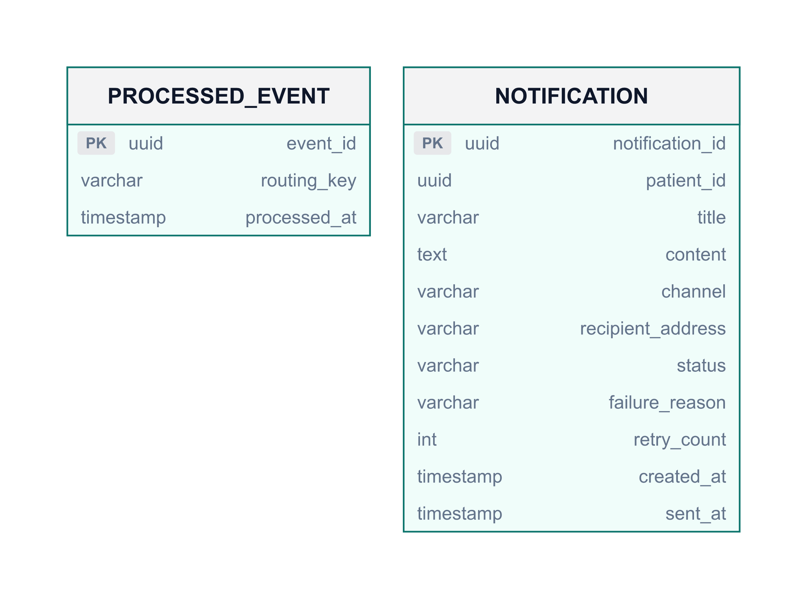

[SVG dùng cho Word](assets/diagrams/word-svg/08-erd-notification.svg) · [PNG 2400 px](assets/diagrams/png/08-erd-notification.png) · [Nguồn Mermaid](assets/diagrams/src/08-erd-notification.mmd)

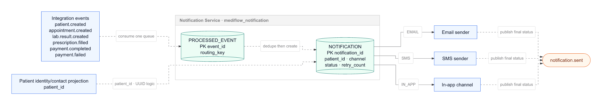

[SVG dùng cho Word](assets/diagrams/word-svg/24-erd-flow-notification.svg) · [PNG 2400 px](assets/diagrams/png/24-erd-flow-notification.png) · [Nguồn Mermaid](assets/diagrams/src/24-erd-flow-notification.mmd)

#### 2.3.8. Report database

**Dữ liệu sở hữu:** `DAILY_VISIT_REPORT`, `MONTHLY_REVENUE_REPORT`, `DRUG_STATISTIC`, `PROCESSED_EVENT`.

**Luồng chính:** nhận sáu event nghiệp vụ để cập nhật read model theo khoa và toàn viện; `department_id`, `drug_id` là chiều dữ liệu logic; Report không gọi REST và không truy cập database nguồn; service không phát event ra ngoài.

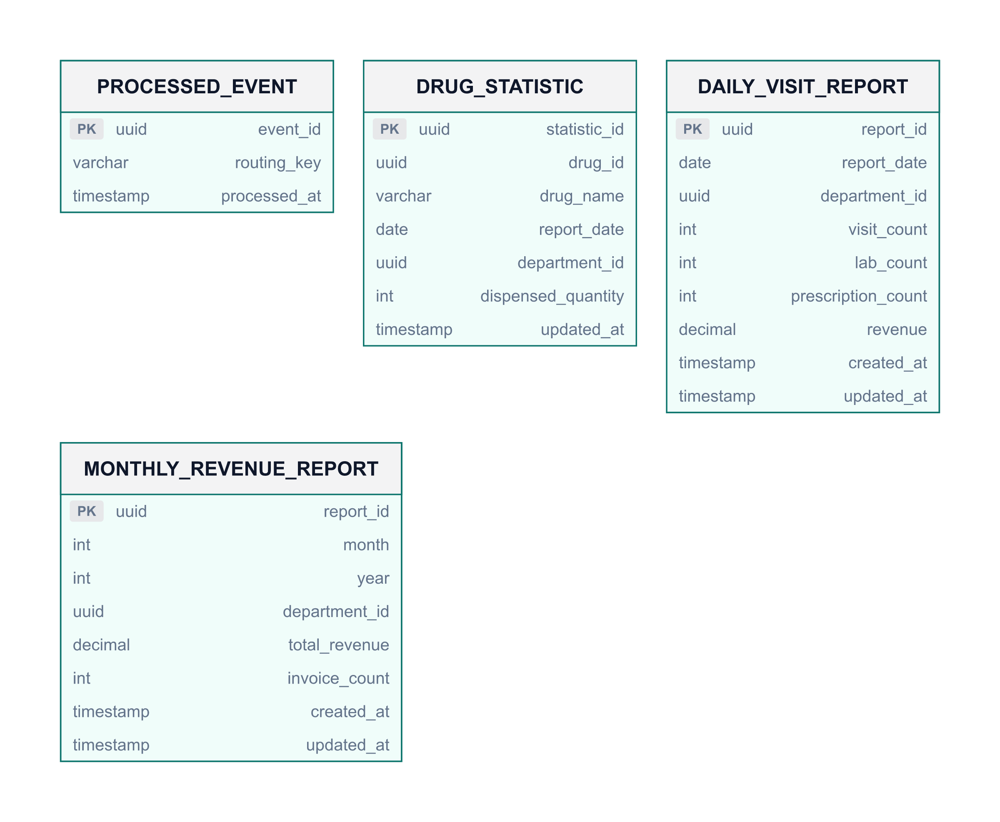

[SVG dùng cho Word](assets/diagrams/word-svg/09-erd-report.svg) · [PNG 2400 px](assets/diagrams/png/09-erd-report.png) · [Nguồn Mermaid](assets/diagrams/src/09-erd-report.mmd)

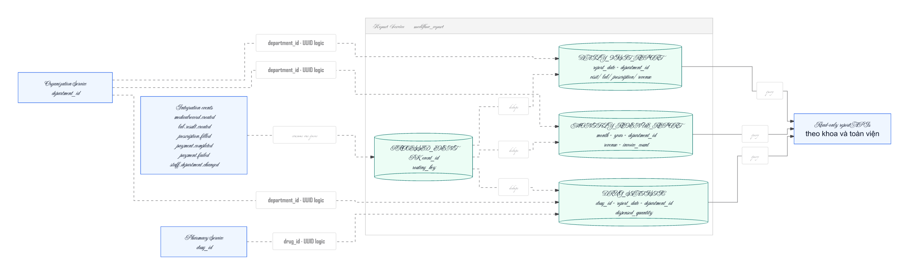

[SVG dùng cho Word](assets/diagrams/word-svg/25-erd-flow-report.svg) · [PNG 2400 px](assets/diagrams/png/25-erd-flow-report.png) · [Nguồn Mermaid](assets/diagrams/src/25-erd-flow-report.mmd)

#### 2.3.9. ERD tổng quan toàn hệ thống

Sơ đồ tổng quan đặt tám database trong tám bounded context riêng. Quan hệ liền chỉ tồn tại bên trong một database; các đường xuyên service là UUID/REST logic hoặc integration event và tuyệt đối không phải khóa ngoại vật lý.

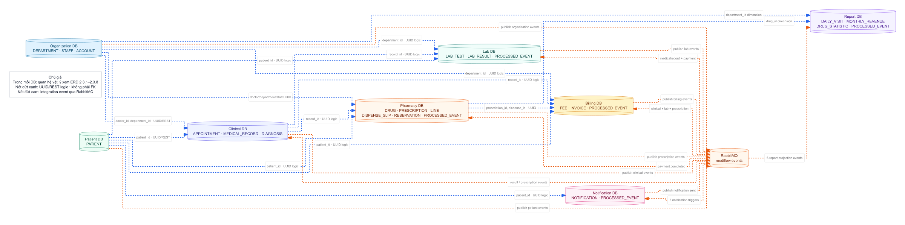

[SVG dùng cho Word](assets/diagrams/word-svg/26-erd-system-overview.svg) · [PNG 2400 px](assets/diagrams/png/26-erd-system-overview.png) · [Nguồn Mermaid](assets/diagrams/src/26-erd-system-overview.mmd)

### 2.4. DDL

#### Quy chuẩn DDL

- Tên vật lý trong tài liệu dùng tiếng Anh; bảng dùng `UPPER_SNAKE_CASE` và cột dùng `snake_case`. Đây là chuẩn hóa hồ sơ thiết kế, chưa phải migration dữ liệu của môi trường đang chạy.
- PostgreSQL, mỗi service có database riêng.
- Khóa chính dùng `UUID`; tiền dùng `NUMERIC(19,2)`; ngày giờ sự kiện dùng `TIMESTAMPTZ`.
- Bảng nghiệp vụ có `created_at`, `updated_at`; các thay đổi quan trọng có thông tin người thực hiện khi nghiệp vụ yêu cầu.
- Ràng buộc `NOT NULL`, `UNIQUE`, `CHECK` và index phải phản ánh đúng business rule.
- DDL được quản lý bằng migration có phiên bản; ứng dụng dùng `ddl-auto=validate` thay vì tự sửa schema.
- Không tạo khóa ngoại hoặc câu lệnh join sang database của service khác.

Mẫu DDL chuẩn hóa:

```sql
CREATE EXTENSION IF NOT EXISTS "pgcrypto";

CREATE TABLE TABLE_NAME (
    id          UUID PRIMARY KEY DEFAULT gen_random_uuid(),
    -- Các cột nghiệp vụ sử dụng snake_case.
    created_at  TIMESTAMPTZ NOT NULL DEFAULT NOW(),
    updated_at  TIMESTAMPTZ NOT NULL DEFAULT NOW()
);

CREATE INDEX idx_table_name_searchable_field
    ON TABLE_NAME (searchable_field);
```

Nguồn DDL chi tiết theo service:

| Service | Đặc tả DDL | Trạng thái đóng gói migration |
|---|---|---|
| Organization | [01-organization.md](../../eproject_general_plan/backend-spec/01-organization.md) | Cần tách thành migration V1 |
| Patient | [02-patient.md](../../eproject_general_plan/backend-spec/02-patient.md) | Cần tách thành migration V1 |
| Clinical | [03-clinical.md](../../eproject_general_plan/backend-spec/03-clinical.md) | Cần tách thành migration V1 |
| Lab | [04-lab.md](../../eproject_general_plan/backend-spec/04-lab.md) | Cần tách thành migration V1 |
| Pharmacy | [05-pharmacy.md](../../eproject_general_plan/backend-spec/05-pharmacy.md) | Đã có migration nền; phải đối chiếu lại với baseline hiện hành |
| Billing | [06-billing.md](../../eproject_general_plan/backend-spec/06-billing.md) | Cần tách thành migration V1 |
| Notification | [07-notification.md](../../eproject_general_plan/backend-spec/07-notification.md) | Cần tách thành migration V1 |
| Report | [08-report.md](../../eproject_general_plan/backend-spec/08-report.md) | Cần tách thành migration V1 |

Điều kiện nghiệm thu DDL: tám database PostgreSQL mới phải chạy migration thành công; danh sách bảng, cột, khóa, check constraint và index phải khớp ERD; dữ liệu mẫu tối thiểu phải được tạo và truy vấn được.

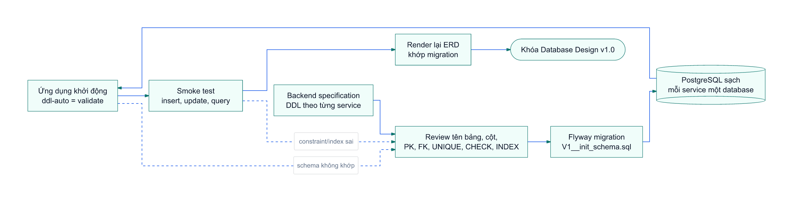

[SVG dùng cho Word](assets/diagrams/word-svg/11-quy-trinh-ddl.svg) · [PNG 2400 px](assets/diagrams/png/11-quy-trinh-ddl.png) · [Nguồn Mermaid](assets/diagrams/src/11-quy-trinh-ddl.mmd)

---

## 3. Thiết kế kiến trúc hệ thống sơ bộ (System Architecture Design)

### 3.1. Sơ đồ tổng quan

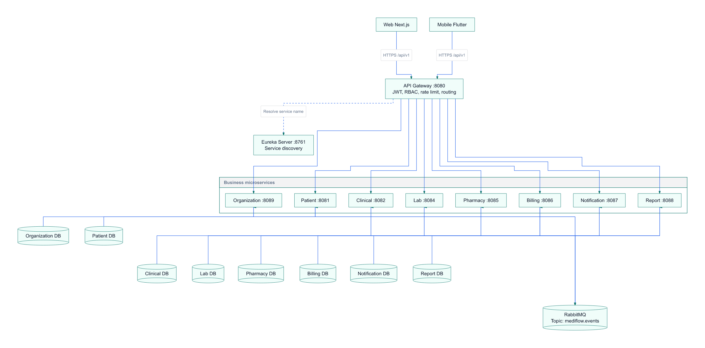

[SVG dùng cho Word](assets/diagrams/word-svg/01-kien-truc-he-thong.svg) · [PNG 2400 px](assets/diagrams/png/01-kien-truc-he-thong.png) · [Nguồn Mermaid](assets/diagrams/src/01-kien-truc-he-thong.mmd)

### 3.2. Trách nhiệm các thành phần

| Thành phần | Trách nhiệm chính | Không được thực hiện |
|---|---|---|
| Web Next.js | Giao diện nghiệp vụ dạng bảng, form, dashboard; gọi API cùng nguồn qua `/api/*` | Không gọi trực tiếp cổng microservice; không tự quyết định quyền nghiệp vụ |
| Mobile Flutter | Trải nghiệm theo vai trò trên thiết bị di động; lưu JWT bằng SecureStorage | Không truy cập database hoặc cổng dịch vụ trực tiếp |
| API Gateway | Điểm vào duy nhất; xác thực JWT, định tuyến, correlation ID và rate limit | Không chứa nghiệp vụ của bệnh viện |
| Eureka Server | Đăng ký và phân giải instance dịch vụ | Không vận chuyển event hoặc lưu dữ liệu nghiệp vụ |
| Business services | Thực hiện use case trong bounded context và sở hữu database tương ứng | Không truy cập repository hoặc database của service khác |
| RabbitMQ | Vận chuyển integration event qua topic exchange | Không thay thế database hoặc chứa logic nghiệp vụ |
| Report service | Xây read model từ event để truy vấn báo cáo nhanh | Không join trực tiếp database nguồn |
| Billing service | Điều phối saga thanh toán - cấp thuốc và bù trừ | Không mở transaction phân tán qua nhiều service |

### 3.3. Giao tiếp liên dịch vụ

Chỉ sử dụng hai kiểu giao tiếp:

1. **REST đồng bộ:** dùng khi cần câu trả lời tức thời để hoàn tất request hiện tại, ví dụ xác minh bệnh nhân, bác sĩ hoặc khoa. Lời gọi đi qua tên service do Eureka phân giải, connect timeout 2 giây, read timeout 3 giây, có circuit breaker và fallback.
2. **Event bất đồng bộ:** dùng khi service thay đổi trạng thái của mình và các service khác cần phản ứng. Event được phát sau commit, consumer idempotent, có retry giới hạn và DLQ.

### 3.4. Danh mục sự kiện tích hợp

Exchange dùng chung: `mediflow.events`, loại `topic`, durable. Mỗi consumer có queue bền riêng, dead-letter exchange `mediflow.events.dlx` và DLQ riêng.

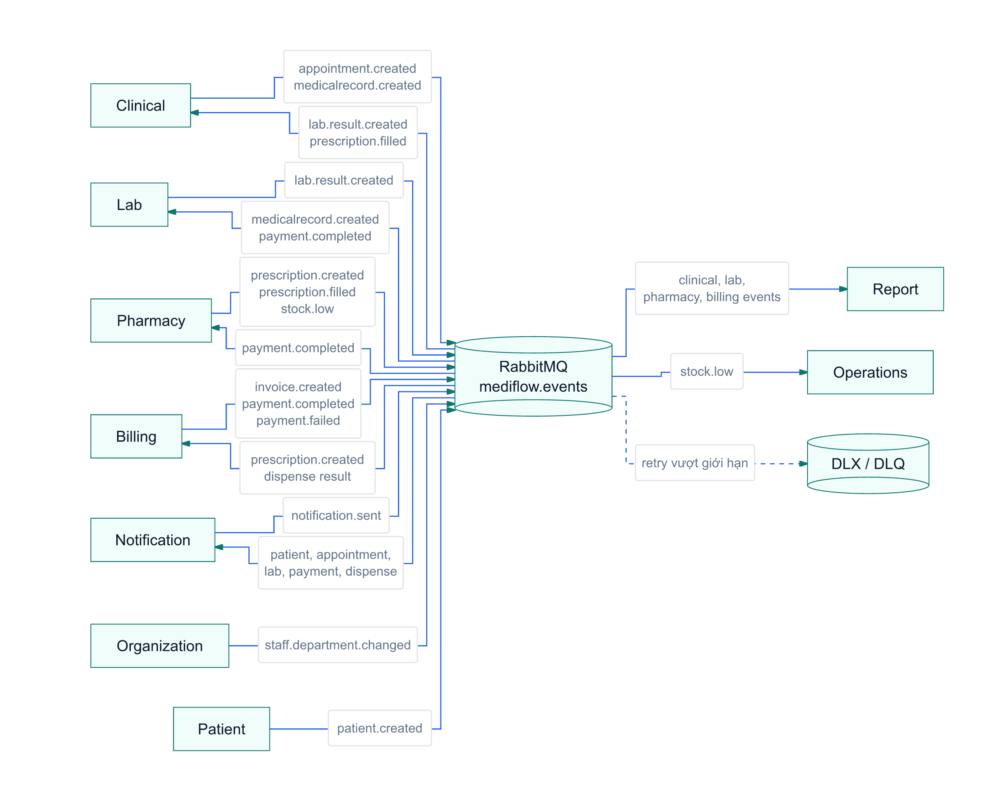

[SVG dùng cho Word](assets/diagrams/word-svg/10-topology-su-kien.svg) · [PNG 2400 px](assets/diagrams/png/10-topology-su-kien.png) · [Nguồn Mermaid](assets/diagrams/src/10-topology-su-kien.mmd)

| Event | Publisher | Subscriber chính |
|---|---|---|
| `department.created` | Organization | Chưa có subscriber bắt buộc |
| `staff.created` | Organization | Chưa có subscriber bắt buộc |
| `staff.department.changed` | Organization | Report |
| `patient.created` | Patient | Notification |
| `patient.updated` | Patient | Chưa có subscriber bắt buộc |
| `appointment.created` | Clinical | Notification |
| `appointment.status.changed` | Clinical | Billing |
| `medicalrecord.created` | Clinical | Lab, Billing, Report |
| `diagnosis.added` | Clinical | Chưa có subscriber bắt buộc |
| `lab.request.created` | Lab | Chưa có subscriber bắt buộc |
| `lab.result.created` | Lab | Clinical, Billing, Notification, Report |
| `prescription.created` | Pharmacy | Billing |
| `prescription.filled` | Pharmacy | Clinical, Notification, Report |
| `stock.low` | Pharmacy | Notification / Vận hành |
| `invoice.created` | Billing | Chưa có subscriber bắt buộc |
| `payment.completed` | Billing | Pharmacy, Lab, Notification, Report |
| `payment.failed` | Billing | Notification và nhánh bù trừ |
| `notification.sent` | Notification | Chưa có subscriber bắt buộc |

Mọi event phải có `eventId`, `occurredAt`, `correlationId`, `eventType`, `version` và payload. Sự kiện thất bại cấp thuốc (`prescription.dispense.failed`) phải được bổ sung chính thức vào catalog trước khi khóa Design v1.0.

### 3.5. Các yêu cầu kiến trúc bắt buộc

- Xác thực tại Gateway và xác minh lại JWT tại mỗi service; endpoint mặc định từ chối khi chưa khai báo quyền.
- Mỗi thay đổi trạng thái phải phát event phù hợp sau khi giao dịch database cục bộ thành công.
- Không có transaction phân tán; quy trình nhiều service dùng saga và compensation.
- Log của request và event phải mang cùng correlation ID.
- API dùng `/api/v1` và response envelope thống nhất.
- Mỗi service cung cấp health check; cấu hình và secret nằm ngoài mã nguồn.

---

## 4. Tổng quan quy trình nghiệp vụ (Business Flowchart)

### 4.1. Luồng xử lý nghiệp vụ tổng quát

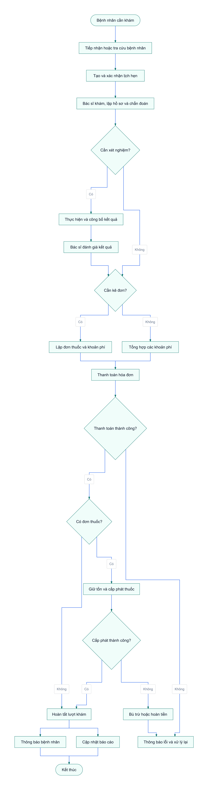

[SVG dùng cho Word](assets/diagrams/word-svg/12-luong-nghiep-vu-tong-quat.svg) · [PNG 2400 px](assets/diagrams/png/12-luong-nghiep-vu-tong-quat.png) · [Nguồn Mermaid](assets/diagrams/src/12-luong-nghiep-vu-tong-quat.mmd)

| Chặng nghiệp vụ | Vai trò chính | Dịch vụ chịu trách nhiệm | Đầu ra |
|---|---|---|---|
| Tiếp nhận | Điều dưỡng | Patient | Hồ sơ bệnh nhân duy nhất |
| Xếp lịch | Điều dưỡng | Clinical | Lịch hẹn hợp lệ |
| Khám bệnh | Bác sĩ | Clinical | Hồ sơ và chẩn đoán |
| Xét nghiệm | Bác sĩ, kỹ thuật viên | Lab | Kết quả xét nghiệm được công bố |
| Kê đơn | Bác sĩ | Pharmacy | Đơn thuốc hợp lệ |
| Thanh toán | Thu ngân | Billing | Hóa đơn đã thanh toán hoặc thất bại rõ ràng |
| Cấp thuốc | Dược sĩ | Pharmacy | Phiếu cấp phát và tồn kho được cập nhật |
| Thông báo | Hệ thống | Notification | Lịch sử thông báo theo bệnh nhân |
| Báo cáo | Quản lý | Report | Chỉ số tổng hợp theo ngày, tháng, khoa và thuốc |

### 4.2. Luồng xử lý nghiệp vụ chi tiết (Microservices)

#### 4.2.1. Tiếp nhận bệnh nhân và tạo lịch hẹn

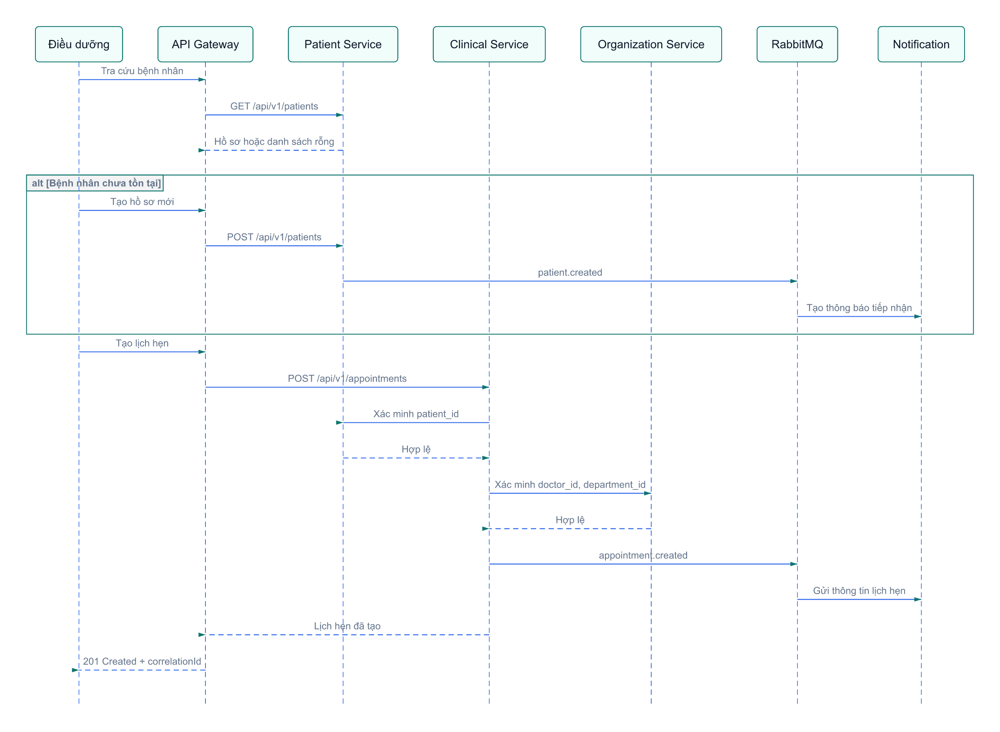

[SVG dùng cho Word](assets/diagrams/word-svg/13-sequence-tiep-nhan-lich-hen.svg) · [PNG 2400 px](assets/diagrams/png/13-sequence-tiep-nhan-lich-hen.png) · [Nguồn Mermaid](assets/diagrams/src/13-sequence-tiep-nhan-lich-hen.mmd)

Nhánh ngoại lệ: trùng định danh bệnh nhân, khoa/bác sĩ không tồn tại, thời gian khám không hợp lệ hoặc lịch đã bị thay đổi. Hệ thống không tạo dữ liệu một phần khi validation thất bại.

#### 4.2.2. Khám bệnh và xét nghiệm

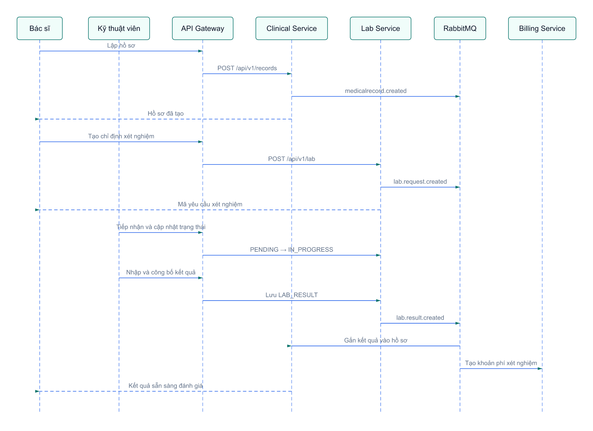

[SVG dùng cho Word](assets/diagrams/word-svg/14-sequence-kham-xet-nghiem.svg) · [PNG 2400 px](assets/diagrams/png/14-sequence-kham-xet-nghiem.png) · [Nguồn Mermaid](assets/diagrams/src/14-sequence-kham-xet-nghiem.mmd)

Nhánh ngoại lệ: trạng thái xét nghiệm không cho phép cập nhật, kết quả thiếu trường bắt buộc, event bị giao lại hoặc event đến muộn. Consumer phải khử trùng lặp theo `eventId`.

#### 4.2.3. Kê đơn, thanh toán và cấp phát thuốc

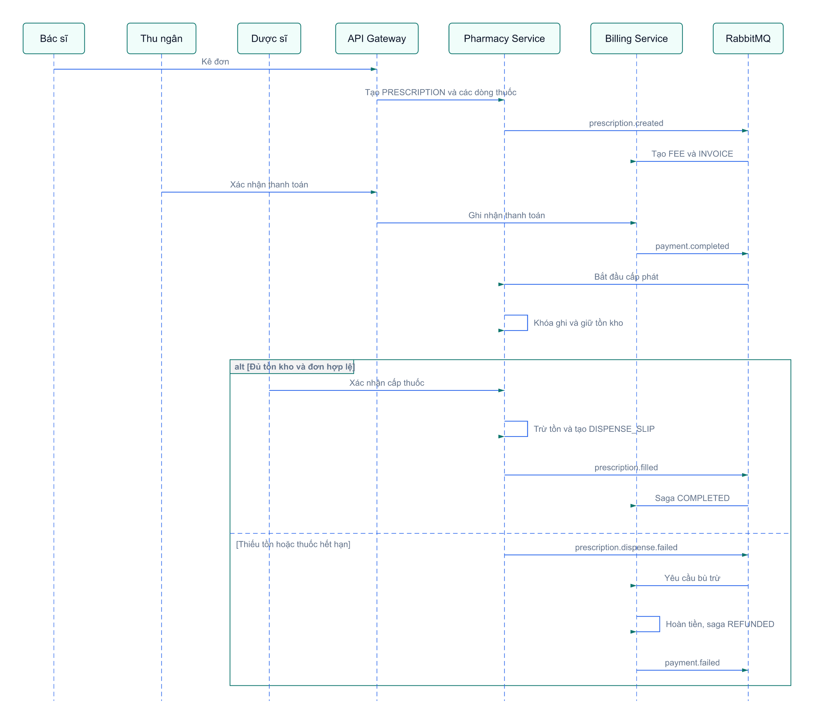

[SVG dùng cho Word](assets/diagrams/word-svg/15-sequence-thanh-toan-cap-thuoc.svg) · [PNG 2400 px](assets/diagrams/png/15-sequence-thanh-toan-cap-thuoc.png) · [Nguồn Mermaid](assets/diagrams/src/15-sequence-thanh-toan-cap-thuoc.mmd)

Quy tắc nhất quán: không để tồn kho âm, không cấp một đơn hai lần, mỗi bước là local transaction, Billing theo dõi trạng thái saga và mọi hành động bù trừ phải có audit log.

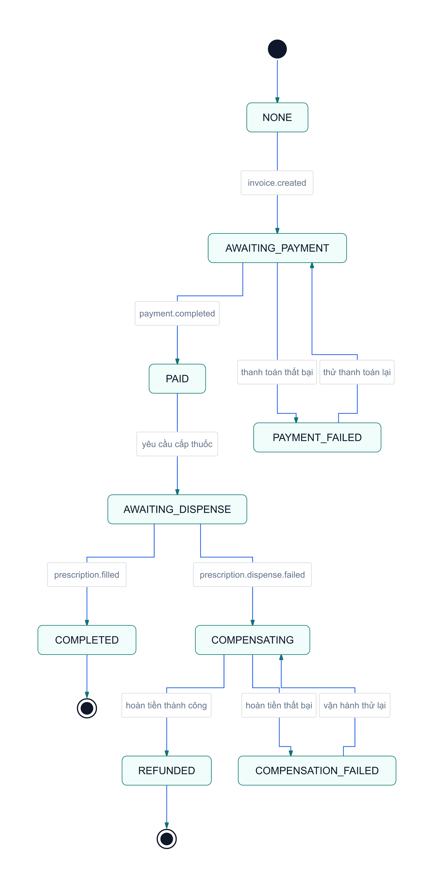

[SVG dùng cho Word](assets/diagrams/word-svg/16-vong-doi-saga.svg) · [PNG 2400 px](assets/diagrams/png/16-vong-doi-saga.png) · [Nguồn Mermaid](assets/diagrams/src/16-vong-doi-saga.mmd)

#### 4.2.4. Thông báo và báo cáo

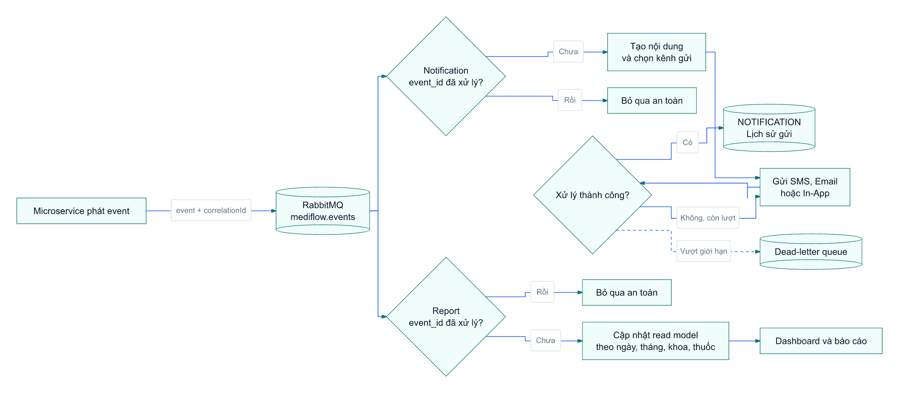

[SVG dùng cho Word](assets/diagrams/word-svg/17-luong-thong-bao-bao-cao.svg) · [PNG 2400 px](assets/diagrams/png/17-luong-thong-bao-bao-cao.png) · [Nguồn Mermaid](assets/diagrams/src/17-luong-thong-bao-bao-cao.mmd)

- Notification chỉ trả thông báo đúng chủ sở hữu bệnh nhân hoặc phạm vi vai trò.
- Report chấp nhận eventual consistency và phải có cơ chế rebuild read model.
- Message lỗi tạm thời được retry có giới hạn; poison message được chuyển DLQ để vận hành xử lý.
- Event trùng không được tạo thông báo kép hoặc cộng số liệu hai lần.

---

## 5. Điều kiện khóa bản thiết kế Giai đoạn 2

- [ ] Bảng màu, typography và layout được nhóm Web/Mobile duyệt chung.
- [ ] Wireframe Web và Mobile bao phủ các luồng trong Mục 4.
- [ ] Danh sách 25 bảng hiện hành được đồng bộ giữa backend spec, ERD và migration.
- [ ] Tám bộ migration chạy thành công trên tám database PostgreSQL sạch.
- [ ] Tên bảng/cột được chốt thống nhất theo quy chuẩn dữ liệu của dự án.
- [ ] `prescription.dispense.failed` và các routing key được bổ sung vào event catalog chính thức.
- [ ] Event payload, version, idempotency, retry và DLQ có contract kiểm thử được.
- [ ] Sơ đồ ERD, kiến trúc và business flow có version, ngày duyệt và người duyệt.

## 6. Tài liệu tham chiếu

- [Kế hoạch giáo viên](../TeacherPlans.docx)
- [Kế hoạch dự án MediFlow](../../plan/KeHoachDuAnMediFlow.docx)
- [GUI Standards và wireframe bản nháp](../gui-standards-wireframes-draft.md)
- [Rà soát ERD, DDL và events](../erd-ddl-events-audit.md)
- [Bộ ERD MediFlow](../../eproject_general_plan/erd/README.md)
- [Backend implementation-ready specifications](../../eproject_general_plan/backend-spec/README.md)
- [Quy chuẩn kiến trúc](../../ai/01-architecture.md)
- [Quy chuẩn event RabbitMQ](../../ai/06-events-rabbitmq.md)
- [Quy chuẩn Frontend Next.js](../../ai/12-frontend.md)
- [Quy chuẩn Mobile Flutter](../../ai/14-flutter.md)
