# MediFlow — Review 2: Architecture, Data and Interface Design

[Vietnamese edition](02-review-2-standard-vi.md)

| Item | Description |
|---|---|
| Project | MediFlow: A Microservices-Based Hospital Information System for Outpatient Care Management |
| Review | Review 2 |
| Baseline | 2026-10-19 · source commit `26232b54813d` + this documentation revision |
| Scope | Outpatient MVP; retained inpatient/surgery source remains deferred |
| Status | Source-backed design review; not a runtime acceptance certificate |

This report follows Review 1’s bilingual report format and updates its historical snapshot. Review 1 still mentions 12 modules and no Support host: the current root reactor has **13 modules**, default Compose has **6 business deployments** and **8 active context stores**. Gateway/Eureka are infrastructure, common is a library; Report/Notification are composed into Support and retain rollback launchers.

Status convention: **SOURCE** = present in source/config; **GATED** = requires the correct profile/contract/activation; **DEFERRED** = retained outside the MVP. Diagrams describe the stated contract mode and do not assert that every path passed on the current environment. Backend suites and live databases were not rerun for this documentation task.

## Diagram conventions

All diagrams use **MediFlow Sky/Teal**: white background, slate text `#0f172a`, blue nodes `#e0f2fe`, borders `#0284c7`, and teal accents `#ccfbf1`. Every Mermaid block carries the same configuration. Solid architecture edges represent direct requests; dashed edges represent messaging/discovery. ERDs show store-local foreign keys; cross-context UUID references are documented separately.

SVG previews are provided for direct reading; expand each Mermaid block to edit its source. Use cases use Mermaid flowcharts with SVG stick-figure actors and rounded use-case nodes for Mermaid 11 compatibility. Technology logos come from Devicon, bundled for offline rendering; Mermaid source retains CDN URLs. Readers blocking HTML/external images may hide logos or actors: use the bundled SVG preview. See [Mermaid flowchart syntax](https://mermaid.js.org/syntax/flowchart.html).

## 1. Architecture Design

### 1.1. System / Application Architecture

### System architecture — one backend boundary, six business services



Mermaid · 01-en

```mermaid
%%{init: {"theme": "base", "securityLevel": "loose", "fontFamily": "Arial, sans-serif", "themeVariables": {"primaryColor": "#e0f2fe", "primaryTextColor": "#0f172a", "primaryBorderColor": "#0284c7", "lineColor": "#475569", "secondaryColor": "#ccfbf1", "tertiaryColor": "#f1f5f9", "background": "#ffffff", "mainBkg": "#e0f2fe", "nodeBorder": "#0284c7", "clusterBkg": "#f8fafc", "clusterBorder": "#94a3b8", "actorBkg": "#e0f2fe", "actorBorder": "#0284c7", "actorTextColor": "#0f172a", "signalColor": "#475569", "signalTextColor": "#0f172a", "labelBoxBkgColor": "#f1f5f9", "labelBoxBorderColor": "#94a3b8", "activationBkgColor": "#ccfbf1", "activationBorderColor": "#0f766e", "sequenceNumberColor": "#ffffff", "attributeBackgroundColorOdd": "#ffffff", "attributeBackgroundColorEven": "#f0f9ff"}, "flowchart": {"htmlLabels": true, "curve": "linear", "nodeSpacing": 40, "rankSpacing": 46, "subGraphTitleMargin": {"top": 12, "bottom": 45}}, "sequence": {"useMaxWidth": true, "wrap": true, "actorMargin": 55, "width": 175, "messageMargin": 30, "mirrorActors": false}, "er": {"useMaxWidth": true}, "maxTextSize": 2000000, "class": {"nodeSpacing": 30, "rankSpacing": 55}}}%%
flowchart LR
 subgraph CLIENT["Client side"]
  WEB["<img src='' width='32' height='32'/><br/><img src='https://cdn.jsdelivr.net/gh/devicons/devicon@v2.17.0/icons/nextjs/nextjs-original.svg' width='28' height='28'/> <img src='https://cdn.jsdelivr.net/gh/devicons/devicon@v2.17.0/icons/react/react-original.svg' width='28' height='28'/> Next.js / React / TypeScript / Tailwind"]
  MOBILE["<img src='' width='32' height='32'/><br/><img src='https://cdn.jsdelivr.net/gh/devicons/devicon@v2.17.0/icons/flutter/flutter-original.svg' width='28' height='28'/> <img src='https://cdn.jsdelivr.net/gh/devicons/devicon@v2.17.0/icons/dart/dart-original.svg' width='28' height='28'/> Flutter / Dart"]
 end
 subgraph SERVER["<img src='' width='32' height='32'/> Server side — MediFlow backend"]
  GW["<img src='https://cdn.jsdelivr.net/gh/devicons/devicon@v2.17.0/icons/spring/spring-original.svg' width='28' height='28'/> API Gateway<br/>JWT / route authorization"]
  subgraph SERVICES["Independently deployed business applications"]
   CORE["Core<br/>Organization + Patient"]
   CL["Clinical<br/>Appointments / consultation"]
   LAB["Lab<br/>Tests / results"]
   PH["Pharmacy<br/>Prescriptions / stock / dispensing"]
   BI["Billing<br/>Charges / payment / clearance"]
   SU["Support<br/>Report + Notification"]
  end
  MQ["<img src='https://cdn.jsdelivr.net/gh/devicons/devicon@v2.17.0/icons/rabbitmq/rabbitmq-original.svg' width='28' height='28'/> RabbitMQ<br/>Domain events / retry / DLQ"]
  EU["<img src='https://cdn.jsdelivr.net/gh/devicons/devicon@v2.17.0/icons/spring/spring-original.svg' width='28' height='28'/> Eureka<br/>Service registry"]
  subgraph STORES["<img src='https://cdn.jsdelivr.net/gh/devicons/devicon@v2.17.0/icons/postgresql/postgresql-original.svg' width='28' height='28'/> Context-owned data — no cross-service SQL"]
   DCORE[(Organization DB + Patient DB)]
   DCL[(Clinical DB)]
   DLAB[(Lab DB)]
   DPH[(Pharmacy DB)]
   DBI[(Billing DB)]
   DSU[(Report DB + Notification DB)]
  end
 end
 WEB <-->|HTTP request /api / JSON response| GW
 MOBILE <-->|HTTP request / JSON response| GW
 GW <-->|HTTP request / response| CORE & CL & LAB & PH & BI & SU
 CL <-->|Authorized identity lookup| CORE
 LAB <-->|Clinical order context via REST| CL
 PH <-->|Clinical prescription context via REST| CL
 CORE --- DCORE
 CL --- DCL
 LAB --- DLAB
 PH --- DPH
 BI --- DBI
 SU --- DSU
 CORE & CL & LAB & PH & BI -.->|Publish committed facts| MQ
 MQ -.->|Deliver to subscribed consumers| CL & LAB & PH & BI & SU
 SERVICES -.->|Register / discover| EU
```

One Server side boundary groups six business applications; it does not mean one backend process. Core and Support each compose two contexts with separate persistence authorities. Broker edges show configured producer/consumer capabilities, not all-to-all delivery. Next.js web hosting and same-origin /api rewrite are deployment details: frontend/next.config.ts still configures the rewrite and production standalone output. They are not a second business backend. Docker Compose orchestrates local infrastructure; no service ports or deferred Inpatient/Surgery are shown.

### Technology and tooling architecture



Mermaid · 02-en

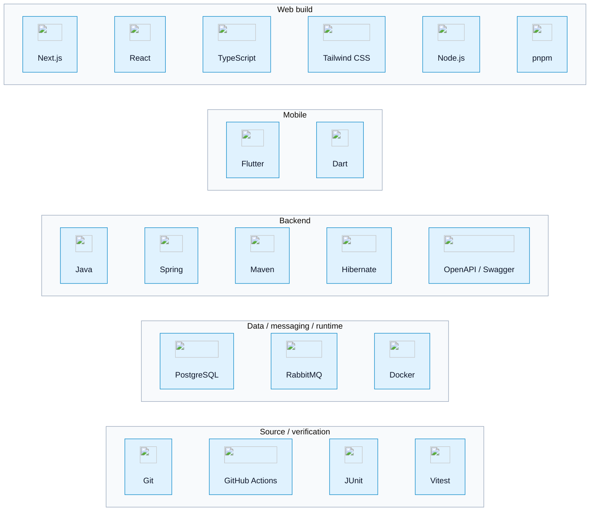
```mermaid
%%{init: {"theme": "base", "securityLevel": "loose", "fontFamily": "Arial, sans-serif", "themeVariables": {"primaryColor": "#e0f2fe", "primaryTextColor": "#0f172a", "primaryBorderColor": "#0284c7", "lineColor": "#475569", "secondaryColor": "#ccfbf1", "tertiaryColor": "#f1f5f9", "background": "#ffffff", "mainBkg": "#e0f2fe", "nodeBorder": "#0284c7", "clusterBkg": "#f8fafc", "clusterBorder": "#94a3b8", "actorBkg": "#e0f2fe", "actorBorder": "#0284c7", "actorTextColor": "#0f172a", "signalColor": "#475569", "signalTextColor": "#0f172a", "labelBoxBkgColor": "#f1f5f9", "labelBoxBorderColor": "#94a3b8", "activationBkgColor": "#ccfbf1", "activationBorderColor": "#0f766e", "sequenceNumberColor": "#ffffff", "attributeBackgroundColorOdd": "#ffffff", "attributeBackgroundColorEven": "#f0f9ff"}, "flowchart": {"htmlLabels": true, "curve": "basis", "nodeSpacing": 30, "rankSpacing": 50}, "sequence": {"useMaxWidth": true, "wrap": true}, "er": {"useMaxWidth": true}}}%%
flowchart TB
 subgraph WEB["Web build"]
 direction LR
 nextjs["<img src='https://cdn.jsdelivr.net/gh/devicons/devicon@v2.17.0/icons/nextjs/nextjs-original.svg' width='34' height='34'/><br/>Next.js"]
 react["<img src='https://cdn.jsdelivr.net/gh/devicons/devicon@v2.17.0/icons/react/react-original.svg' width='34' height='34'/><br/>React"]
 typescript["<img src='https://cdn.jsdelivr.net/gh/devicons/devicon@v2.17.0/icons/typescript/typescript-original.svg' width='34' height='34'/><br/>TypeScript"]
 tailwindcss["<img src='https://cdn.jsdelivr.net/gh/devicons/devicon@v2.17.0/icons/tailwindcss/tailwindcss-original.svg' width='34' height='34'/><br/>Tailwind CSS"]
 nodejs["<img src='https://cdn.jsdelivr.net/gh/devicons/devicon@v2.17.0/icons/nodejs/nodejs-original.svg' width='34' height='34'/><br/>Node.js"]
 pnpm["<img src='https://cdn.jsdelivr.net/gh/devicons/devicon@v2.17.0/icons/pnpm/pnpm-original.svg' width='34' height='34'/><br/>pnpm"]
 nextjs ~~~ react ~~~ typescript ~~~ tailwindcss ~~~ nodejs ~~~ pnpm
 end
 subgraph MOBILE["Mobile"]
 direction LR
 flutter["<img src='https://cdn.jsdelivr.net/gh/devicons/devicon@v2.17.0/icons/flutter/flutter-original.svg' width='34' height='34'/><br/>Flutter"]
 dart["<img src='https://cdn.jsdelivr.net/gh/devicons/devicon@v2.17.0/icons/dart/dart-original.svg' width='34' height='34'/><br/>Dart"]
 flutter ~~~ dart
 end
 subgraph BACK["Backend"]
 direction LR
 java["<img src='https://cdn.jsdelivr.net/gh/devicons/devicon@v2.17.0/icons/java/java-original.svg' width='34' height='34'/><br/>Java"]
 spring["<img src='https://cdn.jsdelivr.net/gh/devicons/devicon@v2.17.0/icons/spring/spring-original.svg' width='34' height='34'/><br/>Spring"]
 maven["<img src='https://cdn.jsdelivr.net/gh/devicons/devicon@v2.17.0/icons/maven/maven-original.svg' width='34' height='34'/><br/>Maven"]
 hibernate["<img src='https://cdn.jsdelivr.net/gh/devicons/devicon@v2.17.0/icons/hibernate/hibernate-original.svg' width='34' height='34'/><br/>Hibernate"]
 swagger["<img src='https://cdn.jsdelivr.net/gh/devicons/devicon@v2.17.0/icons/swagger/swagger-original.svg' width='34' height='34'/><br/>OpenAPI / Swagger"]
 java ~~~ spring ~~~ maven ~~~ hibernate ~~~ swagger
 end
 subgraph DATA["Data / messaging / runtime"]
 direction LR
 postgresql["<img src='https://cdn.jsdelivr.net/gh/devicons/devicon@v2.17.0/icons/postgresql/postgresql-original.svg' width='34' height='34'/><br/>PostgreSQL"]
 rabbitmq["<img src='https://cdn.jsdelivr.net/gh/devicons/devicon@v2.17.0/icons/rabbitmq/rabbitmq-original.svg' width='34' height='34'/><br/>RabbitMQ"]
 docker["<img src='https://cdn.jsdelivr.net/gh/devicons/devicon@v2.17.0/icons/docker/docker-original.svg' width='34' height='34'/><br/>Docker"]
 postgresql ~~~ rabbitmq ~~~ docker
 end
 subgraph QUALITY["Source / verification"]
 direction LR
 git["<img src='https://cdn.jsdelivr.net/gh/devicons/devicon@v2.17.0/icons/git/git-original.svg' width='34' height='34'/><br/>Git"]
 githubactions["<img src='https://cdn.jsdelivr.net/gh/devicons/devicon@v2.17.0/icons/githubactions/githubactions-original.svg' width='34' height='34'/><br/>GitHub Actions"]
 junit["<img src='https://cdn.jsdelivr.net/gh/devicons/devicon@v2.17.0/icons/junit/junit-original.svg' width='34' height='34'/><br/>JUnit"]
 vitest["<img src='https://cdn.jsdelivr.net/gh/devicons/devicon@v2.17.0/icons/vitest/vitest-original.svg' width='34' height='34'/><br/>Vitest"]
 git ~~~ githubactions ~~~ junit ~~~ vitest
 end
 WEB ~~~ MOBILE ~~~ BACK ~~~ DATA ~~~ QUALITY
```

Libraries without an individual logo in the bundled set are named below; they are not extra deployments. Spring represents Boot/Cloud/Security/Data; Flutter represents its mobile ecosystem. Redis, Kafka, Kubernetes and external payment providers are not added to the architecture.

| Layer | Stack verified in source | Evidence |
|---|---|---|
| Backend | Java 21; Spring Boot 3.3.5; Spring Cloud 2023.0.3; Maven; Spring Security; Spring Data JPA/Hibernate; Flyway; MapStruct; Lombok; JJWT 0.12.6; springdoc 2.6.0 | [pom.xml](../../../../pom.xml) |
| Web | Next.js 16.2.11; React 19.2.4; TypeScript 5; Tailwind CSS 4; Node.js/pnpm; Vitest 4; ESLint 9; Testing Library | [frontend/package.json](../../../../frontend/package.json) |
| Mobile | Flutter; Dart ^3.13.0; Riverpod ^3.4.3; GoRouter ^18.1.0; Dio ^5.11.1; flutter_secure_storage ^11.2.0 | [mobile/pubspec.yaml](../../../../mobile/pubspec.yaml) |
| Infrastructure | PostgreSQL 16-alpine; RabbitMQ 3-management-alpine; Docker Compose; Eureka; Gateway | [docker-compose.yml](../../../../docker-compose.yml) |
| Verification | JUnit / Spring Boot Test / Testcontainers; Git / GitHub Actions | [backend/support-service/pom.xml](../../../../backend/support-service/pom.xml) |

Versions with `^` are manifest constraints, not installed runtime measurements. Technology names/logos do not certify production deployment.

### Application architecture — request path and inward dependencies



Mermaid · 03-en

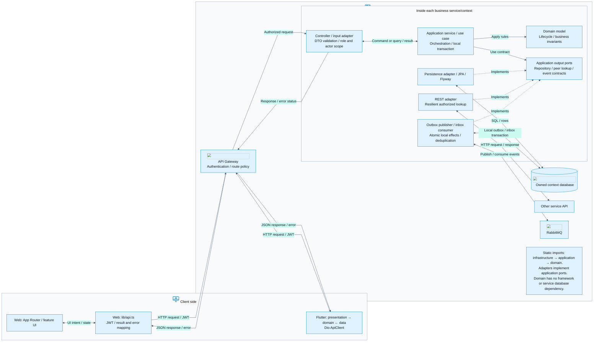
```mermaid
%%{init: {"theme": "base", "securityLevel": "loose", "fontFamily": "Arial, sans-serif", "themeVariables": {"primaryColor": "#e0f2fe", "primaryTextColor": "#0f172a", "primaryBorderColor": "#0284c7", "lineColor": "#475569", "secondaryColor": "#ccfbf1", "tertiaryColor": "#f1f5f9", "background": "#ffffff", "mainBkg": "#e0f2fe", "nodeBorder": "#0284c7", "clusterBkg": "#f8fafc", "clusterBorder": "#94a3b8", "actorBkg": "#e0f2fe", "actorBorder": "#0284c7", "actorTextColor": "#0f172a", "signalColor": "#475569", "signalTextColor": "#0f172a", "labelBoxBkgColor": "#f1f5f9", "labelBoxBorderColor": "#94a3b8", "activationBkgColor": "#ccfbf1", "activationBorderColor": "#0f766e", "sequenceNumberColor": "#ffffff", "attributeBackgroundColorOdd": "#ffffff", "attributeBackgroundColorEven": "#f0f9ff"}, "flowchart": {"htmlLabels": true, "curve": "linear", "nodeSpacing": 40, "rankSpacing": 46, "subGraphTitleMargin": {"top": 12, "bottom": 45}}, "sequence": {"useMaxWidth": true, "wrap": true, "actorMargin": 55, "width": 175, "messageMargin": 30, "mirrorActors": false}, "er": {"useMaxWidth": true}, "maxTextSize": 2000000, "class": {"nodeSpacing": 30, "rankSpacing": 55}}}%%
flowchart LR
 subgraph CLIENT["<img src='' width='32' height='32'/> Client side"]
  WP["Web: App Router / feature UI"]
  API["Web: lib/api.ts<br/>JWT / result and error mapping"]
  MP["Flutter: presentation → domain ← data<br/>Dio ApiClient"]
  WP <-->|UI intent / state| API
 end
 subgraph SERVER["<img src='' width='32' height='32'/> Server side — MediFlow backend"]
  GW["<img src='https://cdn.jsdelivr.net/gh/devicons/devicon@v2.17.0/icons/spring/spring-original.svg' width='28' height='28'/> API Gateway<br/>Authentication / route policy"]
  subgraph CONTEXT["Inside each business service/context"]
   WEB["Controller / input adapter<br/>DTO validation / role and actor scope"]
   APP["Application service / use case<br/>Orchestration / local transaction"]
   DOMAIN["Domain model<br/>Lifecycle / business invariants"]
   PORT["Application output ports<br/>Repository / peer lookup / event contracts"]
   PERSIST["Persistence adapter / JPA / Flyway"]
   REST["REST adapter<br/>Resilient authorized lookup"]
   OUTBOX["Outbox publisher / inbox consumer<br/>Atomic local effects / deduplication"]
   WEB <-->|Command or query / result| APP
   APP -->|Apply rules| DOMAIN
   APP -->|Use contract| PORT
   PERSIST -.->|Implements| PORT
   REST -.->|Implements| PORT
   OUTBOX -.->|Implements| PORT
  end
  DB[(<img src='https://cdn.jsdelivr.net/gh/devicons/devicon@v2.17.0/icons/postgresql/postgresql-original.svg' width='28' height='28'/> Owned context database)]
  PEER["Other service API"]
  MQ["<img src='https://cdn.jsdelivr.net/gh/devicons/devicon@v2.17.0/icons/rabbitmq/rabbitmq-original.svg' width='28' height='28'/> RabbitMQ"]
  GW -->|Authorized request| WEB
  WEB -->|Response / error status| GW
  PERSIST <-->|SQL / rows| DB
  OUTBOX <-->|Local outbox / inbox transaction| DB
  REST <-->|HTTP request / response| PEER
  OUTBOX <-->|Publish / consume events| MQ
  DEP["Static imports: infrastructure → application → domain.<br/>Adapters implement application ports.<br/>Domain has no framework or service database dependency."]
 end
 API & MP -->|HTTP request / JWT| GW
 GW -->|JSON response / error| API & MP
```

Solid edges name runtime requests/results or rule evaluation; dotted implements edges name static interface realization, not HTTP. The import rule is explicit in the bottom note. The same pattern applies within each context; Core/Support composition does not merge the context databases. A local commit is not a distributed transaction. The diagram abstracts web hosting while retaining the configured same-origin gateway route.

### 1.2. Use Cases Diagrams

One diagram per human role. Common authentication goals are separate; business tasks require a valid session. Use cases describe goals, not the order of a visit.

<!-- role-usecases:start -->
### Detailed use cases — one diagram per role

Figures 29–36 follow the supervisor’s presentation: one human actor per diagram, solid arrows to primary tasks, dashed `«include»` arrows for required supporting behavior, and dashed `«extend»` arrows from a conditional extension to its base task. An extension may have its own included subflow. Arrow direction is relational, not chronological. Sign-in and token renewal are independent goals. A valid session is a precondition of protected business tasks. Blue ovals are primary tasks; teal ovals are supporting/extension tasks. These are source capabilities, not proof of UI completeness or production enablement.

**Scope correction:** PATIENT currently has authentication/refresh and own-notification access. No appointment or laboratory self-service is claimed. SYSTEM is a machine identity and has no human-role diagram. All role permissions below are intersected with the Gateway route matrix and downstream guards.

#### ADMIN — Administrator tasks



Mermaid · 29-en

```mermaid
%%{init: {"theme": "base", "securityLevel": "loose", "fontFamily": "Arial, sans-serif", "themeVariables": {"primaryColor": "#e0f2fe", "primaryTextColor": "#0f172a", "primaryBorderColor": "#0284c7", "lineColor": "#475569", "secondaryColor": "#ccfbf1", "tertiaryColor": "#f1f5f9", "background": "#ffffff", "mainBkg": "#e0f2fe", "nodeBorder": "#0284c7", "clusterBkg": "#f8fafc", "clusterBorder": "#94a3b8", "actorBkg": "#e0f2fe", "actorBorder": "#0284c7", "actorTextColor": "#0f172a", "signalColor": "#475569", "signalTextColor": "#0f172a", "labelBoxBkgColor": "#f1f5f9", "labelBoxBorderColor": "#94a3b8", "activationBkgColor": "#ccfbf1", "activationBorderColor": "#0f766e", "sequenceNumberColor": "#ffffff", "attributeBackgroundColorOdd": "#ffffff", "attributeBackgroundColorEven": "#f0f9ff", "fontSize": "18px"}, "flowchart": {"htmlLabels": true, "curve": "linear", "nodeSpacing": 30, "rankSpacing": 44, "padding": 24, "diagramPadding": 24, "wrappingWidth": 165, "subGraphTitleMargin": {"top": 10, "bottom": 32}}, "sequence": {"useMaxWidth": true, "wrap": true, "actorMargin": 65, "width": 210, "height": 55, "boxMargin": 14, "boxTextMargin": 8, "noteMargin": 16, "messageMargin": 24, "diagramMarginX": 24, "diagramMarginY": 24, "mirrorActors": true, "actorFontSize": 17, "messageFontSize": 16, "noteFontSize": 16, "wrapPadding": 10}, "er": {"useMaxWidth": true, "nodeSpacing": 45, "rankSpacing": 55, "diagramPadding": 24, "entityPadding": 10, "fontSize": 17}, "themeCSS": ".nodeLabel p {margin:0;} .edgeLabel {font-size:15px;} .nodeLabel img {display:inline-block!important;width:36px!important;height:48px!important;}", "class": {"diagramPadding": 24, "nodeSpacing": 32, "rankSpacing": 45}}}%%
%% Role use case: one actor; solid primary task; dashed include/extend.
flowchart TB
 ACTOR["<img src='' width='36' height='48'/><br/>ADMIN"]
 subgraph SYS["MediFlow — ADMIN"]
 AUTH_LOGIN(["Sign in"])
 AUTH_REFRESH(["Renew session"])
 A1(["Create account"])
 A2(["Assign account role"])
 A3(["Change account status"])
 A5(["Create staff profile"])
 A7(["Update staff profile"])
 A9(["Transfer staff department"])
 A11(["Update department"])
 A13(["Create department"])
 A15(["View management reports"])
 A17(["Send notification"])
 end
 ACTOR --> AUTH_LOGIN
 ACTOR --> AUTH_REFRESH
 ACTOR --> A1
 ACTOR --> A3
 ACTOR --> A5
 ACTOR --> A7
 ACTOR --> A9
 ACTOR --> A11
 ACTOR --> A13
 ACTOR --> A15
 ACTOR --> A17
 A1 -.->|"«include»"| A2
 classDef actor fill:transparent,stroke:transparent,color:#0f172a;
 classDef main fill:#e0f2fe,stroke:#0284c7,color:#0f172a;
 classDef sub fill:#f0fdfa,stroke:#0f766e,color:#0f172a;
 class ACTOR actor;
 class AUTH_LOGIN,AUTH_REFRESH,A1,A3,A5,A7,A9,A11,A13,A15,A17 main;
 class A2 sub;
```

This diagram focuses on organization/account administration. ADMIN also has explicit permissions in the other seven context diagrams; it does not bypass business guards. No account deletion or arbitrary permission editor is invented. Sign-in and renewal are independent goals, not an include/extend pair. Staff business commands require a valid authenticated session. Preconditions and field validation are described in the sequence/specification, not expanded as screen-step use cases.

Extension conditions: None.

Source evidence: [AccountController](../../../../backend/core-service/src/main/java/com/mediflow/organization/web/controller/AccountController.java) · [StaffController](../../../../backend/core-service/src/main/java/com/mediflow/organization/web/controller/StaffController.java) · [DepartmentController](../../../../backend/core-service/src/main/java/com/mediflow/organization/web/controller/DepartmentController.java) · [ReportController](../../../../backend/report-service/src/main/java/com/mediflow/report/web/ReportController.java) · [NotificationController](../../../../backend/notification-service/src/main/java/com/mediflow/notification/web/NotificationController.java) · [RouteAuthorizationFilter](../../../../backend/gateway/src/main/java/com/mediflow/gateway/filter/RouteAuthorizationFilter.java) · [AuthController](../../../../backend/gateway/src/main/java/com/mediflow/gateway/auth/AuthController.java)

#### MANAGER — Manager tasks



Mermaid · 30-en

```mermaid
%%{init: {"theme": "base", "securityLevel": "loose", "fontFamily": "Arial, sans-serif", "themeVariables": {"primaryColor": "#e0f2fe", "primaryTextColor": "#0f172a", "primaryBorderColor": "#0284c7", "lineColor": "#475569", "secondaryColor": "#ccfbf1", "tertiaryColor": "#f1f5f9", "background": "#ffffff", "mainBkg": "#e0f2fe", "nodeBorder": "#0284c7", "clusterBkg": "#f8fafc", "clusterBorder": "#94a3b8", "actorBkg": "#e0f2fe", "actorBorder": "#0284c7", "actorTextColor": "#0f172a", "signalColor": "#475569", "signalTextColor": "#0f172a", "labelBoxBkgColor": "#f1f5f9", "labelBoxBorderColor": "#94a3b8", "activationBkgColor": "#ccfbf1", "activationBorderColor": "#0f766e", "sequenceNumberColor": "#ffffff", "attributeBackgroundColorOdd": "#ffffff", "attributeBackgroundColorEven": "#f0f9ff", "fontSize": "18px"}, "flowchart": {"htmlLabels": true, "curve": "linear", "nodeSpacing": 30, "rankSpacing": 44, "padding": 24, "diagramPadding": 24, "wrappingWidth": 165, "subGraphTitleMargin": {"top": 10, "bottom": 32}}, "sequence": {"useMaxWidth": true, "wrap": true, "actorMargin": 65, "width": 210, "height": 55, "boxMargin": 14, "boxTextMargin": 8, "noteMargin": 16, "messageMargin": 24, "diagramMarginX": 24, "diagramMarginY": 24, "mirrorActors": true, "actorFontSize": 17, "messageFontSize": 16, "noteFontSize": 16, "wrapPadding": 10}, "er": {"useMaxWidth": true, "nodeSpacing": 45, "rankSpacing": 55, "diagramPadding": 24, "entityPadding": 10, "fontSize": 17}, "themeCSS": ".nodeLabel p {margin:0;} .edgeLabel {font-size:15px;} .nodeLabel img {display:inline-block!important;width:36px!important;height:48px!important;}", "class": {"diagramPadding": 24, "nodeSpacing": 32, "rankSpacing": 45}}}%%
%% Role use case: one actor; solid primary task; dashed include/extend.
flowchart TB
 ACTOR["<img src='' width='36' height='48'/><br/>MANAGER"]
 subgraph SYS["MediFlow — MANAGER"]
 AUTH_LOGIN(["Sign in"])
 AUTH_REFRESH(["Renew session"])
 M1(["View outpatient report"])
 M3(["Inspect report coverage"])
 M4(["View financial report"])
 M6(["View medicine statistics"])
 M8(["View appointments"])
 M10(["Filter appointments by department"])
 M11(["View staff directory"])
 end
 ACTOR --> AUTH_LOGIN
 ACTOR --> AUTH_REFRESH
 ACTOR --> M1
 ACTOR --> M4
 ACTOR --> M6
 ACTOR --> M8
 ACTOR --> M11
 M3 -.->|"«extend» [E1]"| M1
 M10 -.->|"«extend» [E2]"| M8
 classDef actor fill:transparent,stroke:transparent,color:#0f172a;
 classDef main fill:#e0f2fe,stroke:#0284c7,color:#0f172a;
 classDef sub fill:#f0fdfa,stroke:#0f766e,color:#0f172a;
 class ACTOR actor;
 class AUTH_LOGIN,AUTH_REFRESH,M1,M4,M6,M8,M11 main;
 class M3,M10 sub;
```

Read-only management tasks: daily/monthly reports, top medicines, department revenue, appointment/lab lists, staff and department directories. MANAGER cannot create accounts, update staff or record clinical/financial commands. Snapshot reports remain subject to their runtime availability and coverage. Sign-in and renewal are independent goals, not an include/extend pair. Staff business commands require a valid authenticated session. Preconditions and field validation are described in the sequence/specification, not expanded as screen-step use cases.

Extension conditions: E1: Inspect report coverage — coverage inspection requested; E2: Filter appointments by department — department filter selected

Source evidence: [OutpatientReportController](../../../../backend/report-service/src/main/java/com/mediflow/report/web/OutpatientReportController.java) · [FinancialSnapshotReportController](../../../../backend/report-service/src/main/java/com/mediflow/report/web/FinancialSnapshotReportController.java) · [ReportController](../../../../backend/report-service/src/main/java/com/mediflow/report/web/ReportController.java) · [RevenueController](../../../../backend/billing-service/src/main/java/com/mediflow/billing/web/RevenueController.java) · [AppointmentController](../../../../backend/clinical-service/src/main/java/com/mediflow/clinical/web/AppointmentController.java) · [StaffController](../../../../backend/core-service/src/main/java/com/mediflow/organization/web/controller/StaffController.java) · [AuthController](../../../../backend/gateway/src/main/java/com/mediflow/gateway/auth/AuthController.java)

#### DOCTOR — Doctor tasks



Mermaid · 31-en

```mermaid
%%{init: {"theme": "base", "securityLevel": "loose", "fontFamily": "Arial, sans-serif", "themeVariables": {"primaryColor": "#e0f2fe", "primaryTextColor": "#0f172a", "primaryBorderColor": "#0284c7", "lineColor": "#475569", "secondaryColor": "#ccfbf1", "tertiaryColor": "#f1f5f9", "background": "#ffffff", "mainBkg": "#e0f2fe", "nodeBorder": "#0284c7", "clusterBkg": "#f8fafc", "clusterBorder": "#94a3b8", "actorBkg": "#e0f2fe", "actorBorder": "#0284c7", "actorTextColor": "#0f172a", "signalColor": "#475569", "signalTextColor": "#0f172a", "labelBoxBkgColor": "#f1f5f9", "labelBoxBorderColor": "#94a3b8", "activationBkgColor": "#ccfbf1", "activationBorderColor": "#0f766e", "sequenceNumberColor": "#ffffff", "attributeBackgroundColorOdd": "#ffffff", "attributeBackgroundColorEven": "#f0f9ff", "fontSize": "18px"}, "flowchart": {"htmlLabels": true, "curve": "linear", "nodeSpacing": 30, "rankSpacing": 44, "padding": 24, "diagramPadding": 24, "wrappingWidth": 165, "subGraphTitleMargin": {"top": 10, "bottom": 32}}, "sequence": {"useMaxWidth": true, "wrap": true, "actorMargin": 65, "width": 210, "height": 55, "boxMargin": 14, "boxTextMargin": 8, "noteMargin": 16, "messageMargin": 24, "diagramMarginX": 24, "diagramMarginY": 24, "mirrorActors": true, "actorFontSize": 17, "messageFontSize": 16, "noteFontSize": 16, "wrapPadding": 10}, "er": {"useMaxWidth": true, "nodeSpacing": 45, "rankSpacing": 55, "diagramPadding": 24, "entityPadding": 10, "fontSize": 17}, "themeCSS": ".nodeLabel p {margin:0;} .edgeLabel {font-size:15px;} .nodeLabel img {display:inline-block!important;width:36px!important;height:48px!important;}", "class": {"diagramPadding": 24, "nodeSpacing": 32, "rankSpacing": 45}}}%%
%% Role use case: one actor; solid primary task; dashed include/extend.
flowchart TB
 ACTOR["<img src='' width='36' height='48'/><br/>DOCTOR"]
 subgraph SYS["MediFlow — DOCTOR"]
 AUTH_LOGIN(["Sign in"])
 AUTH_REFRESH(["Renew session"])
 D1(["Review clinical history"])
 D3(["Start examination [V1]"])
 D5(["Record consultation"])
 D7(["Record diagnosis"])
 D8(["Order lab test"])
 D10(["Review lab results"])
 D11(["Issue prescription"])
 D13(["Complete visit [V1]"])
 D14(["Record visit disposition"])
 D15(["Cancel prescription"])
 end
 ACTOR --> AUTH_LOGIN
 ACTOR --> AUTH_REFRESH
 ACTOR --> D1
 ACTOR --> D3
 ACTOR --> D5
 ACTOR --> D7
 ACTOR --> D10
 ACTOR --> D13
 ACTOR --> D15
 D8 -.->|"«extend» [E1]"| D5
 D11 -.->|"«extend» [E2]"| D5
 D13 -.->|"«include»"| D7
 D13 -.->|"«include»"| D14
 classDef actor fill:transparent,stroke:transparent,color:#0f172a;
 classDef main fill:#e0f2fe,stroke:#0284c7,color:#0f172a;
 classDef sub fill:#f0fdfa,stroke:#0f766e,color:#0f172a;
 class ACTOR actor;
 class AUTH_LOGIN,AUTH_REFRESH,D1,D3,D5,D7,D10,D13,D15 main;
 class D8,D11,D14 sub;
```

Clinical authority and patient/context checks still apply. [V1] requires care-finance-v2 enabled; start-exam needs exact EXAM clearance or the supported audited override. AppointmentController additionally authorizes appointment reads/updates/status; operational report reads and lab cancellation are also source-authorized. A doctor cannot perform nurse check-in, pharmacy dispensing or cashier payment. Sign-in and renewal are independent goals, not an include/extend pair. Staff business commands require a valid authenticated session. Preconditions and field validation are described in the sequence/specification, not expanded as screen-step use cases.

Extension conditions: E1: Order lab test — test clinically indicated; E2: Issue prescription — medication clinically indicated

Source evidence: [AppointmentController](../../../../backend/clinical-service/src/main/java/com/mediflow/clinical/web/AppointmentController.java) · [MedicalRecordController](../../../../backend/clinical-service/src/main/java/com/mediflow/clinical/web/MedicalRecordController.java) · [ClinicalCareFinanceController](../../../../backend/clinical-service/src/main/java/com/mediflow/clinical/web/ClinicalCareFinanceController.java) · [ClinicalLabOrderController](../../../../backend/clinical-service/src/main/java/com/mediflow/clinical/web/ClinicalLabOrderController.java) · [LabController](../../../../backend/lab-service/src/main/java/com/mediflow/lab/web/LabController.java) · [PrescriptionController](../../../../backend/pharmacy-service/src/main/java/com/mediflow/pharmacy/web/PrescriptionController.java) · [AuthController](../../../../backend/gateway/src/main/java/com/mediflow/gateway/auth/AuthController.java)

#### NURSE — Nurse tasks



Mermaid · 32-en

```mermaid
%%{init: {"theme": "base", "securityLevel": "loose", "fontFamily": "Arial, sans-serif", "themeVariables": {"primaryColor": "#e0f2fe", "primaryTextColor": "#0f172a", "primaryBorderColor": "#0284c7", "lineColor": "#475569", "secondaryColor": "#ccfbf1", "tertiaryColor": "#f1f5f9", "background": "#ffffff", "mainBkg": "#e0f2fe", "nodeBorder": "#0284c7", "clusterBkg": "#f8fafc", "clusterBorder": "#94a3b8", "actorBkg": "#e0f2fe", "actorBorder": "#0284c7", "actorTextColor": "#0f172a", "signalColor": "#475569", "signalTextColor": "#0f172a", "labelBoxBkgColor": "#f1f5f9", "labelBoxBorderColor": "#94a3b8", "activationBkgColor": "#ccfbf1", "activationBorderColor": "#0f766e", "sequenceNumberColor": "#ffffff", "attributeBackgroundColorOdd": "#ffffff", "attributeBackgroundColorEven": "#f0f9ff", "fontSize": "18px"}, "flowchart": {"htmlLabels": true, "curve": "linear", "nodeSpacing": 30, "rankSpacing": 44, "padding": 24, "diagramPadding": 24, "wrappingWidth": 165, "subGraphTitleMargin": {"top": 10, "bottom": 32}}, "sequence": {"useMaxWidth": true, "wrap": true, "actorMargin": 65, "width": 210, "height": 55, "boxMargin": 14, "boxTextMargin": 8, "noteMargin": 16, "messageMargin": 24, "diagramMarginX": 24, "diagramMarginY": 24, "mirrorActors": true, "actorFontSize": 17, "messageFontSize": 16, "noteFontSize": 16, "wrapPadding": 10}, "er": {"useMaxWidth": true, "nodeSpacing": 45, "rankSpacing": 55, "diagramPadding": 24, "entityPadding": 10, "fontSize": 17}, "themeCSS": ".nodeLabel p {margin:0;} .edgeLabel {font-size:15px;} .nodeLabel img {display:inline-block!important;width:36px!important;height:48px!important;}", "class": {"diagramPadding": 24, "nodeSpacing": 32, "rankSpacing": 45}}}%%
%% Role use case: one actor; solid primary task; dashed include/extend.
flowchart TB
 ACTOR["<img src='' width='36' height='48'/><br/>NURSE"]
 subgraph SYS["MediFlow — NURSE"]
 AUTH_LOGIN(["Sign in"])
 AUTH_REFRESH(["Renew session"])
 N1(["Register patient"])
 N3(["Update patient profile"])
 N4(["Find patient"])
 N5(["Schedule appointment"])
 N7(["View appointments"])
 N9(["Reschedule appointment"])
 N11(["Check in patient [V1]"])
 N13(["Read clinical information"])
 N14(["Read laboratory information"])
 N15(["View patient notifications"])
 end
 ACTOR --> AUTH_LOGIN
 ACTOR --> AUTH_REFRESH
 ACTOR --> N1
 ACTOR --> N3
 ACTOR --> N4
 ACTOR --> N5
 ACTOR --> N7
 ACTOR --> N9
 ACTOR --> N11
 ACTOR --> N13
 ACTOR --> N14
 ACTOR --> N15
 classDef actor fill:transparent,stroke:transparent,color:#0f172a;
 classDef main fill:#e0f2fe,stroke:#0284c7,color:#0f172a;
 classDef sub fill:#f0fdfa,stroke:#0f766e,color:#0f172a;
 class ACTOR actor;
 class AUTH_LOGIN,AUTH_REFRESH,N1,N3,N4,N5,N7,N9,N11,N13,N14,N15 main;
```

[V1] check-in requires care-finance-v2 enabled and does not start an examination. NURSE can query lab list/detail and notification lists by patient, but cannot write diagnoses, lab results, prescriptions or payments; individual notification detail is not granted to NURSE. There is no separate RECEPTIONIST role. Sign-in and renewal are independent goals, not an include/extend pair. Staff business commands require a valid authenticated session. Preconditions and field validation are described in the sequence/specification, not expanded as screen-step use cases.

Extension conditions: None.

Source evidence: [PatientController](../../../../backend/core-service/src/main/java/com/mediflow/patient/web/PatientController.java) · [AppointmentController](../../../../backend/clinical-service/src/main/java/com/mediflow/clinical/web/AppointmentController.java) · [ClinicalCareFinanceController](../../../../backend/clinical-service/src/main/java/com/mediflow/clinical/web/ClinicalCareFinanceController.java) · [MedicalRecordController](../../../../backend/clinical-service/src/main/java/com/mediflow/clinical/web/MedicalRecordController.java) · [LabController](../../../../backend/lab-service/src/main/java/com/mediflow/lab/web/LabController.java) · [NotificationController](../../../../backend/notification-service/src/main/java/com/mediflow/notification/web/NotificationController.java) · [AuthController](../../../../backend/gateway/src/main/java/com/mediflow/gateway/auth/AuthController.java)

#### LAB_TECH — Laboratory technician tasks



Mermaid · 33-en

```mermaid
%%{init: {"theme": "base", "securityLevel": "loose", "fontFamily": "Arial, sans-serif", "themeVariables": {"primaryColor": "#e0f2fe", "primaryTextColor": "#0f172a", "primaryBorderColor": "#0284c7", "lineColor": "#475569", "secondaryColor": "#ccfbf1", "tertiaryColor": "#f1f5f9", "background": "#ffffff", "mainBkg": "#e0f2fe", "nodeBorder": "#0284c7", "clusterBkg": "#f8fafc", "clusterBorder": "#94a3b8", "actorBkg": "#e0f2fe", "actorBorder": "#0284c7", "actorTextColor": "#0f172a", "signalColor": "#475569", "signalTextColor": "#0f172a", "labelBoxBkgColor": "#f1f5f9", "labelBoxBorderColor": "#94a3b8", "activationBkgColor": "#ccfbf1", "activationBorderColor": "#0f766e", "sequenceNumberColor": "#ffffff", "attributeBackgroundColorOdd": "#ffffff", "attributeBackgroundColorEven": "#f0f9ff", "fontSize": "18px"}, "flowchart": {"htmlLabels": true, "curve": "linear", "nodeSpacing": 30, "rankSpacing": 44, "padding": 24, "diagramPadding": 24, "wrappingWidth": 165, "subGraphTitleMargin": {"top": 10, "bottom": 32}}, "sequence": {"useMaxWidth": true, "wrap": true, "actorMargin": 65, "width": 210, "height": 55, "boxMargin": 14, "boxTextMargin": 8, "noteMargin": 16, "messageMargin": 24, "diagramMarginX": 24, "diagramMarginY": 24, "mirrorActors": true, "actorFontSize": 17, "messageFontSize": 16, "noteFontSize": 16, "wrapPadding": 10}, "er": {"useMaxWidth": true, "nodeSpacing": 45, "rankSpacing": 55, "diagramPadding": 24, "entityPadding": 10, "fontSize": 17}, "themeCSS": ".nodeLabel p {margin:0;} .edgeLabel {font-size:15px;} .nodeLabel img {display:inline-block!important;width:36px!important;height:48px!important;}", "class": {"diagramPadding": 24, "nodeSpacing": 32, "rankSpacing": 45}}}%%
%% Role use case: one actor; solid primary task; dashed include/extend.
flowchart TB
 ACTOR["<img src='' width='36' height='48'/><br/>LAB_TECH"]
 subgraph SYS["MediFlow — LAB_TECH"]
 AUTH_LOGIN(["Sign in"])
 AUTH_REFRESH(["Renew session"])
 L1(["View test worklist"])
 L3(["Filter tests by status"])
 L4(["Start test [V1]"])
 L7(["Record test results"])
 L10(["Cancel test"])
 L12(["Update allowed test status"])
 end
 ACTOR --> AUTH_LOGIN
 ACTOR --> AUTH_REFRESH
 ACTOR --> L1
 ACTOR --> L4
 ACTOR --> L7
 ACTOR --> L10
 ACTOR --> L12
 L3 -.->|"«extend» [E1]"| L1
 classDef actor fill:transparent,stroke:transparent,color:#0f172a;
 classDef main fill:#e0f2fe,stroke:#0284c7,color:#0f172a;
 classDef sub fill:#f0fdfa,stroke:#0f766e,color:#0f172a;
 class ACTOR actor;
 class AUTH_LOGIN,AUTH_REFRESH,L1,L4,L7,L10,L12 main;
 class L3 sub;
```

Start/cancel remain subject to lifecycle and feature availability; exact LAB_TEST clearance applies to the V1 protected action. LAB_TECH can search/read tests and write results/status, but cannot create an indication, prescribe or collect payment. Filtering is an optional extension of the worklist. Sign-in and renewal are independent goals, not an include/extend pair. Staff business commands require a valid authenticated session. Preconditions and field validation are described in the sequence/specification, not expanded as screen-step use cases.

Extension conditions: E1: Filter tests by status — status filter selected

Source evidence: [LabController](../../../../backend/lab-service/src/main/java/com/mediflow/lab/web/LabController.java) · [AuthController](../../../../backend/gateway/src/main/java/com/mediflow/gateway/auth/AuthController.java)

#### PHARMACIST — Pharmacist tasks



Mermaid · 34-en

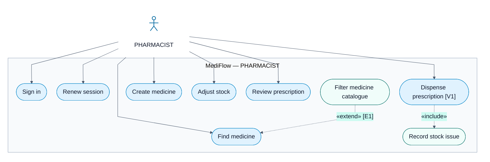
```mermaid
%%{init: {"theme": "base", "securityLevel": "loose", "fontFamily": "Arial, sans-serif", "themeVariables": {"primaryColor": "#e0f2fe", "primaryTextColor": "#0f172a", "primaryBorderColor": "#0284c7", "lineColor": "#475569", "secondaryColor": "#ccfbf1", "tertiaryColor": "#f1f5f9", "background": "#ffffff", "mainBkg": "#e0f2fe", "nodeBorder": "#0284c7", "clusterBkg": "#f8fafc", "clusterBorder": "#94a3b8", "actorBkg": "#e0f2fe", "actorBorder": "#0284c7", "actorTextColor": "#0f172a", "signalColor": "#475569", "signalTextColor": "#0f172a", "labelBoxBkgColor": "#f1f5f9", "labelBoxBorderColor": "#94a3b8", "activationBkgColor": "#ccfbf1", "activationBorderColor": "#0f766e", "sequenceNumberColor": "#ffffff", "attributeBackgroundColorOdd": "#ffffff", "attributeBackgroundColorEven": "#f0f9ff", "fontSize": "18px"}, "flowchart": {"htmlLabels": true, "curve": "linear", "nodeSpacing": 30, "rankSpacing": 44, "padding": 24, "diagramPadding": 24, "wrappingWidth": 165, "subGraphTitleMargin": {"top": 10, "bottom": 32}}, "sequence": {"useMaxWidth": true, "wrap": true, "actorMargin": 65, "width": 210, "height": 55, "boxMargin": 14, "boxTextMargin": 8, "noteMargin": 16, "messageMargin": 24, "diagramMarginX": 24, "diagramMarginY": 24, "mirrorActors": true, "actorFontSize": 17, "messageFontSize": 16, "noteFontSize": 16, "wrapPadding": 10}, "er": {"useMaxWidth": true, "nodeSpacing": 45, "rankSpacing": 55, "diagramPadding": 24, "entityPadding": 10, "fontSize": 17}, "themeCSS": ".nodeLabel p {margin:0;} .edgeLabel {font-size:15px;} .nodeLabel img {display:inline-block!important;width:36px!important;height:48px!important;}", "class": {"diagramPadding": 24, "nodeSpacing": 32, "rankSpacing": 45}}}%%
%% Role use case: one actor; solid primary task; dashed include/extend.
flowchart TB
 ACTOR["<img src='' width='36' height='48'/><br/>PHARMACIST"]
 subgraph SYS["MediFlow — PHARMACIST"]
 AUTH_LOGIN(["Sign in"])
 AUTH_REFRESH(["Renew session"])
 P1(["Find medicine"])
 P3(["Filter medicine catalogue"])
 P4(["Create medicine"])
 P6(["Adjust stock"])
 P8(["Review prescription"])
 P10(["Dispense prescription [V1]"])
 P13(["Record stock issue"])
 end
 ACTOR --> AUTH_LOGIN
 ACTOR --> AUTH_REFRESH
 ACTOR --> P1
 ACTOR --> P4
 ACTOR --> P6
 ACTOR --> P8
 ACTOR --> P10
 P3 -.->|"«extend» [E1]"| P1
 P10 -.->|"«include»"| P13
 classDef actor fill:transparent,stroke:transparent,color:#0f172a;
 classDef main fill:#e0f2fe,stroke:#0284c7,color:#0f172a;
 classDef sub fill:#f0fdfa,stroke:#0f766e,color:#0f172a;
 class ACTOR actor;
 class AUTH_LOGIN,AUTH_REFRESH,P1,P4,P6,P8,P10 main;
 class P3,P13 sub;
```

The public outpatient dispense action resolves the signed actor and V1 lifecycle; exact PRESCRIPTION clearance, stock and reservation guards apply. It is explicit pharmacist action, not automatic dispensing on payment. PHARMACIST cannot create/cancel prescriptions; expiration is system lifecycle behavior rather than a human task. Sign-in and renewal are independent goals, not an include/extend pair. Staff business commands require a valid authenticated session. Preconditions and field validation are described in the sequence/specification, not expanded as screen-step use cases.

Extension conditions: E1: Filter medicine catalogue — catalogue filter selected

Source evidence: [DrugController](../../../../backend/pharmacy-service/src/main/java/com/mediflow/pharmacy/web/DrugController.java) · [PrescriptionController](../../../../backend/pharmacy-service/src/main/java/com/mediflow/pharmacy/web/PrescriptionController.java) · [AuthController](../../../../backend/gateway/src/main/java/com/mediflow/gateway/auth/AuthController.java)

#### CASHIER — Cashier tasks



Mermaid · 35-en

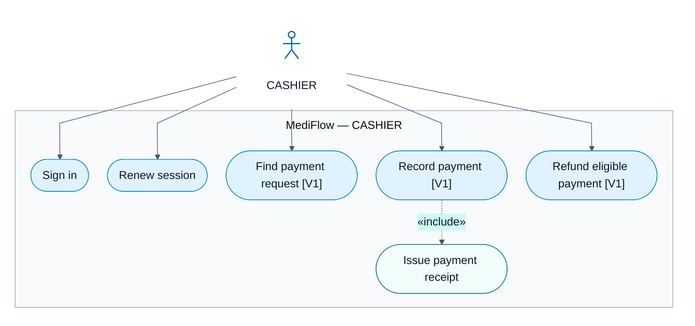
```mermaid
%%{init: {"theme": "base", "securityLevel": "loose", "fontFamily": "Arial, sans-serif", "themeVariables": {"primaryColor": "#e0f2fe", "primaryTextColor": "#0f172a", "primaryBorderColor": "#0284c7", "lineColor": "#475569", "secondaryColor": "#ccfbf1", "tertiaryColor": "#f1f5f9", "background": "#ffffff", "mainBkg": "#e0f2fe", "nodeBorder": "#0284c7", "clusterBkg": "#f8fafc", "clusterBorder": "#94a3b8", "actorBkg": "#e0f2fe", "actorBorder": "#0284c7", "actorTextColor": "#0f172a", "signalColor": "#475569", "signalTextColor": "#0f172a", "labelBoxBkgColor": "#f1f5f9", "labelBoxBorderColor": "#94a3b8", "activationBkgColor": "#ccfbf1", "activationBorderColor": "#0f766e", "sequenceNumberColor": "#ffffff", "attributeBackgroundColorOdd": "#ffffff", "attributeBackgroundColorEven": "#f0f9ff", "fontSize": "18px"}, "flowchart": {"htmlLabels": true, "curve": "linear", "nodeSpacing": 30, "rankSpacing": 44, "padding": 24, "diagramPadding": 24, "wrappingWidth": 165, "subGraphTitleMargin": {"top": 10, "bottom": 32}}, "sequence": {"useMaxWidth": true, "wrap": true, "actorMargin": 65, "width": 210, "height": 55, "boxMargin": 14, "boxTextMargin": 8, "noteMargin": 16, "messageMargin": 24, "diagramMarginX": 24, "diagramMarginY": 24, "mirrorActors": true, "actorFontSize": 17, "messageFontSize": 16, "noteFontSize": 16, "wrapPadding": 10}, "er": {"useMaxWidth": true, "nodeSpacing": 45, "rankSpacing": 55, "diagramPadding": 24, "entityPadding": 10, "fontSize": 17}, "themeCSS": ".nodeLabel p {margin:0;} .edgeLabel {font-size:15px;} .nodeLabel img {display:inline-block!important;width:36px!important;height:48px!important;}", "class": {"diagramPadding": 24, "nodeSpacing": 32, "rankSpacing": 45}}}%%
%% Role use case: one actor; solid primary task; dashed include/extend.
flowchart TB
 ACTOR["<img src='' width='36' height='48'/><br/>CASHIER"]
 subgraph SYS["MediFlow — CASHIER"]
 AUTH_LOGIN(["Sign in"])
 AUTH_REFRESH(["Renew session"])
 C7(["Find payment request [V1]"])
 C9(["Record payment [V1]"])
 C11(["Issue payment receipt"])
 C12(["Refund eligible payment [V1]"])
 end
 ACTOR --> AUTH_LOGIN
 ACTOR --> AUTH_REFRESH
 ACTOR --> C7
 ACTOR --> C9
 ACTOR --> C12
 C9 -.->|"«include»"| C11
 classDef actor fill:transparent,stroke:transparent,color:#0f172a;
 classDef main fill:#e0f2fe,stroke:#0284c7,color:#0f172a;
 classDef sub fill:#f0fdfa,stroke:#0f766e,color:#0f172a;
 class ACTOR actor;
 class AUTH_LOGIN,AUTH_REFRESH,C7,C9,C12 main;
 class C11 sub;
```

This main diagram uses V1 ledger payment requests. Refund is an independent later operation on a refundable payment; it does not extend the act of paying. Legacy invoice commands remain source-supported compatibility operations outside the main V1 journey. Repeating a command preserves intent and must not collect money twice.

Extension conditions: None.

Source evidence: [InvoiceController](../../../../backend/billing-service/src/main/java/com/mediflow/billing/web/InvoiceController.java) · [PaymentRequestDiscoveryController](../../../../backend/billing-service/src/main/java/com/mediflow/billing/web/PaymentRequestDiscoveryController.java) · [LedgerPaymentController](../../../../backend/billing-service/src/main/java/com/mediflow/billing/web/LedgerPaymentController.java) · [LedgerRefundController](../../../../backend/billing-service/src/main/java/com/mediflow/billing/web/LedgerRefundController.java) · [LedgerRefundService](../../../../backend/billing-service/src/main/java/com/mediflow/billing/application/service/LedgerRefundService.java) · [AuthController](../../../../backend/gateway/src/main/java/com/mediflow/gateway/auth/AuthController.java)

#### PATIENT — Patient tasks



Mermaid · 36-en

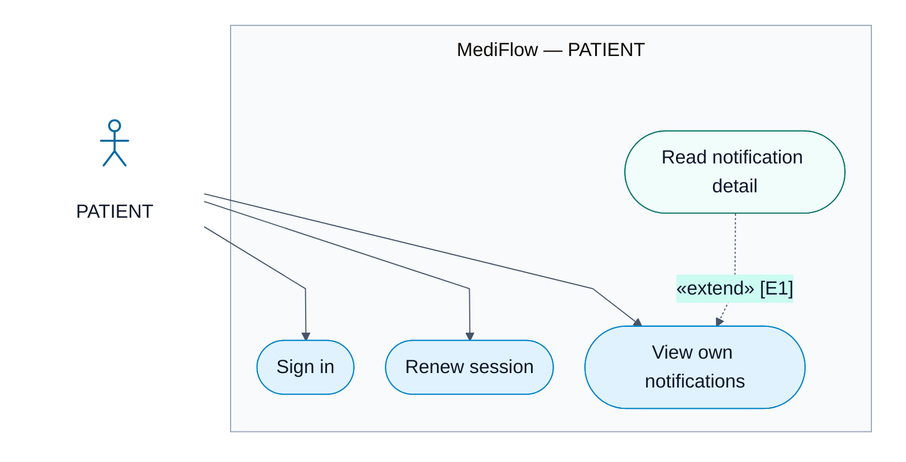
```mermaid
%%{init: {"theme": "base", "securityLevel": "loose", "fontFamily": "Arial, sans-serif", "themeVariables": {"primaryColor": "#e0f2fe", "primaryTextColor": "#0f172a", "primaryBorderColor": "#0284c7", "lineColor": "#475569", "secondaryColor": "#ccfbf1", "tertiaryColor": "#f1f5f9", "background": "#ffffff", "mainBkg": "#e0f2fe", "nodeBorder": "#0284c7", "clusterBkg": "#f8fafc", "clusterBorder": "#94a3b8", "actorBkg": "#e0f2fe", "actorBorder": "#0284c7", "actorTextColor": "#0f172a", "signalColor": "#475569", "signalTextColor": "#0f172a", "labelBoxBkgColor": "#f1f5f9", "labelBoxBorderColor": "#94a3b8", "activationBkgColor": "#ccfbf1", "activationBorderColor": "#0f766e", "sequenceNumberColor": "#ffffff", "attributeBackgroundColorOdd": "#ffffff", "attributeBackgroundColorEven": "#f0f9ff", "fontSize": "18px"}, "flowchart": {"htmlLabels": true, "curve": "linear", "nodeSpacing": 30, "rankSpacing": 44, "padding": 24, "diagramPadding": 24, "wrappingWidth": 165, "subGraphTitleMargin": {"top": 10, "bottom": 32}}, "sequence": {"useMaxWidth": true, "wrap": true, "actorMargin": 65, "width": 210, "height": 55, "boxMargin": 14, "boxTextMargin": 8, "noteMargin": 16, "messageMargin": 24, "diagramMarginX": 24, "diagramMarginY": 24, "mirrorActors": true, "actorFontSize": 17, "messageFontSize": 16, "noteFontSize": 16, "wrapPadding": 10}, "er": {"useMaxWidth": true, "nodeSpacing": 45, "rankSpacing": 55, "diagramPadding": 24, "entityPadding": 10, "fontSize": 17}, "themeCSS": ".nodeLabel p {margin:0;} .edgeLabel {font-size:15px;} .nodeLabel img {display:inline-block!important;width:36px!important;height:48px!important;}", "class": {"diagramPadding": 24, "nodeSpacing": 32, "rankSpacing": 45}}}%%
%% Role use case: one actor; solid primary task; dashed include/extend.
flowchart TB
 ACTOR["<img src='' width='36' height='48'/><br/>PATIENT"]
 subgraph SYS["MediFlow — PATIENT"]
 AUTH_LOGIN(["Sign in"])
 AUTH_REFRESH(["Renew session"])
 T6(["View own notifications"])
 T9(["Read notification detail"])
 end
 ACTOR --> AUTH_LOGIN
 ACTOR --> AUTH_REFRESH
 ACTOR --> T6
 T9 -.->|"«extend» [E1]"| T6
 classDef actor fill:transparent,stroke:transparent,color:#0f172a;
 classDef main fill:#e0f2fe,stroke:#0284c7,color:#0f172a;
 classDef sub fill:#f0fdfa,stroke:#0f766e,color:#0f172a;
 class ACTOR actor;
 class AUTH_LOGIN,AUTH_REFRESH,T6 main;
 class T9 sub;
```

This intentionally reflects the narrow current source permission surface. PATIENT cannot directly create/read appointments, retrieve patient records, lab results, prescriptions or invoices through the current Gateway/controller matrix. Self-registration and profile editing are not exposed. Those are future gaps, not implemented use cases. Notification detail checks ownership independently. Sign-in and renewal are independent goals, not an include/extend pair. Staff business commands require a valid authenticated session. Preconditions and field validation are described in the sequence/specification, not expanded as screen-step use cases.

Extension conditions: E1: Read notification detail — an owned notification is selected

Source evidence: [AuthController](../../../../backend/gateway/src/main/java/com/mediflow/gateway/auth/AuthController.java) · [NotificationController](../../../../backend/notification-service/src/main/java/com/mediflow/notification/web/NotificationController.java) · [RouteAuthorizationFilter](../../../../backend/gateway/src/main/java/com/mediflow/gateway/filter/RouteAuthorizationFilter.java)

<!-- role-usecases:end -->

### 1.3. Sequences Diagrams

<!-- word-sequence-excerpts:start -->
Word panels preserve the exact conditions enclosing each message. If a panel shows only one alternative branch, it uses `opt` with that branch condition to mark a guarded excerpt; read the complete figure for the full `alt` and other outcomes.
<!-- word-sequence-excerpts:end -->

The main journey uses the V1 outpatient contract consistently. Read in this order: schedule → arrive/check in → pay exam fee → consultation → indicated Lab/payment/results → doctor conclusion → optional prescription → payment/explicit dispense. Figures 06 and 04 are independent authentication scenarios. Each actor uses its own authorized session; abbreviated service API lifelines route through Gateway. V1 feature/acceptance gates still apply. Reports and notifications update independently and do not block care.

### Sign in — validation, rejected credentials and recovery

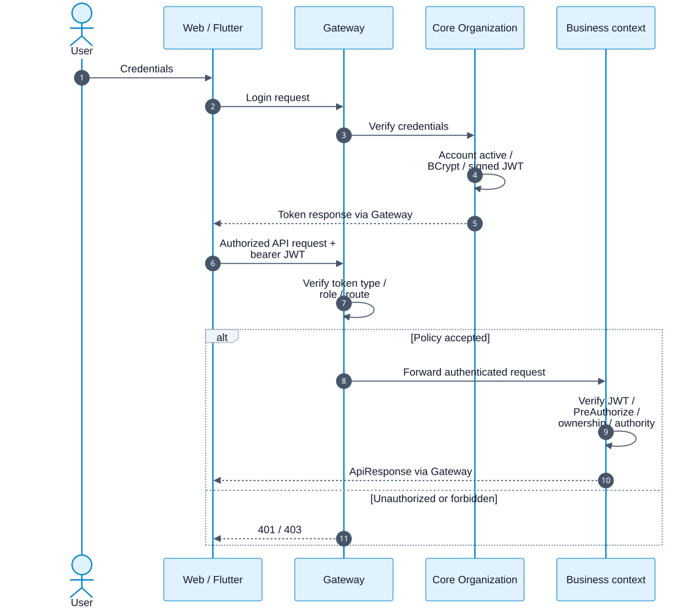

Mermaid · 06-en

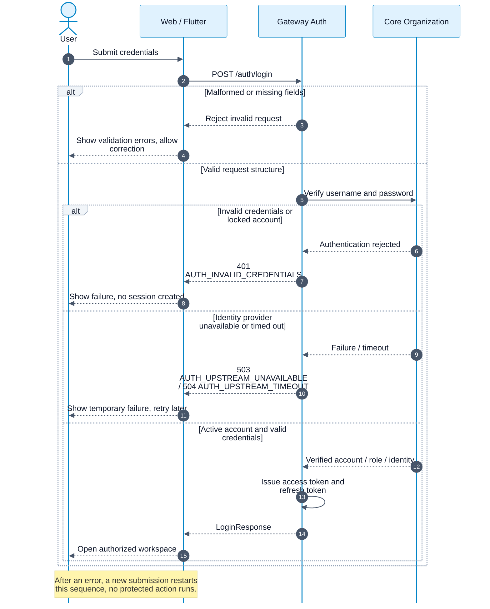
```mermaid
%%{init: {"theme": "base", "securityLevel": "loose", "fontFamily": "Arial, sans-serif", "themeVariables": {"primaryColor": "#e0f2fe", "primaryTextColor": "#0f172a", "primaryBorderColor": "#0284c7", "lineColor": "#475569", "secondaryColor": "#ccfbf1", "tertiaryColor": "#f1f5f9", "background": "#ffffff", "mainBkg": "#e0f2fe", "nodeBorder": "#0284c7", "clusterBkg": "#f8fafc", "clusterBorder": "#94a3b8", "actorBkg": "#e0f2fe", "actorBorder": "#0284c7", "actorTextColor": "#0f172a", "signalColor": "#475569", "signalTextColor": "#0f172a", "labelBoxBkgColor": "#f1f5f9", "labelBoxBorderColor": "#94a3b8", "activationBkgColor": "#ccfbf1", "activationBorderColor": "#0f766e", "sequenceNumberColor": "#ffffff", "attributeBackgroundColorOdd": "#ffffff", "attributeBackgroundColorEven": "#f0f9ff"}, "flowchart": {"htmlLabels": true, "curve": "linear", "nodeSpacing": 40, "rankSpacing": 46, "subGraphTitleMargin": {"top": 12, "bottom": 45}}, "sequence": {"useMaxWidth": true, "wrap": true, "actorMargin": 55, "width": 175, "messageMargin": 30, "mirrorActors": false}, "er": {"useMaxWidth": true}, "maxTextSize": 2000000, "class": {"nodeSpacing": 30, "rankSpacing": 55}}}%%
sequenceDiagram
 autonumber
 actor User as User
 participant UI as Web / Flutter
 participant G as Gateway Auth
 participant C as Core Organization
 User->>UI: Submit credentials
 UI->>G: POST /auth/login
 alt Malformed or missing fields
  G-->>UI: Reject invalid request
  UI-->>User: Show validation errors, allow correction
 else Valid request structure
  G->>C: Verify username and password
  alt Invalid credentials or locked account
   C-->>G: Authentication rejected
   G-->>UI: 401 AUTH_INVALID_CREDENTIALS
   UI-->>User: Show failure, no session created
  else Identity provider unavailable or timed out
   C-->>G: Failure / timeout
   G-->>UI: 503 AUTH_UPSTREAM_UNAVAILABLE / 504 AUTH_UPSTREAM_TIMEOUT
   UI-->>User: Show temporary failure, retry later
  else Active account and valid credentials
   C-->>G: Verified account / role / identity
   G->>G: Issue access token and refresh token
   G-->>UI: LoginResponse
   UI-->>User: Open authorized workspace
  end
 end
 Note over User,UI: After an error, a new submission restarts this sequence, no protected action runs.
```

Gateway issues tokens after Core verifies the account; Core does not send a token directly to the client. Renewal is figure 04, an independent use case. Invalid request error shape follows validation handling; login success uses LoginResponse rather than an invented universal envelope.

### Renew session — a separate authentication use case



Mermaid · 04-en

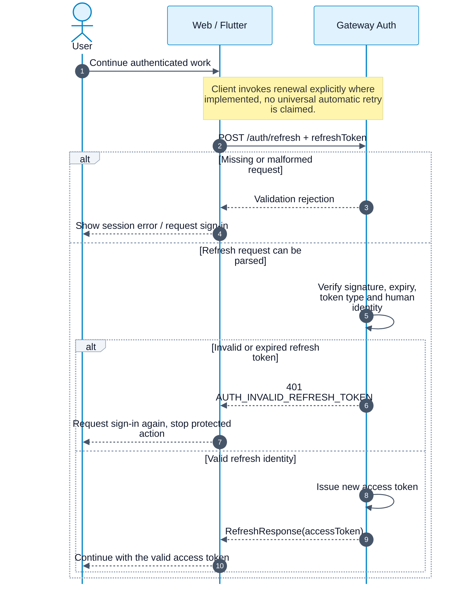
```mermaid
%%{init: {"theme": "base", "securityLevel": "loose", "fontFamily": "Arial, sans-serif", "themeVariables": {"primaryColor": "#e0f2fe", "primaryTextColor": "#0f172a", "primaryBorderColor": "#0284c7", "lineColor": "#475569", "secondaryColor": "#ccfbf1", "tertiaryColor": "#f1f5f9", "background": "#ffffff", "mainBkg": "#e0f2fe", "nodeBorder": "#0284c7", "clusterBkg": "#f8fafc", "clusterBorder": "#94a3b8", "actorBkg": "#e0f2fe", "actorBorder": "#0284c7", "actorTextColor": "#0f172a", "signalColor": "#475569", "signalTextColor": "#0f172a", "labelBoxBkgColor": "#f1f5f9", "labelBoxBorderColor": "#94a3b8", "activationBkgColor": "#ccfbf1", "activationBorderColor": "#0f766e", "sequenceNumberColor": "#ffffff", "attributeBackgroundColorOdd": "#ffffff", "attributeBackgroundColorEven": "#f0f9ff"}, "flowchart": {"htmlLabels": true, "curve": "linear", "nodeSpacing": 40, "rankSpacing": 46, "subGraphTitleMargin": {"top": 12, "bottom": 45}}, "sequence": {"useMaxWidth": true, "wrap": true, "actorMargin": 55, "width": 175, "messageMargin": 30, "mirrorActors": false}, "er": {"useMaxWidth": true}, "maxTextSize": 2000000, "class": {"nodeSpacing": 30, "rankSpacing": 55}}}%%
sequenceDiagram
 autonumber
 actor User as User
 participant UI as Web / Flutter
 participant G as Gateway Auth
 User->>UI: Continue authenticated work
 Note over UI,G: Client invokes renewal explicitly where implemented, no universal automatic retry is claimed.
 UI->>G: POST /auth/refresh + refreshToken
 alt Missing or malformed request
  G-->>UI: Validation rejection
  UI-->>User: Show session error / request sign-in
 else Refresh request can be parsed
  G->>G: Verify signature, expiry, token type and human identity
  alt Invalid or expired refresh token
   G-->>UI: 401 AUTH_INVALID_REFRESH_TOKEN
   UI-->>User: Request sign-in again, stop protected action
  else Valid refresh identity
   G->>G: Issue new access token
   G-->>UI: RefreshResponse(accessToken)
   UI-->>User: Continue with the valid access token
  end
 end
```

Refresh validates the signed claims locally in Gateway; it does not call Core again or rotate a refresh token in the current implementation. This diagram describes the endpoint contract, not proof of automatic client refresh.

### Schedule appointment before arrival

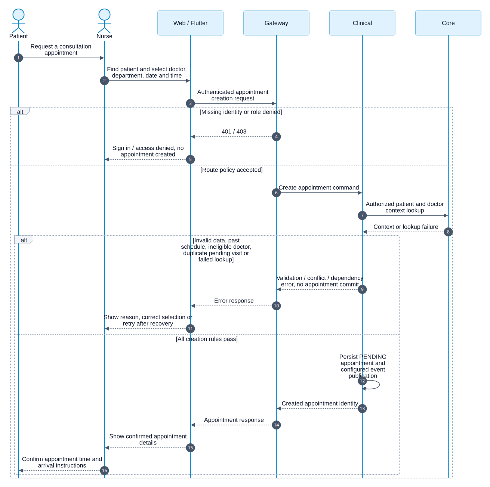

Mermaid · 05-en

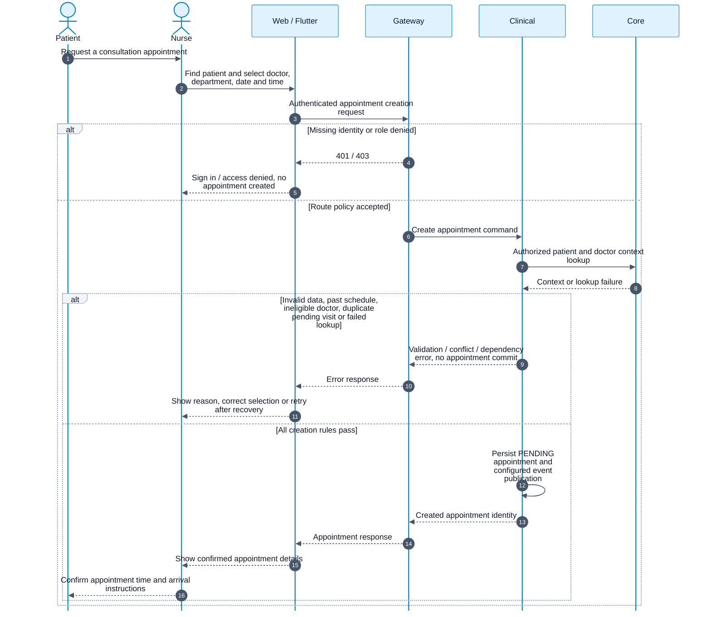
```mermaid
%%{init: {"theme": "base", "securityLevel": "loose", "fontFamily": "Arial, sans-serif", "themeVariables": {"primaryColor": "#e0f2fe", "primaryTextColor": "#0f172a", "primaryBorderColor": "#0284c7", "lineColor": "#475569", "secondaryColor": "#ccfbf1", "tertiaryColor": "#f1f5f9", "background": "#ffffff", "mainBkg": "#e0f2fe", "nodeBorder": "#0284c7", "clusterBkg": "#f8fafc", "clusterBorder": "#94a3b8", "actorBkg": "#e0f2fe", "actorBorder": "#0284c7", "actorTextColor": "#0f172a", "signalColor": "#475569", "signalTextColor": "#0f172a", "labelBoxBkgColor": "#f1f5f9", "labelBoxBorderColor": "#94a3b8", "activationBkgColor": "#ccfbf1", "activationBorderColor": "#0f766e", "sequenceNumberColor": "#ffffff", "attributeBackgroundColorOdd": "#ffffff", "attributeBackgroundColorEven": "#f0f9ff"}, "flowchart": {"htmlLabels": true, "curve": "linear", "nodeSpacing": 40, "rankSpacing": 46, "subGraphTitleMargin": {"top": 12, "bottom": 45}}, "sequence": {"useMaxWidth": true, "wrap": true, "actorMargin": 55, "width": 175, "messageMargin": 30, "mirrorActors": false}, "er": {"useMaxWidth": true}, "maxTextSize": 2000000, "class": {"nodeSpacing": 30, "rankSpacing": 55}}}%%
sequenceDiagram
 autonumber
 actor Patient as Patient
 actor Nurse as Nurse
 participant UI as Web / Flutter
 participant G as Gateway
 participant C as Clinical
 participant Core as Core
 Patient->>Nurse: Request a consultation appointment
 Nurse->>UI: Find patient and select doctor, department, date and time
 UI->>G: Authenticated appointment creation request
 alt Missing identity or role denied
  G-->>UI: 401 / 403
  UI-->>Nurse: Sign in / access denied, no appointment created
 else Route policy accepted
  G->>C: Create appointment command
  C->>Core: Authorized patient and doctor context lookup
  Core-->>C: Context or lookup failure
  alt Invalid data, past schedule, ineligible doctor, duplicate pending visit or failed lookup
   C-->>G: Validation / conflict / dependency error, no appointment commit
   G-->>UI: Error response
   UI-->>Nurse: Show reason, correct selection or retry after recovery
  else All creation rules pass
   C->>C: Persist PENDING appointment and configured event publication
   C-->>G: Created appointment identity
   G-->>UI: Appointment response
   UI-->>Nurse: Show confirmed appointment details
   Nurse-->>Patient: Confirm appointment time and arrival instructions
  end
 end
```

PATIENT requests scheduling through the nurse; no patient self-service API is invented. New patients are registered in Core first, outside this sequence. Only a successful saved appointment is a valid input to check-in (figure 07). Scheduling itself is not proof of payment or permission to start consultation.

### Arrival → exam payment → start consultation (V1)

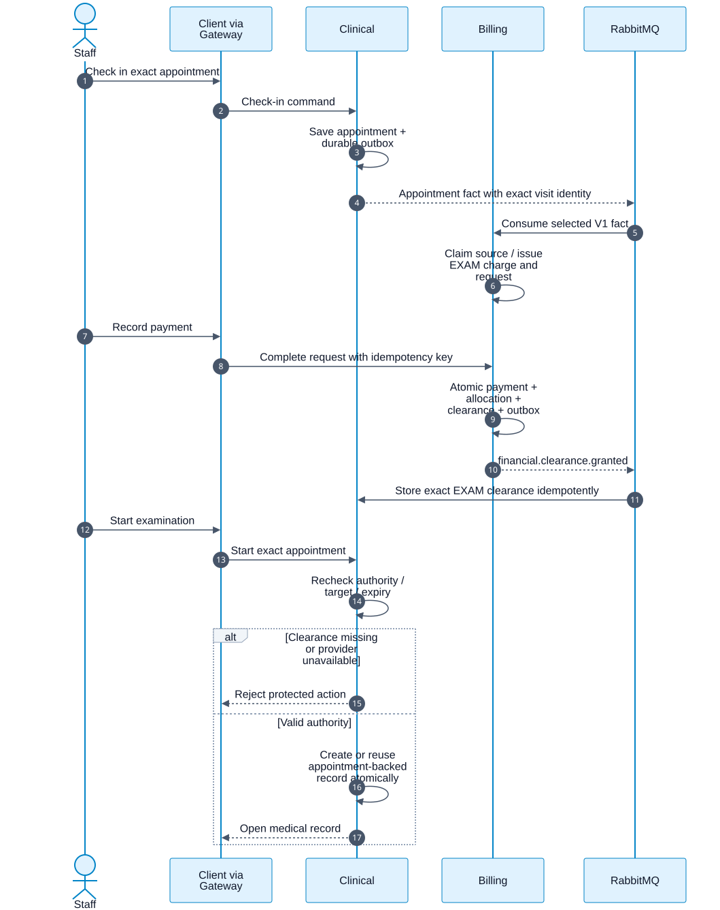

Mermaid · 07-en

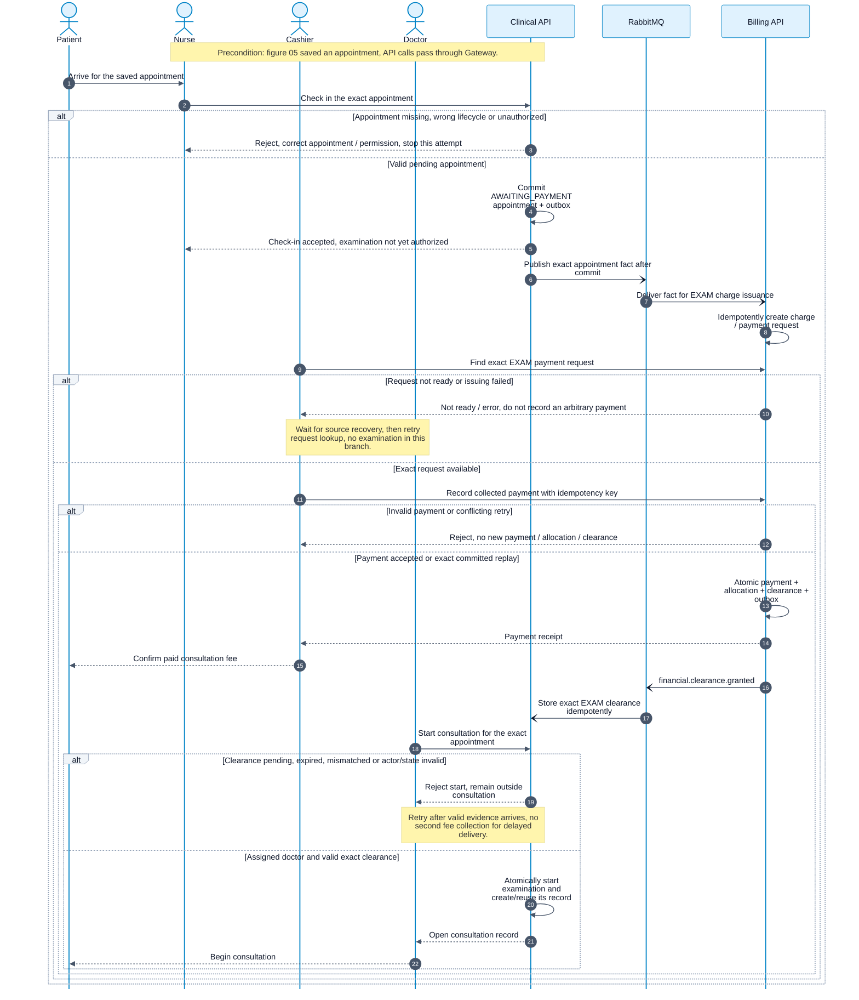
```mermaid
%%{init: {"theme": "base", "securityLevel": "loose", "fontFamily": "Arial, sans-serif", "themeVariables": {"primaryColor": "#e0f2fe", "primaryTextColor": "#0f172a", "primaryBorderColor": "#0284c7", "lineColor": "#475569", "secondaryColor": "#ccfbf1", "tertiaryColor": "#f1f5f9", "background": "#ffffff", "mainBkg": "#e0f2fe", "nodeBorder": "#0284c7", "clusterBkg": "#f8fafc", "clusterBorder": "#94a3b8", "actorBkg": "#e0f2fe", "actorBorder": "#0284c7", "actorTextColor": "#0f172a", "signalColor": "#475569", "signalTextColor": "#0f172a", "labelBoxBkgColor": "#f1f5f9", "labelBoxBorderColor": "#94a3b8", "activationBkgColor": "#ccfbf1", "activationBorderColor": "#0f766e", "sequenceNumberColor": "#ffffff", "attributeBackgroundColorOdd": "#ffffff", "attributeBackgroundColorEven": "#f0f9ff"}, "flowchart": {"htmlLabels": true, "curve": "linear", "nodeSpacing": 40, "rankSpacing": 46, "subGraphTitleMargin": {"top": 12, "bottom": 45}}, "sequence": {"useMaxWidth": true, "wrap": true, "actorMargin": 55, "width": 175, "messageMargin": 30, "mirrorActors": false}, "er": {"useMaxWidth": true}, "maxTextSize": 2000000, "class": {"nodeSpacing": 30, "rankSpacing": 55}}}%%
sequenceDiagram
 autonumber
 actor Patient as Patient
 actor Nurse as Nurse
 actor Cashier as Cashier
 actor Doctor as Doctor
 participant C as Clinical API
 participant Q as RabbitMQ
 participant B as Billing API
 Note over Nurse,C: Precondition: figure 05 saved an appointment, API calls pass through Gateway.
 Patient->>Nurse: Arrive for the saved appointment
 Nurse->>C: Check in the exact appointment
 alt Appointment missing, wrong lifecycle or unauthorized
  C-->>Nurse: Reject, correct appointment / permission, stop this attempt
 else Valid pending appointment
  C->>C: Commit AWAITING_PAYMENT appointment + outbox
  C-->>Nurse: Check-in accepted, examination not yet authorized
  C-)Q: Publish exact appointment fact after commit
  Q-)B: Deliver fact for EXAM charge issuance
  B->>B: Idempotently create charge / payment request
  Cashier->>B: Find exact EXAM payment request
  alt Request not ready or issuing failed
   B-->>Cashier: Not ready / error, do not record an arbitrary payment
   Note over Cashier,Doctor: Wait for source recovery, then retry request lookup, no examination in this branch.
  else Exact request available
   Cashier->>B: Record collected payment with idempotency key
   alt Invalid payment or conflicting retry
    B-->>Cashier: Reject, no new payment / allocation / clearance
   else Payment accepted or exact committed replay
    B->>B: Atomic payment + allocation + clearance + outbox
    B-->>Cashier: Payment receipt
    Cashier-->>Patient: Confirm paid consultation fee
    B-)Q: financial.clearance.granted
    Q-)C: Store exact EXAM clearance idempotently
    Doctor->>C: Start consultation for the exact appointment
    alt Clearance pending, expired, mismatched or actor/state invalid
     C-->>Doctor: Reject start, remain outside consultation
     Note over Doctor,C: Retry after valid evidence arrives, no second fee collection for delayed delivery.
    else Assigned doctor and valid exact clearance
     C->>C: Atomically start examination and create/reuse its record
     C-->>Doctor: Open consultation record
     Doctor-->>Patient: Begin consultation
    end
   end
  end
 end
```

Normal V1 outpatient path. Check-in precedes fee collection, and fee authorization precedes examination. Audited emergency override remains a separately authorized source capability, not a fallback for ordinary unpaid visits. Actors use their own sessions; API lifelines abbreviate Gateway transport only. Event arrows are asynchronous and duplicate delivery does not create a second fee.

### Lab order → payment → test → doctor reads results (V1)

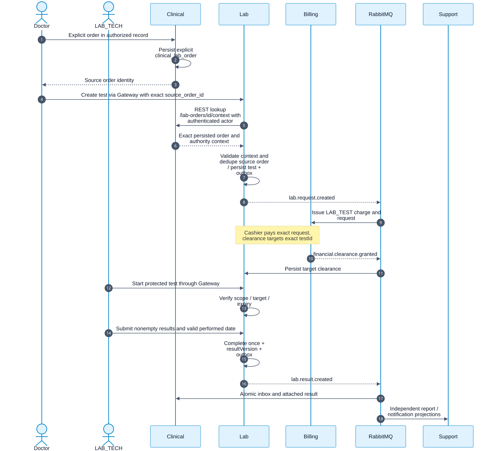

Mermaid · 08-en

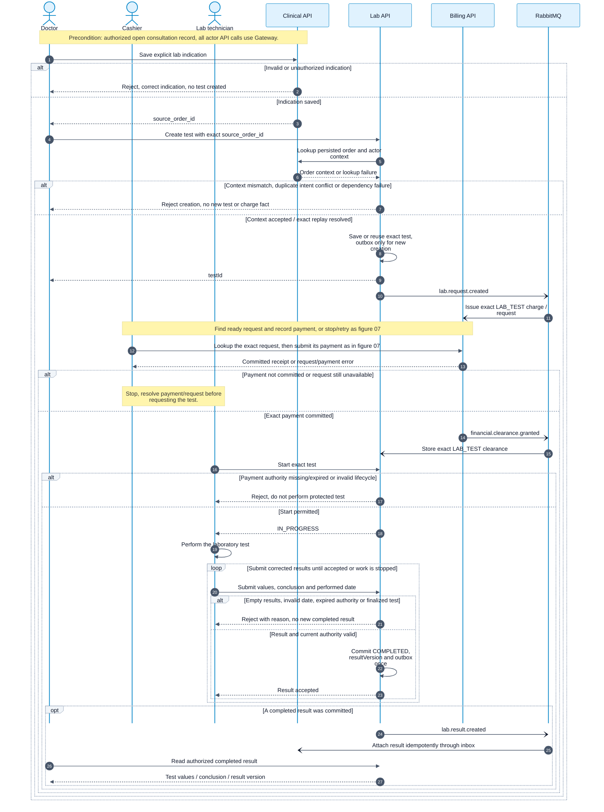
```mermaid
%%{init: {"theme": "base", "securityLevel": "loose", "fontFamily": "Arial, sans-serif", "themeVariables": {"primaryColor": "#e0f2fe", "primaryTextColor": "#0f172a", "primaryBorderColor": "#0284c7", "lineColor": "#475569", "secondaryColor": "#ccfbf1", "tertiaryColor": "#f1f5f9", "background": "#ffffff", "mainBkg": "#e0f2fe", "nodeBorder": "#0284c7", "clusterBkg": "#f8fafc", "clusterBorder": "#94a3b8", "actorBkg": "#e0f2fe", "actorBorder": "#0284c7", "actorTextColor": "#0f172a", "signalColor": "#475569", "signalTextColor": "#0f172a", "labelBoxBkgColor": "#f1f5f9", "labelBoxBorderColor": "#94a3b8", "activationBkgColor": "#ccfbf1", "activationBorderColor": "#0f766e", "sequenceNumberColor": "#ffffff", "attributeBackgroundColorOdd": "#ffffff", "attributeBackgroundColorEven": "#f0f9ff"}, "flowchart": {"htmlLabels": true, "curve": "linear", "nodeSpacing": 40, "rankSpacing": 46, "subGraphTitleMargin": {"top": 12, "bottom": 45}}, "sequence": {"useMaxWidth": true, "wrap": true, "actorMargin": 55, "width": 175, "messageMargin": 30, "mirrorActors": false}, "er": {"useMaxWidth": true}, "maxTextSize": 2000000, "class": {"nodeSpacing": 30, "rankSpacing": 55}}}%%
sequenceDiagram
 autonumber
 actor Doctor as Doctor
 actor Cashier as Cashier
 actor Tech as Lab technician
 participant C as Clinical API
 participant L as Lab API
 participant B as Billing API
 participant Q as RabbitMQ
 Note over Doctor,C: Precondition: authorized open consultation record, all actor API calls use Gateway.
 Doctor->>C: Save explicit lab indication
 alt Invalid or unauthorized indication
  C-->>Doctor: Reject, correct indication, no test created
 else Indication saved
  C-->>Doctor: source_order_id
  Doctor->>L: Create test with exact source_order_id
  L->>C: Lookup persisted order and actor context
  C-->>L: Order context or lookup failure
  alt Context mismatch, duplicate intent conflict or dependency failure
   L-->>Doctor: Reject creation, no new test or charge fact
  else Context accepted / exact replay resolved
   L->>L: Save or reuse exact test, outbox only for new creation
   L-->>Doctor: testId
   L-)Q: lab.request.created
   Q-)B: Issue exact LAB_TEST charge / request
   Note over Cashier,B: Find ready request and record payment, or stop/retry as figure 07
   Cashier->>B: Lookup the exact request, then submit its payment as in figure 07
   B-->>Cashier: Committed receipt or request/payment error
   alt Payment not committed or request still unavailable
    Note over Cashier,Tech: Stop, resolve payment/request before requesting the test.
   else Exact payment committed
   B-)Q: financial.clearance.granted
   Q-)L: Store exact LAB_TEST clearance
   Tech->>L: Start exact test
   alt Payment authority missing/expired or invalid lifecycle
    L-->>Tech: Reject, do not perform protected test
   else Start permitted
    L-->>Tech: IN_PROGRESS
    Tech->>Tech: Perform the laboratory test
    loop Submit corrected results until accepted or work is stopped
     Tech->>L: Submit values, conclusion and performed date
     alt Empty results, invalid date, expired authority or finalized test
      L-->>Tech: Reject with reason, no new completed result
     else Result and current authority valid
      L->>L: Commit COMPLETED, resultVersion and outbox once
      L-->>Tech: Result accepted
     end
    end
    opt A completed result was committed
     L-)Q: lab.result.created
     Q-)C: Attach result idempotently through inbox
     Doctor->>L: Read authorized completed result
     L-->>Doctor: Test values / conclusion / result version
    end
   end
   end
  end
 end
```

The payment reference imports the complete success/failure payment subflow, not an unconditional successful payment. Starting and entering results both enforce current authority. The technician records results; the doctor interprets them in figure 37. Support projections do not block this path and are omitted. A failed result cannot produce the completion event.

### Doctor explains consultation outcome to patient

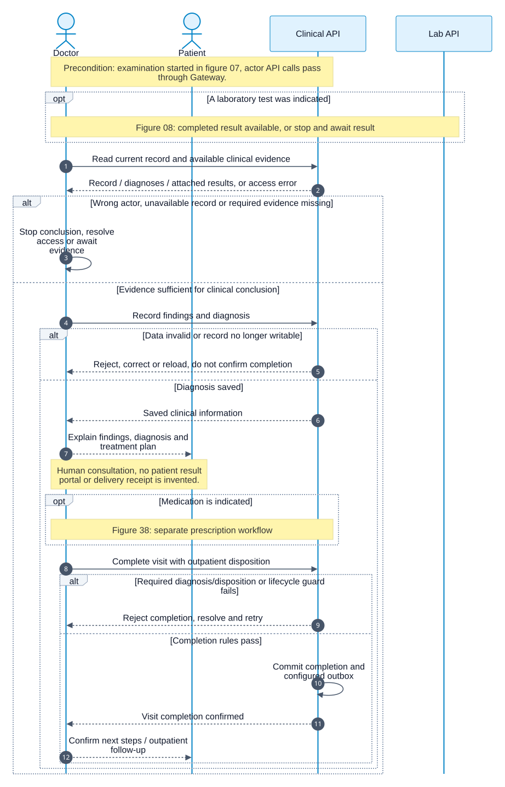

Mermaid · 37-en

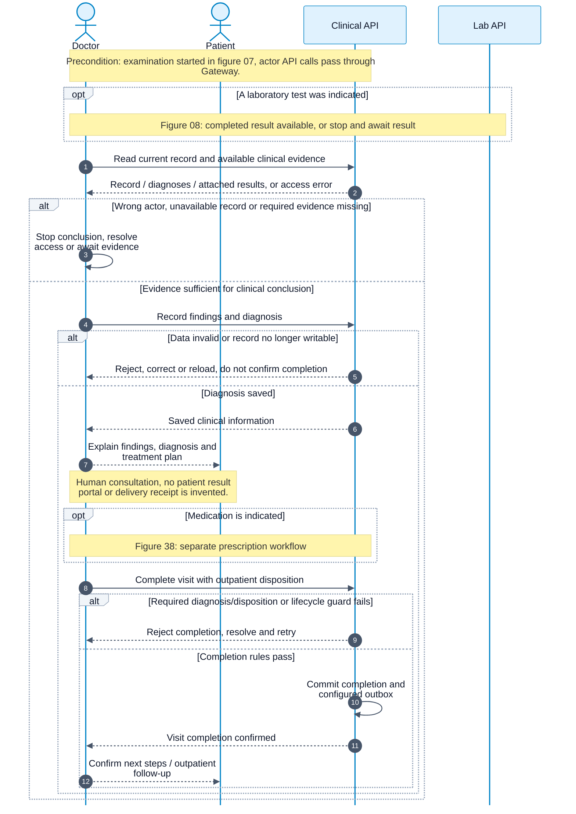
```mermaid
%%{init: {"theme": "base", "securityLevel": "loose", "fontFamily": "Arial, sans-serif", "themeVariables": {"primaryColor": "#e0f2fe", "primaryTextColor": "#0f172a", "primaryBorderColor": "#0284c7", "lineColor": "#475569", "secondaryColor": "#ccfbf1", "tertiaryColor": "#f1f5f9", "background": "#ffffff", "mainBkg": "#e0f2fe", "nodeBorder": "#0284c7", "clusterBkg": "#f8fafc", "clusterBorder": "#94a3b8", "actorBkg": "#e0f2fe", "actorBorder": "#0284c7", "actorTextColor": "#0f172a", "signalColor": "#475569", "signalTextColor": "#0f172a", "labelBoxBkgColor": "#f1f5f9", "labelBoxBorderColor": "#94a3b8", "activationBkgColor": "#ccfbf1", "activationBorderColor": "#0f766e", "sequenceNumberColor": "#ffffff", "attributeBackgroundColorOdd": "#ffffff", "attributeBackgroundColorEven": "#f0f9ff"}, "flowchart": {"htmlLabels": true, "curve": "linear", "nodeSpacing": 40, "rankSpacing": 46, "subGraphTitleMargin": {"top": 12, "bottom": 45}}, "sequence": {"useMaxWidth": true, "wrap": true, "actorMargin": 55, "width": 175, "messageMargin": 30, "mirrorActors": false}, "er": {"useMaxWidth": true}, "maxTextSize": 2000000, "class": {"nodeSpacing": 30, "rankSpacing": 55}}}%%
sequenceDiagram
 autonumber
 actor Doctor as Doctor
 actor Patient as Patient
 participant C as Clinical API
 participant L as Lab API
 Note over Doctor,C: Precondition: examination started in figure 07, actor API calls pass through Gateway.
 opt A laboratory test was indicated
  Note over Doctor,L: Figure 08: completed result available, or stop and await result
 end
 Doctor->>C: Read current record and available clinical evidence
 C-->>Doctor: Record / diagnoses / attached results, or access error
 alt Wrong actor, unavailable record or required evidence missing
  Doctor->>Doctor: Stop conclusion, resolve access or await evidence
 else Evidence sufficient for clinical conclusion
  Doctor->>C: Record findings and diagnosis
  alt Data invalid or record no longer writable
   C-->>Doctor: Reject, correct or reload, do not confirm completion
  else Diagnosis saved
   C-->>Doctor: Saved clinical information
   Doctor-->>Patient: Explain findings, diagnosis and treatment plan
   Note over Doctor,Patient: Human consultation, no patient result portal or delivery receipt is invented.
   opt Medication is indicated
    Note over Doctor,C: Figure 38: separate prescription workflow
   end
   Doctor->>C: Complete visit with outpatient disposition
   alt Required diagnosis/disposition or lifecycle guard fails
    C-->>Doctor: Reject completion, resolve and retry
   else Completion rules pass
    C->>C: Commit completion and configured outbox
    C-->>Doctor: Visit completion confirmed
    Doctor-->>Patient: Confirm next steps / outpatient follow-up
   end
  end
 end
```

The actor reads Lab results through its authorized API; asynchronous Clinical attachment may arrive later. This figure models professional explanation to the patient, not a new software result-delivery endpoint. Medication fulfilment is a separate Pharmacy/Billing process and is not proof of consultation-result delivery. The clinical completion command uses source lifecycle rules; it is not made dependent on a fabricated dispense condition.

### Create prescription — an optional separate workflow

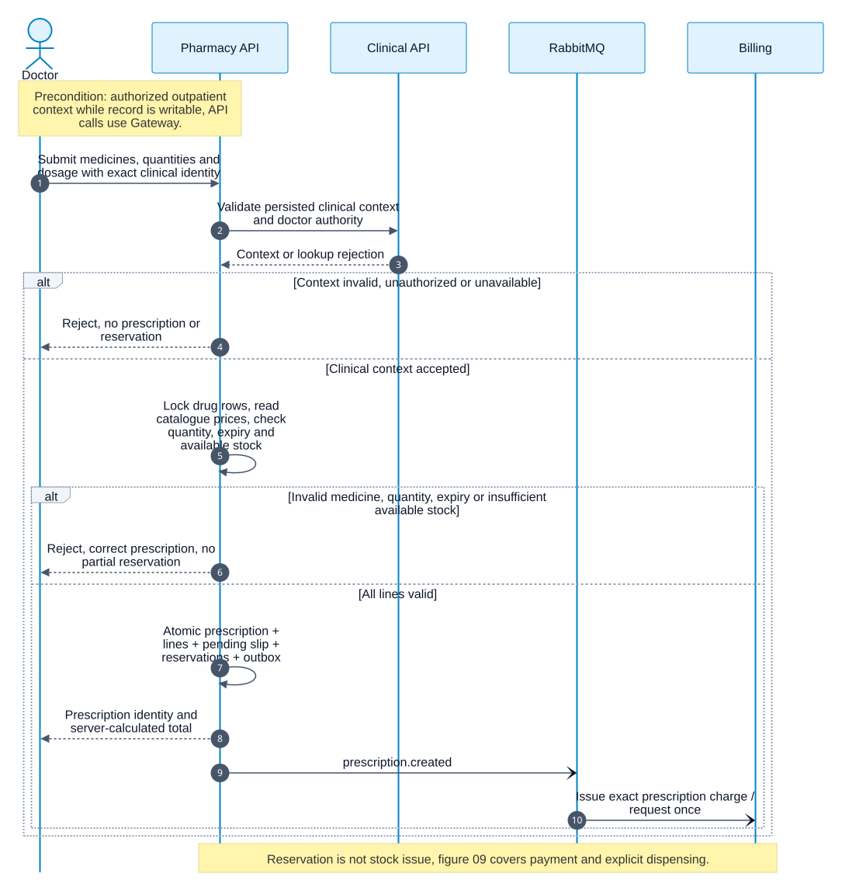

Mermaid · 38-en

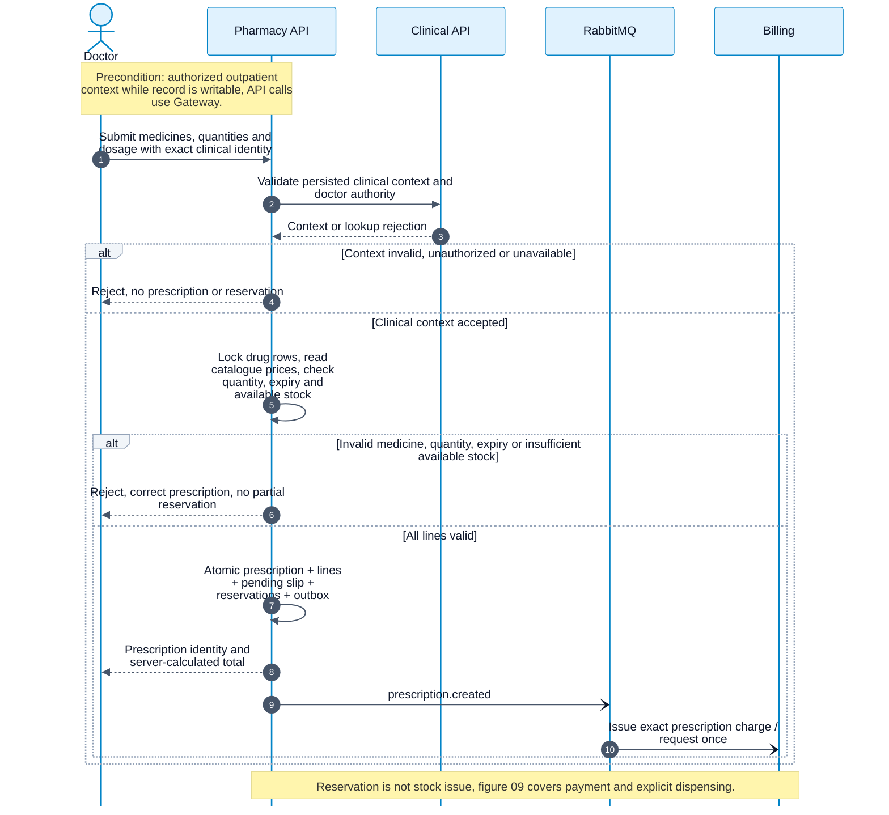
```mermaid
%%{init: {"theme": "base", "securityLevel": "loose", "fontFamily": "Arial, sans-serif", "themeVariables": {"primaryColor": "#e0f2fe", "primaryTextColor": "#0f172a", "primaryBorderColor": "#0284c7", "lineColor": "#475569", "secondaryColor": "#ccfbf1", "tertiaryColor": "#f1f5f9", "background": "#ffffff", "mainBkg": "#e0f2fe", "nodeBorder": "#0284c7", "clusterBkg": "#f8fafc", "clusterBorder": "#94a3b8", "actorBkg": "#e0f2fe", "actorBorder": "#0284c7", "actorTextColor": "#0f172a", "signalColor": "#475569", "signalTextColor": "#0f172a", "labelBoxBkgColor": "#f1f5f9", "labelBoxBorderColor": "#94a3b8", "activationBkgColor": "#ccfbf1", "activationBorderColor": "#0f766e", "sequenceNumberColor": "#ffffff", "attributeBackgroundColorOdd": "#ffffff", "attributeBackgroundColorEven": "#f0f9ff"}, "flowchart": {"htmlLabels": true, "curve": "linear", "nodeSpacing": 40, "rankSpacing": 46, "subGraphTitleMargin": {"top": 12, "bottom": 45}}, "sequence": {"useMaxWidth": true, "wrap": true, "actorMargin": 55, "width": 175, "messageMargin": 30, "mirrorActors": false}, "er": {"useMaxWidth": true}, "maxTextSize": 2000000, "class": {"nodeSpacing": 30, "rankSpacing": 55}}}%%
sequenceDiagram
 autonumber
 actor Doctor as Doctor
 participant P as Pharmacy API
 participant C as Clinical API
 participant Q as RabbitMQ
 participant B as Billing
 Note over Doctor,P: Precondition: authorized outpatient context while record is writable, API calls use Gateway.
 Doctor->>P: Submit medicines, quantities and dosage with exact clinical identity
 P->>C: Validate persisted clinical context and doctor authority
 C-->>P: Context or lookup rejection
 alt Context invalid, unauthorized or unavailable
  P-->>Doctor: Reject, no prescription or reservation
 else Clinical context accepted
  P->>P: Lock drug rows, read catalogue prices, check quantity, expiry and available stock
  alt Invalid medicine, quantity, expiry or insufficient available stock
   P-->>Doctor: Reject, correct prescription, no partial reservation
  else All lines valid
   P->>P: Atomic prescription + lines + pending slip + reservations + outbox
   P-->>Doctor: Prescription identity and server-calculated total
   P-)Q: prescription.created
   Q-)B: Issue exact prescription charge / request once
  end
 end
 Note over P,B: Reservation is not stock issue, figure 09 covers payment and explicit dispensing.
```

Prices come from server catalogue snapshots, not client-supplied amounts. Source context is validated rather than inferred from a diagnosis string or arbitrary UUID. Retry semantics follow the actual endpoint; this diagram does not invent a universal prescription idempotency key.

### Prescription payment and explicit pharmacist dispensing (V1)

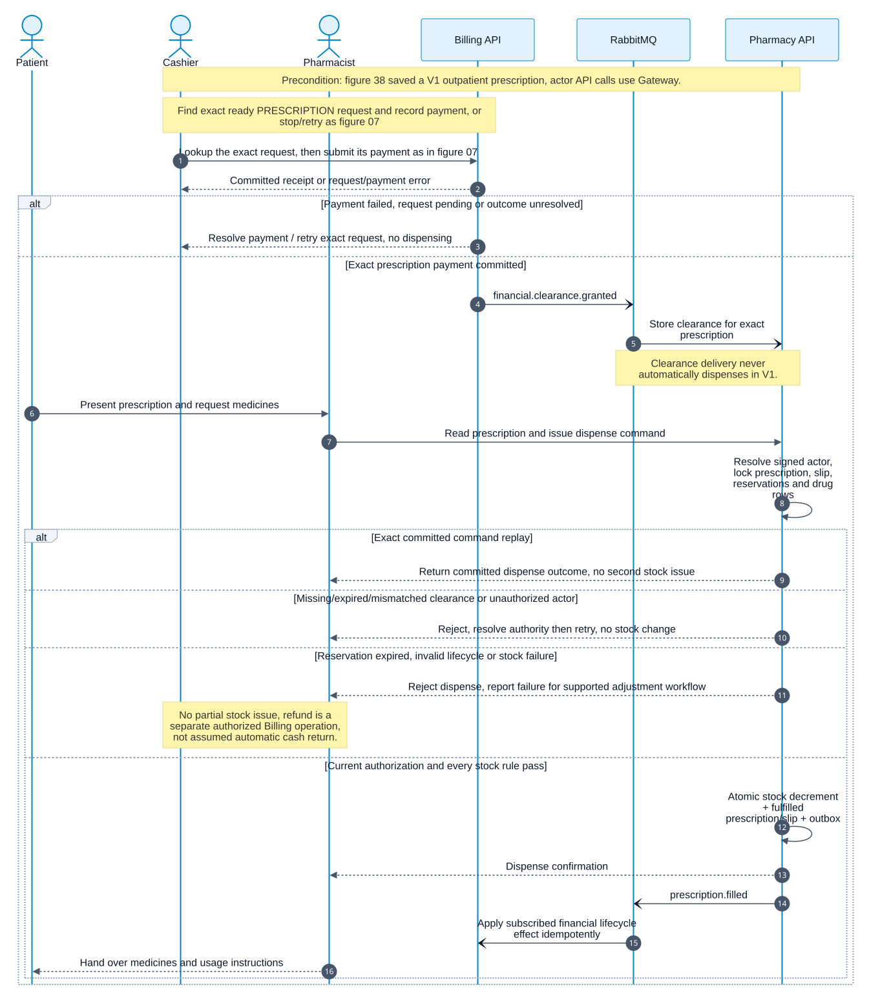

Mermaid · 09-en

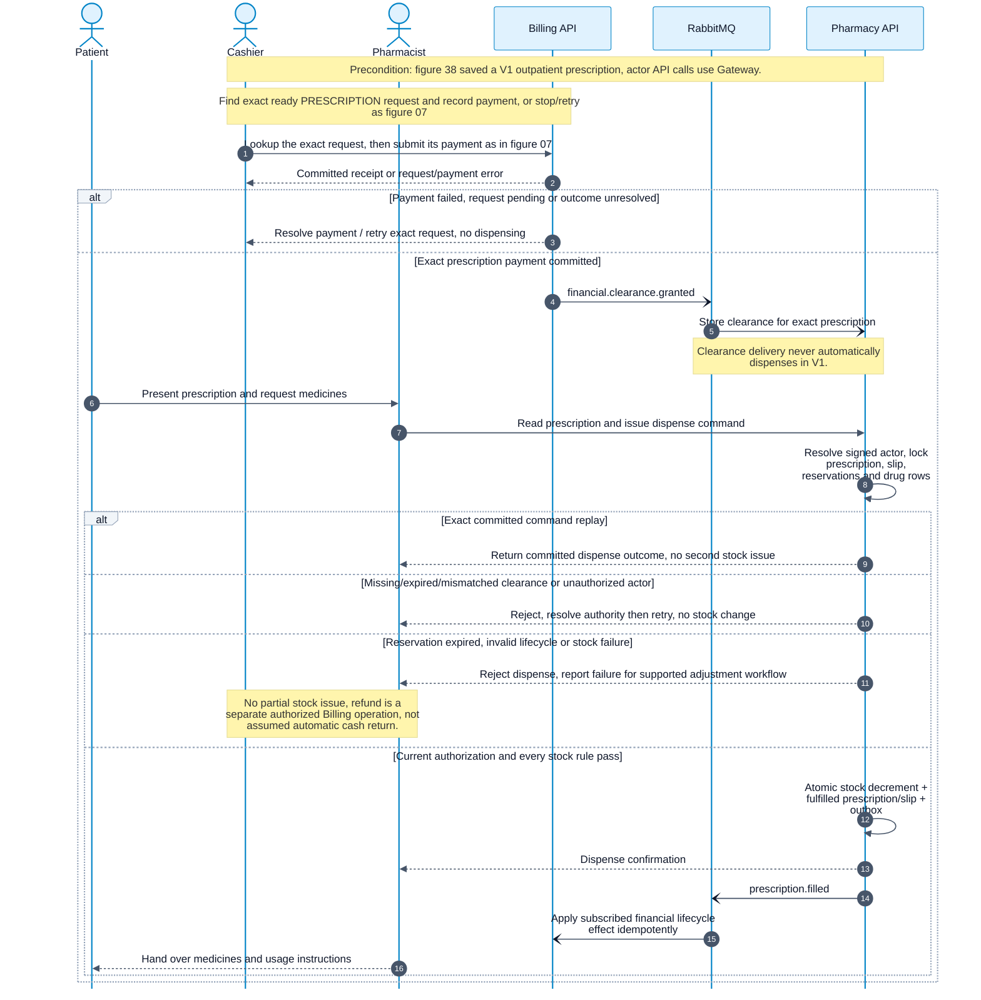
```mermaid
%%{init: {"theme": "base", "securityLevel": "loose", "fontFamily": "Arial, sans-serif", "themeVariables": {"primaryColor": "#e0f2fe", "primaryTextColor": "#0f172a", "primaryBorderColor": "#0284c7", "lineColor": "#475569", "secondaryColor": "#ccfbf1", "tertiaryColor": "#f1f5f9", "background": "#ffffff", "mainBkg": "#e0f2fe", "nodeBorder": "#0284c7", "clusterBkg": "#f8fafc", "clusterBorder": "#94a3b8", "actorBkg": "#e0f2fe", "actorBorder": "#0284c7", "actorTextColor": "#0f172a", "signalColor": "#475569", "signalTextColor": "#0f172a", "labelBoxBkgColor": "#f1f5f9", "labelBoxBorderColor": "#94a3b8", "activationBkgColor": "#ccfbf1", "activationBorderColor": "#0f766e", "sequenceNumberColor": "#ffffff", "attributeBackgroundColorOdd": "#ffffff", "attributeBackgroundColorEven": "#f0f9ff"}, "flowchart": {"htmlLabels": true, "curve": "linear", "nodeSpacing": 40, "rankSpacing": 46, "subGraphTitleMargin": {"top": 12, "bottom": 45}}, "sequence": {"useMaxWidth": true, "wrap": true, "actorMargin": 55, "width": 175, "messageMargin": 30, "mirrorActors": false}, "er": {"useMaxWidth": true}, "maxTextSize": 2000000, "class": {"nodeSpacing": 30, "rankSpacing": 55}}}%%
sequenceDiagram
 autonumber
 actor Patient as Patient
 actor Cashier as Cashier
 actor Pharmacist as Pharmacist
 participant B as Billing API
 participant Q as RabbitMQ
 participant P as Pharmacy API
 Note over Cashier,P: Precondition: figure 38 saved a V1 outpatient prescription, actor API calls use Gateway.
 Note over Cashier,B: Find exact ready PRESCRIPTION request and record payment, or stop/retry as figure 07
 Cashier->>B: Lookup the exact request, then submit its payment as in figure 07
 B-->>Cashier: Committed receipt or request/payment error
 alt Payment failed, request pending or outcome unresolved
  B-->>Cashier: Resolve payment / retry exact request, no dispensing
 else Exact prescription payment committed
 B-)Q: financial.clearance.granted
 Q-)P: Store clearance for exact prescription
 Note over Q,P: Clearance delivery never automatically dispenses in V1.
 Patient->>Pharmacist: Present prescription and request medicines
 Pharmacist->>P: Read prescription and issue dispense command
 P->>P: Resolve signed actor, lock prescription, slip, reservations and drug rows
 alt Exact committed command replay
  P-->>Pharmacist: Return committed dispense outcome, no second stock issue
 else Missing/expired/mismatched clearance or unauthorized actor
  P-->>Pharmacist: Reject, resolve authority then retry, no stock change
 else Reservation expired, invalid lifecycle or stock failure
  P-->>Pharmacist: Reject dispense, report failure for supported adjustment workflow
  Note over Cashier,Pharmacist: No partial stock issue, refund is a separate authorized Billing operation, not assumed automatic cash return.
 else Current authorization and every stock rule pass
  P->>P: Atomic stock decrement + fulfilled prescription/slip + outbox
  P-->>Pharmacist: Dispense confirmation
  P-)Q: prescription.filled
  Q-)B: Apply subscribed financial lifecycle effect idempotently
  Pharmacist-->>Patient: Hand over medicines and usage instructions
 end
 end
```

The V0 automatic payment.completed saga is a legacy compatibility mechanism, not the main V1 journey. Pharmacist command, current target clearance, lifecycle and locked stock evidence are mandatory. Physical handover is shown as a human action after persisted confirmation; the source does not prove receipt by the patient.

### 1.4. Class Diagrams

Domain classes are grouped by deployed service. Core/Support preserve their internal context boundaries; Pharmacy/Billing share a figure but remain two independent services. Attributes are selective and must match source; dotted integration dependencies are not database relationships.

### Core service — Organization and Patient modules



Mermaid · 39-en

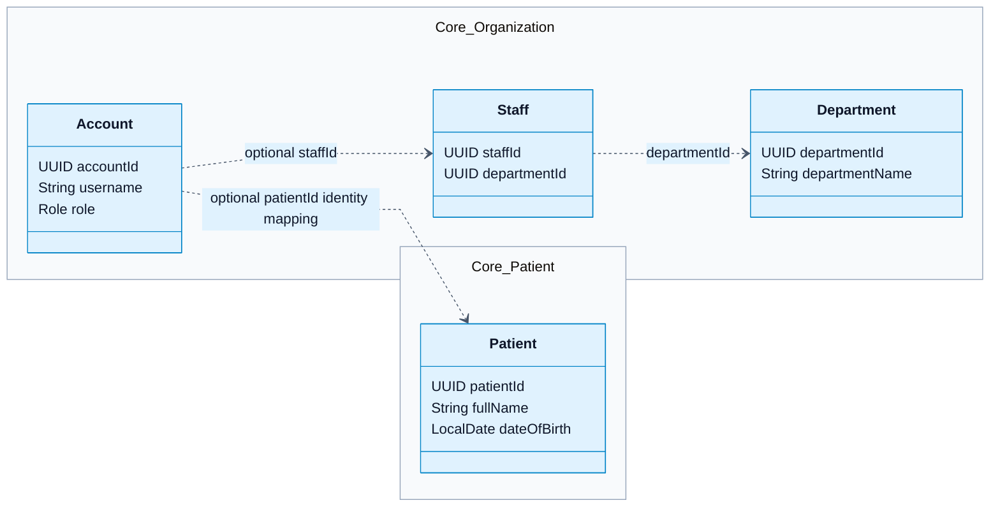
```mermaid
%%{init: {"theme": "base", "securityLevel": "loose", "fontFamily": "Arial, sans-serif", "themeVariables": {"primaryColor": "#e0f2fe", "primaryTextColor": "#0f172a", "primaryBorderColor": "#0284c7", "lineColor": "#475569", "secondaryColor": "#ccfbf1", "tertiaryColor": "#f1f5f9", "background": "#ffffff", "mainBkg": "#e0f2fe", "nodeBorder": "#0284c7", "clusterBkg": "#f8fafc", "clusterBorder": "#94a3b8", "actorBkg": "#e0f2fe", "actorBorder": "#0284c7", "actorTextColor": "#0f172a", "signalColor": "#475569", "signalTextColor": "#0f172a", "labelBoxBkgColor": "#f1f5f9", "labelBoxBorderColor": "#94a3b8", "activationBkgColor": "#ccfbf1", "activationBorderColor": "#0f766e", "sequenceNumberColor": "#ffffff", "attributeBackgroundColorOdd": "#ffffff", "attributeBackgroundColorEven": "#f0f9ff"}, "flowchart": {"htmlLabels": true, "curve": "linear", "nodeSpacing": 40, "rankSpacing": 46, "subGraphTitleMargin": {"top": 12, "bottom": 45}}, "sequence": {"useMaxWidth": true, "wrap": true, "actorMargin": 55, "width": 175, "messageMargin": 30, "mirrorActors": false}, "er": {"useMaxWidth": true}, "maxTextSize": 2000000, "class": {"nodeSpacing": 30, "rankSpacing": 55}}}%%
classDiagram
 direction LR
 namespace Core_Organization {
  class Account {
   UUID accountId
   String username
   Role role
  }
  class Staff {
   UUID staffId
   UUID departmentId
  }
  class Department {
   UUID departmentId
   String departmentName
  }
 }
 namespace Core_Patient {
  class Patient {
   UUID patientId
   String fullName
   LocalDate dateOfBirth
  }
 }
 Staff ..> Department : departmentId
 Account ..> Staff : optional staffId
 Account ..> Patient : optional patientId identity mapping
```

Both modules run in Core but retain separate Organization/Patient stores. Identity references are optional and depend on account role; the drawing does not create a cross-database foreign key. Infrastructure classes are excluded from this domain overview.

### Clinical service — domain classes



Mermaid · 10-en

```mermaid
%%{init: {"theme": "base", "securityLevel": "loose", "fontFamily": "Arial, sans-serif", "themeVariables": {"primaryColor": "#e0f2fe", "primaryTextColor": "#0f172a", "primaryBorderColor": "#0284c7", "lineColor": "#475569", "secondaryColor": "#ccfbf1", "tertiaryColor": "#f1f5f9", "background": "#ffffff", "mainBkg": "#e0f2fe", "nodeBorder": "#0284c7", "clusterBkg": "#f8fafc", "clusterBorder": "#94a3b8", "actorBkg": "#e0f2fe", "actorBorder": "#0284c7", "actorTextColor": "#0f172a", "signalColor": "#475569", "signalTextColor": "#0f172a", "labelBoxBkgColor": "#f1f5f9", "labelBoxBorderColor": "#94a3b8", "activationBkgColor": "#ccfbf1", "activationBorderColor": "#0f766e", "sequenceNumberColor": "#ffffff", "attributeBackgroundColorOdd": "#ffffff", "attributeBackgroundColorEven": "#f0f9ff"}, "flowchart": {"htmlLabels": true, "curve": "linear", "nodeSpacing": 40, "rankSpacing": 46, "subGraphTitleMargin": {"top": 12, "bottom": 45}}, "sequence": {"useMaxWidth": true, "wrap": true, "actorMargin": 55, "width": 175, "messageMargin": 30, "mirrorActors": false}, "er": {"useMaxWidth": true}, "maxTextSize": 2000000, "class": {"nodeSpacing": 30, "rankSpacing": 55}}}%%
classDiagram
 direction LR
 namespace Clinical {
  class Appointment {
   UUID appointmentId
   UUID patientId
   UUID doctorId
   UUID departmentId
   AppointmentStatus status
   checkIn(priceCode, at)
   startExam(clearanceId, overrideId, at)
   complete(at)
  }
  class MedicalRecord {
   UUID recordId
   UUID appointmentId
   MedicalRecordStatus status
   RecordDisposition disposition
  }
  class Diagnosis {
   UUID diagnosisId
   String diagnosisName
   String icdCode
  }
  class ClinicalLabOrder {
   UUID sourceOrderId
   UUID recordId
   UUID patientId
  }
  class ExamClearance {
   UUID clearanceId
   UUID appointmentId
   Instant expiresAt
  }
 }
 Appointment "0..1" --> "0..1" MedicalRecord : appointmentId
 MedicalRecord "1" *-- "0..*" Diagnosis
 ClinicalLabOrder ..> MedicalRecord : recordId
 ExamClearance ..> Appointment : appointmentId
```

All classes in this figure belong to Clinical. LabTest/LabResult move to figure 40. Dashed UUID references do not imply JPA navigation. Appointment-backed records are distinct from preserved legacy records without an appointment. Selected attributes/methods are copied from source; no generated getters are listed.

### Lab service — tests, results and financial authority



Mermaid · 40-en

```mermaid
%%{init: {"theme": "base", "securityLevel": "loose", "fontFamily": "Arial, sans-serif", "themeVariables": {"primaryColor": "#e0f2fe", "primaryTextColor": "#0f172a", "primaryBorderColor": "#0284c7", "lineColor": "#475569", "secondaryColor": "#ccfbf1", "tertiaryColor": "#f1f5f9", "background": "#ffffff", "mainBkg": "#e0f2fe", "nodeBorder": "#0284c7", "clusterBkg": "#f8fafc", "clusterBorder": "#94a3b8", "actorBkg": "#e0f2fe", "actorBorder": "#0284c7", "actorTextColor": "#0f172a", "signalColor": "#475569", "signalTextColor": "#0f172a", "labelBoxBkgColor": "#f1f5f9", "labelBoxBorderColor": "#94a3b8", "activationBkgColor": "#ccfbf1", "activationBorderColor": "#0f766e", "sequenceNumberColor": "#ffffff", "attributeBackgroundColorOdd": "#ffffff", "attributeBackgroundColorEven": "#f0f9ff"}, "flowchart": {"htmlLabels": true, "curve": "linear", "nodeSpacing": 40, "rankSpacing": 46, "subGraphTitleMargin": {"top": 12, "bottom": 45}}, "sequence": {"useMaxWidth": true, "wrap": true, "actorMargin": 55, "width": 175, "messageMargin": 30, "mirrorActors": false}, "er": {"useMaxWidth": true}, "maxTextSize": 2000000, "class": {"nodeSpacing": 30, "rankSpacing": 55}}}%%
classDiagram
 direction LR
 namespace Lab {
  class LabTest {
   UUID testId
   UUID recordId
   UUID sourceOrderId
   LabTestStatus status
   int resultVersion
   start(clearance, override, at)
   recordResults(results, conclusion, performedDate)
  }
  class LabResult {
   UUID resultId
   String indicator
   String value
   String unit
  }
  class LabFinancialClearance {
   UUID clearanceId
   UUID testId
   Instant expiresAt
  }
 }
 LabTest "1" *-- "0..*" LabResult
 LabTest ..> LabFinancialClearance : validate exact LAB_TEST authority
```

Clinical record and indication are external UUID references, not Clinical objects inside Lab. Lab stores its own received clearance evidence; Billing remains the authority for financial effects. Results are empty before completion and must be nonempty when completed.

### Pharmacy and Billing — separate services, explicit contracts



Mermaid · 11-en

```mermaid
%%{init: {"theme": "base", "securityLevel": "loose", "fontFamily": "Arial, sans-serif", "themeVariables": {"primaryColor": "#e0f2fe", "primaryTextColor": "#0f172a", "primaryBorderColor": "#0284c7", "lineColor": "#475569", "secondaryColor": "#ccfbf1", "tertiaryColor": "#f1f5f9", "background": "#ffffff", "mainBkg": "#e0f2fe", "nodeBorder": "#0284c7", "clusterBkg": "#f8fafc", "clusterBorder": "#94a3b8", "actorBkg": "#e0f2fe", "actorBorder": "#0284c7", "actorTextColor": "#0f172a", "signalColor": "#475569", "signalTextColor": "#0f172a", "labelBoxBkgColor": "#f1f5f9", "labelBoxBorderColor": "#94a3b8", "activationBkgColor": "#ccfbf1", "activationBorderColor": "#0f766e", "sequenceNumberColor": "#ffffff", "attributeBackgroundColorOdd": "#ffffff", "attributeBackgroundColorEven": "#f0f9ff"}, "flowchart": {"htmlLabels": true, "curve": "linear", "nodeSpacing": 40, "rankSpacing": 46, "subGraphTitleMargin": {"top": 12, "bottom": 45}}, "sequence": {"useMaxWidth": true, "wrap": true, "actorMargin": 55, "width": 175, "messageMargin": 30, "mirrorActors": false}, "er": {"useMaxWidth": true}, "maxTextSize": 2000000, "class": {"nodeSpacing": 30, "rankSpacing": 55}}}%%
classDiagram
 direction LR
 namespace Pharmacy {
  class Drug {
   UUID drugId
   BigDecimal price
   int stockQuantity
   LocalDate expiryDate
  }
  class Prescription {
   UUID prescriptionId
   BigDecimal totalAmount
   PrescriptionStatus status
  }
  class PrescriptionLine {
   UUID drugId
   int quantity
   BigDecimal unitPrice
  }
  class StockReservation {
   UUID prescriptionId
   UUID drugId
   int quantity
   Instant expiresAt
  }
  class DispenseSlip {
   UUID dispenseId
   UUID prescriptionId
  }
 }
 namespace Billing {
  class BillingAccount {
   UUID accountId
  }
  class Charge {
   UUID chargeId
   UUID accountId
   BigDecimal grossAmount
  }
  class PaymentRequest {
   UUID paymentRequestId
   UUID accountId
  }
  class PaymentTransaction {
   UUID transactionId
   UUID accountId
   BigDecimal amount
  }
  class PaymentAllocation {
   UUID transactionId
   UUID chargeId
   BigDecimal amount
  }
  class FinancialClearance {
   UUID clearanceId
   UUID prescriptionId
   Instant expiresAt
  }
 }
 Prescription "1" *-- "1..*" PrescriptionLine
 PrescriptionLine "*" --> "1" Drug : drugId
 Prescription "1" --> "1..*" StockReservation : prescriptionId
 Prescription "1" --> "1" DispenseSlip : prescriptionId
 Charge ..> BillingAccount : accountId
 PaymentRequest ..> BillingAccount : accountId
 PaymentTransaction ..> BillingAccount : accountId
 PaymentAllocation ..> PaymentTransaction : transactionId
 PaymentAllocation ..> Charge : chargeId
 Charge ..> Prescription : source identity via prescription.created
 FinancialClearance ..> Prescription : prescriptionId via clearance fact
```

Namespaces are two independent service boundaries, each with its own database. Cross-boundary dependencies denote event/UUID contracts, never an entity relationship or shared transaction. The V1 class view intentionally uses ledger models; legacy Invoice remains in the database dictionary and compatibility source. StockReservation/DispenseSlip are created with a prescription in the represented successful creation workflow.

### Support service — separate reporting and notification models



Mermaid · 41-en

```mermaid
%%{init: {"theme": "base", "securityLevel": "loose", "fontFamily": "Arial, sans-serif", "themeVariables": {"primaryColor": "#e0f2fe", "primaryTextColor": "#0f172a", "primaryBorderColor": "#0284c7", "lineColor": "#475569", "secondaryColor": "#ccfbf1", "tertiaryColor": "#f1f5f9", "background": "#ffffff", "mainBkg": "#e0f2fe", "nodeBorder": "#0284c7", "clusterBkg": "#f8fafc", "clusterBorder": "#94a3b8", "actorBkg": "#e0f2fe", "actorBorder": "#0284c7", "actorTextColor": "#0f172a", "signalColor": "#475569", "signalTextColor": "#0f172a", "labelBoxBkgColor": "#f1f5f9", "labelBoxBorderColor": "#94a3b8", "activationBkgColor": "#ccfbf1", "activationBorderColor": "#0f766e", "sequenceNumberColor": "#ffffff", "attributeBackgroundColorOdd": "#ffffff", "attributeBackgroundColorEven": "#f0f9ff"}, "flowchart": {"htmlLabels": true, "curve": "linear", "nodeSpacing": 40, "rankSpacing": 46, "subGraphTitleMargin": {"top": 12, "bottom": 45}}, "sequence": {"useMaxWidth": true, "wrap": true, "actorMargin": 55, "width": 175, "messageMargin": 30, "mirrorActors": false}, "er": {"useMaxWidth": true}, "maxTextSize": 2000000, "class": {"nodeSpacing": 30, "rankSpacing": 55}}}%%
classDiagram
 direction LR
 namespace Support_Report {
  class DailyVisitReport {
   UUID reportId
   LocalDate reportDate
   UUID departmentId
  }
  class MonthlyRevenueReport {
   UUID reportId
   int month
   int year
  }
  class DrugStatistic {
   UUID statisticId
   UUID drugId
  }
 }
 namespace Support_Notification {
  class Notification {
   UUID notificationId
   UUID patientId
   String content
  }
 }
```

Report and Notification are composed in Support but have separate databases and transaction managers. There is no invented domain association between independent projections. Domain events update these models asynchronously; they are not required participants in the consultation/result/dispense request path.

## 2. Data Flow Diagram

Consistency rule: EXAM, LAB_TEST and PRESCRIPTION are distinct payment targets. A stored payment is not an immediate guarantee of event delivery. Clinical outcome explanation and physical medicine handover are human interactions; neither implies a new patient self-service endpoint. The older V0 invoice/saga tables and algorithms remain compatibility references, outside the main V1 sequences.

The DFD represents business data, not endpoint contracts or cross-service transactions. Context process P0 decomposes into P1–P6 at Level 1; implementation routes all actor requests through clients/Gateway.

### DFD Level 0 — system boundary



Mermaid · 12-en

```mermaid
%%{init: {"theme": "base", "securityLevel": "loose", "fontFamily": "Arial, sans-serif", "themeVariables": {"primaryColor": "#e0f2fe", "primaryTextColor": "#0f172a", "primaryBorderColor": "#0284c7", "lineColor": "#475569", "secondaryColor": "#ccfbf1", "tertiaryColor": "#f1f5f9", "background": "#ffffff", "mainBkg": "#e0f2fe", "nodeBorder": "#0284c7", "clusterBkg": "#f8fafc", "clusterBorder": "#94a3b8", "actorBkg": "#e0f2fe", "actorBorder": "#0284c7", "actorTextColor": "#0f172a", "signalColor": "#475569", "signalTextColor": "#0f172a", "labelBoxBkgColor": "#f1f5f9", "labelBoxBorderColor": "#94a3b8", "activationBkgColor": "#ccfbf1", "activationBorderColor": "#0f766e", "sequenceNumberColor": "#ffffff", "attributeBackgroundColorOdd": "#ffffff", "attributeBackgroundColorEven": "#f0f9ff"}, "flowchart": {"htmlLabels": true, "curve": "basis", "nodeSpacing": 30, "rankSpacing": 50}, "sequence": {"useMaxWidth": true, "wrap": true}, "er": {"useMaxWidth": true}}}%%
flowchart LR
 PA["PATIENT"] -->|sign-in / renewal / own notification query| P0(("P0 MediFlow"))
 P0 -->|session / own notifications| PA
 ST["DOCTOR / NURSE / LAB_TECH"] -->|records / orders / results| P0
 P0 -->|clinical status / clearance| ST
 PC["PHARMACIST / CASHIER"] -->|payment / dispensing| P0
 P0 -->|receipt / stock state| PC
 MA["ADMIN / MANAGER"] -->|configuration / report scope| P0
 P0 -->|audit / covered reports| MA
```

### DFD Level 1 — six processes and eight stores



Mermaid · 13-en

```mermaid
%%{init: {"theme": "base", "securityLevel": "loose", "fontFamily": "Arial, sans-serif", "themeVariables": {"primaryColor": "#e0f2fe", "primaryTextColor": "#0f172a", "primaryBorderColor": "#0284c7", "lineColor": "#475569", "secondaryColor": "#ccfbf1", "tertiaryColor": "#f1f5f9", "background": "#ffffff", "mainBkg": "#e0f2fe", "nodeBorder": "#0284c7", "clusterBkg": "#f8fafc", "clusterBorder": "#94a3b8", "actorBkg": "#e0f2fe", "actorBorder": "#0284c7", "actorTextColor": "#0f172a", "signalColor": "#475569", "signalTextColor": "#0f172a", "labelBoxBkgColor": "#f1f5f9", "labelBoxBorderColor": "#94a3b8", "activationBkgColor": "#ccfbf1", "activationBorderColor": "#0f766e", "sequenceNumberColor": "#ffffff", "attributeBackgroundColorOdd": "#ffffff", "attributeBackgroundColorEven": "#f0f9ff"}, "flowchart": {"htmlLabels": true, "curve": "basis", "nodeSpacing": 30, "rankSpacing": 50}, "sequence": {"useMaxWidth": true, "wrap": true}, "er": {"useMaxWidth": true}}}%%
flowchart TB
 U["Authorized actors / clients"] -->|identity data| P1(("P1 Core"))
 U -->|appointment / examination / order| P2(("P2 Clinical"))
 U -->|test lifecycle / result data| P3(("P3 Lab"))
 U -->|prescription / stock / dispensing| P4(("P4 Pharmacy"))
 U -->|payment / adjustment commands| P5(("P5 Billing"))
 U -->|report query / notification read| P6(("P6 Support"))
 P1 <-->|account / organization data| D1[(D1 Organization)]
 P1 <-->|patient identity| D2[(D2 Patient)]
 P2 <-->|clinical state| D3[(D3 Clinical)]
 P3 <-->|tests / results| D4[(D4 Lab)]
 P4 <-->|stock / prescriptions| D5[(D5 Pharmacy)]
 P5 <-->|charges / payments / clearance| D6[(D6 Billing)]
 P6 <-->|report projections| D7[(D7 Report)]
 P6 <-->|notification history| D8[(D8 Notification)]
 P2 & P3 & P4 & P5 -->|committed facts| BUS["RabbitMQ — integration transport"]
 BUS -->|targeted clearance / results / fill outcomes| P2 & P3 & P4 & P5
 BUS -->|selected report / notification facts| P6
 P1 -->|authoritative identity lookup response| P2 & P3 & P4
 P2 & P3 & P4 & P5 & P6 -->|authorized result / status / receipt| U
```

### DFD Level 2 — V1 payment and service authorization



Mermaid · 14-en

```mermaid
%%{init: {"theme": "base", "securityLevel": "loose", "fontFamily": "Arial, sans-serif", "themeVariables": {"primaryColor": "#e0f2fe", "primaryTextColor": "#0f172a", "primaryBorderColor": "#0284c7", "lineColor": "#475569", "secondaryColor": "#ccfbf1", "tertiaryColor": "#f1f5f9", "background": "#ffffff", "mainBkg": "#e0f2fe", "nodeBorder": "#0284c7", "clusterBkg": "#f8fafc", "clusterBorder": "#94a3b8", "actorBkg": "#e0f2fe", "actorBorder": "#0284c7", "actorTextColor": "#0f172a", "signalColor": "#475569", "signalTextColor": "#0f172a", "labelBoxBkgColor": "#f1f5f9", "labelBoxBorderColor": "#94a3b8", "activationBkgColor": "#ccfbf1", "activationBorderColor": "#0f766e", "sequenceNumberColor": "#ffffff", "attributeBackgroundColorOdd": "#ffffff", "attributeBackgroundColorEven": "#f0f9ff"}, "flowchart": {"htmlLabels": true, "curve": "basis", "nodeSpacing": 30, "rankSpacing": 50}, "sequence": {"useMaxWidth": true, "wrap": true}, "er": {"useMaxWidth": true}}}%%
flowchart LR
 IN["Payment command + signed actor"] --> P51(("P5.1 Validate intent"))
 P51 --> P52(("P5.2 Lock key / account / request"))
 D6[(Billing store)] -->|request / previous receipt / totals| P52
 P52 -->|same key / same intent| OLD["Original persisted receipt"]
 P52 -->|new admissible payment| P53(("P5.3 Allocate payment"))
 P53 --> P54(("P5.4 Update request and grant if fully paid"))
 P54 -->|single local transaction| D6
 P54 -->|payment / allocation / clearance / outbox| D6
 D6 -->|unpublished durable outbox row| P55(("P5.5 Publish"))
 P55 --> MQ["RabbitMQ"]
 MQ --> P56(("P5.6 Consumer inbox + exact-target authority"))
 P56 --> OWN[(Clinical / Lab / Pharmacy own store)]
```

## 3. Entity Relationship Diagram

The following ERDs are physical slices of each database derived from migrations. Crow’s feet denote local FKs, with no invented cross-database links. UUID fields naming another context’s object are logical references. Each diagram selects core tables; section 4 inventories every CREATE TABLE across eight contexts, including gated/deferred extension infrastructure.

### ERD — Organization



Mermaid · 15-en

```mermaid
%%{init: {"theme": "base", "securityLevel": "loose", "fontFamily": "Arial, sans-serif", "themeVariables": {"primaryColor": "#e0f2fe", "primaryTextColor": "#0f172a", "primaryBorderColor": "#0284c7", "lineColor": "#475569", "secondaryColor": "#ccfbf1", "tertiaryColor": "#f1f5f9", "background": "#ffffff", "mainBkg": "#e0f2fe", "nodeBorder": "#0284c7", "clusterBkg": "#f8fafc", "clusterBorder": "#94a3b8", "actorBkg": "#e0f2fe", "actorBorder": "#0284c7", "actorTextColor": "#0f172a", "signalColor": "#475569", "signalTextColor": "#0f172a", "labelBoxBkgColor": "#f1f5f9", "labelBoxBorderColor": "#94a3b8", "activationBkgColor": "#ccfbf1", "activationBorderColor": "#0f766e", "sequenceNumberColor": "#ffffff", "attributeBackgroundColorOdd": "#ffffff", "attributeBackgroundColorEven": "#f0f9ff"}, "flowchart": {"htmlLabels": true, "curve": "basis", "nodeSpacing": 30, "rankSpacing": 50}, "sequence": {"useMaxWidth": true, "wrap": true}, "er": {"useMaxWidth": true}}}%%
erDiagram
 department {
  uuid department_id PK
  uuid department_head_id
 }
 staff {
  uuid staff_id PK
  uuid department_id
  varchar status
 }
 account {
  uuid account_id PK
  uuid staff_id
  uuid patient_id
 }
 room {
  uuid room_id PK
  uuid department_id
 }
 staff |o--o{ department : "department_head_id"
 department ||--o{ staff : "department_id"
 staff |o--o{ account : "staff_id"
 department ||--o{ room : "department_id"
```

### ERD — Patient

Mermaid · 16-en

```mermaid
%%{init: {"theme": "base", "securityLevel": "loose", "fontFamily": "Arial, sans-serif", "themeVariables": {"primaryColor": "#e0f2fe", "primaryTextColor": "#0f172a", "primaryBorderColor": "#0284c7", "lineColor": "#475569", "secondaryColor": "#ccfbf1", "tertiaryColor": "#f1f5f9", "background": "#ffffff", "mainBkg": "#e0f2fe", "nodeBorder": "#0284c7", "clusterBkg": "#f8fafc", "clusterBorder": "#94a3b8", "actorBkg": "#e0f2fe", "actorBorder": "#0284c7", "actorTextColor": "#0f172a", "signalColor": "#475569", "signalTextColor": "#0f172a", "labelBoxBkgColor": "#f1f5f9", "labelBoxBorderColor": "#94a3b8", "activationBkgColor": "#ccfbf1", "activationBorderColor": "#0f766e", "sequenceNumberColor": "#ffffff", "attributeBackgroundColorOdd": "#ffffff", "attributeBackgroundColorEven": "#f0f9ff"}, "flowchart": {"htmlLabels": true, "curve": "basis", "nodeSpacing": 30, "rankSpacing": 50}, "sequence": {"useMaxWidth": true, "wrap": true}, "er": {"useMaxWidth": true}}}%%
erDiagram
 patient {
  uuid patient_id PK
 }
```

### ERD — Clinical



Mermaid · 17-en

```mermaid
%%{init: {"theme": "base", "securityLevel": "loose", "fontFamily": "Arial, sans-serif", "themeVariables": {"primaryColor": "#e0f2fe", "primaryTextColor": "#0f172a", "primaryBorderColor": "#0284c7", "lineColor": "#475569", "secondaryColor": "#ccfbf1", "tertiaryColor": "#f1f5f9", "background": "#ffffff", "mainBkg": "#e0f2fe", "nodeBorder": "#0284c7", "clusterBkg": "#f8fafc", "clusterBorder": "#94a3b8", "actorBkg": "#e0f2fe", "actorBorder": "#0284c7", "actorTextColor": "#0f172a", "signalColor": "#475569", "signalTextColor": "#0f172a", "labelBoxBkgColor": "#f1f5f9", "labelBoxBorderColor": "#94a3b8", "activationBkgColor": "#ccfbf1", "activationBorderColor": "#0f766e", "sequenceNumberColor": "#ffffff", "attributeBackgroundColorOdd": "#ffffff", "attributeBackgroundColorEven": "#f0f9ff"}, "flowchart": {"htmlLabels": true, "curve": "basis", "nodeSpacing": 30, "rankSpacing": 50}, "sequence": {"useMaxWidth": true, "wrap": true}, "er": {"useMaxWidth": true}}}%%
erDiagram
 appointment {
  uuid appointment_id PK
  uuid patient_id
  uuid doctor_id
  uuid department_id
  varchar status
  smallint care_contract_version
  uuid exam_clearance_id
  uuid emergency_override_id
 }
 medical_record {
  uuid record_id PK
  uuid patient_id
  uuid doctor_id
  uuid department_id
  uuid appointment_id FK
  varchar status
 }
 diagnosis {
  uuid diagnosis_id PK
  uuid record_id FK
 }
 clinical_lab_order {
  uuid source_order_id PK
  uuid record_id FK
  uuid patient_id
  uuid requesting_doctor_id
  uuid requesting_department_id
  varchar care_episode_type
  uuid care_episode_id FK
 }
 exam_clearance {
  uuid clearance_id PK
  uuid event_id
  uuid invoice_id
  uuid account_id
  uuid appointment_id
  uuid record_id
  uuid patient_id
  varchar care_episode_type
  uuid care_episode_id
  numeric amount
 }
 attached_result {
  uuid record_id PK, FK
  uuid reference_id PK
 }
 appointment |o--o| medical_record : "appointment_id"
 medical_record ||--o{ diagnosis : "record_id"
 medical_record ||--o{ clinical_lab_order : "record_id"
 appointment ||--o{ clinical_lab_order : "care_episode_id"
 medical_record ||--o{ attached_result : "record_id"
```

### ERD — Lab



Mermaid · 18-en

```mermaid
%%{init: {"theme": "base", "securityLevel": "loose", "fontFamily": "Arial, sans-serif", "themeVariables": {"primaryColor": "#e0f2fe", "primaryTextColor": "#0f172a", "primaryBorderColor": "#0284c7", "lineColor": "#475569", "secondaryColor": "#ccfbf1", "tertiaryColor": "#f1f5f9", "background": "#ffffff", "mainBkg": "#e0f2fe", "nodeBorder": "#0284c7", "clusterBkg": "#f8fafc", "clusterBorder": "#94a3b8", "actorBkg": "#e0f2fe", "actorBorder": "#0284c7", "actorTextColor": "#0f172a", "signalColor": "#475569", "signalTextColor": "#0f172a", "labelBoxBkgColor": "#f1f5f9", "labelBoxBorderColor": "#94a3b8", "activationBkgColor": "#ccfbf1", "activationBorderColor": "#0f766e", "sequenceNumberColor": "#ffffff", "attributeBackgroundColorOdd": "#ffffff", "attributeBackgroundColorEven": "#f0f9ff"}, "flowchart": {"htmlLabels": true, "curve": "basis", "nodeSpacing": 30, "rankSpacing": 50}, "sequence": {"useMaxWidth": true, "wrap": true}, "er": {"useMaxWidth": true}}}%%
erDiagram
 lab_test {
  uuid test_id PK
  uuid record_id
  uuid patient_id
  uuid requesting_department_id
  varchar status
  smallint care_contract_version
  varchar care_episode_type
  uuid care_episode_id
  uuid source_order_id
  uuid clearance_id
 }
 lab_result {
  uuid result_id PK
  uuid test_id FK
 }
 lab_financial_clearance {
  uuid clearance_target_id PK
  uuid clearance_id
  uuid event_id
  uuid invoice_id
  uuid account_id
  uuid test_id FK
  uuid patient_id
  varchar care_episode_type
  uuid care_episode_id
  numeric amount
 }
 lab_test ||--o{ lab_result : "test_id"
 lab_test ||--o{ lab_financial_clearance : "test_id"
```

### ERD — Pharmacy



Mermaid · 19-en

```mermaid
%%{init: {"theme": "base", "securityLevel": "loose", "fontFamily": "Arial, sans-serif", "themeVariables": {"primaryColor": "#e0f2fe", "primaryTextColor": "#0f172a", "primaryBorderColor": "#0284c7", "lineColor": "#475569", "secondaryColor": "#ccfbf1", "tertiaryColor": "#f1f5f9", "background": "#ffffff", "mainBkg": "#e0f2fe", "nodeBorder": "#0284c7", "clusterBkg": "#f8fafc", "clusterBorder": "#94a3b8", "actorBkg": "#e0f2fe", "actorBorder": "#0284c7", "actorTextColor": "#0f172a", "signalColor": "#475569", "signalTextColor": "#0f172a", "labelBoxBkgColor": "#f1f5f9", "labelBoxBorderColor": "#94a3b8", "activationBkgColor": "#ccfbf1", "activationBorderColor": "#0f766e", "sequenceNumberColor": "#ffffff", "attributeBackgroundColorOdd": "#ffffff", "attributeBackgroundColorEven": "#f0f9ff"}, "flowchart": {"htmlLabels": true, "curve": "basis", "nodeSpacing": 30, "rankSpacing": 50}, "sequence": {"useMaxWidth": true, "wrap": true}, "er": {"useMaxWidth": true}}}%%
erDiagram
 drug {
  uuid drug_id PK
  decimal price
  int stock_quantity
 }
 prescription {
  uuid prescription_id PK
  uuid record_id
  uuid patient_id
  uuid doctor_id
  uuid department_id
  decimal total_amount
  varchar status
  smallint care_contract_version
  varchar care_episode_type
  uuid care_episode_id
 }
 prescription_line {
  uuid line_id PK
  uuid prescription_id FK
  uuid drug_id FK
  int quantity
 }
 stock_reservation {
  uuid reservation_id PK
  uuid drug_id FK
  uuid prescription_id FK
  int quantity
  varchar status
 }
 dispense_slip {
  uuid dispense_id PK
  uuid prescription_id FK
  varchar status
 }
 prescription ||--o{ prescription_line : "prescription_id"
 drug ||--o{ prescription_line : "drug_id"
 drug ||--o{ stock_reservation : "drug_id"
 prescription ||--o{ stock_reservation : "prescription_id"
 prescription ||--o| dispense_slip : "prescription_id"
```

### ERD — Billing



Mermaid · 20-en

```mermaid
%%{init: {"theme": "base", "securityLevel": "loose", "fontFamily": "Arial, sans-serif", "themeVariables": {"primaryColor": "#e0f2fe", "primaryTextColor": "#0f172a", "primaryBorderColor": "#0284c7", "lineColor": "#475569", "secondaryColor": "#ccfbf1", "tertiaryColor": "#f1f5f9", "background": "#ffffff", "mainBkg": "#e0f2fe", "nodeBorder": "#0284c7", "clusterBkg": "#f8fafc", "clusterBorder": "#94a3b8", "actorBkg": "#e0f2fe", "actorBorder": "#0284c7", "actorTextColor": "#0f172a", "signalColor": "#475569", "signalTextColor": "#0f172a", "labelBoxBkgColor": "#f1f5f9", "labelBoxBorderColor": "#94a3b8", "activationBkgColor": "#ccfbf1", "activationBorderColor": "#0f766e", "sequenceNumberColor": "#ffffff", "attributeBackgroundColorOdd": "#ffffff", "attributeBackgroundColorEven": "#f0f9ff"}, "flowchart": {"htmlLabels": true, "curve": "basis", "nodeSpacing": 30, "rankSpacing": 50}, "sequence": {"useMaxWidth": true, "wrap": true}, "er": {"useMaxWidth": true}}}%%
erDiagram
 billing_account {
  uuid account_id PK
  uuid patient_id
  uuid department_id
  varchar care_episode_type
  uuid care_episode_id
  varchar status
 }
 charge {
  uuid charge_id PK
  uuid account_id FK
  uuid patient_id
  uuid department_id
  uuid source_id
  numeric quantity
  varchar status
  uuid reconciled_result_id
 }
 payment_request {
  uuid payment_request_id PK
  uuid invoice_id
  uuid account_id FK
  varchar status
  decimal requested_amount
 }
 payment_request_charge {
  uuid payment_request_id PK, FK
  uuid charge_id PK, FK
  decimal requested_amount
 }
 payment_transaction {
  uuid transaction_id PK
  uuid account_id FK
  uuid payment_request_id FK
  varchar status
  decimal amount
  uuid original_transaction_id FK
  uuid actor_account_id
 }
 payment_allocation {
  uuid allocation_id PK
  uuid transaction_id FK
  uuid charge_id FK
  decimal amount
 }
 financial_clearance {
  uuid clearance_id PK
  uuid account_id FK
  uuid payment_request_id FK
  uuid invoice_id
  uuid patient_id
  varchar care_episode_type
  uuid care_episode_id
  uuid appointment_id
  uuid record_id
  uuid prescription_id
 }
 billing_account ||--o{ charge : "account_id"
 billing_account ||--o{ payment_request : "account_id"
 payment_request ||--o{ payment_request_charge : "payment_request_id"
 charge ||--o{ payment_request_charge : "charge_id"
 billing_account ||--o{ payment_transaction : "account_id"
 payment_request |o--o{ payment_transaction : "payment_request_id"
 payment_transaction |o--o{ payment_transaction : "original_transaction_id"
 payment_transaction ||--o{ payment_allocation : "transaction_id"
 charge ||--o{ payment_allocation : "charge_id"
 billing_account ||--o{ financial_clearance : "account_id"
 payment_request ||--o| financial_clearance : "payment_request_id"
```

### ERD — Notification

Mermaid · 21-en

```mermaid
%%{init: {"theme": "base", "securityLevel": "loose", "fontFamily": "Arial, sans-serif", "themeVariables": {"primaryColor": "#e0f2fe", "primaryTextColor": "#0f172a", "primaryBorderColor": "#0284c7", "lineColor": "#475569", "secondaryColor": "#ccfbf1", "tertiaryColor": "#f1f5f9", "background": "#ffffff", "mainBkg": "#e0f2fe", "nodeBorder": "#0284c7", "clusterBkg": "#f8fafc", "clusterBorder": "#94a3b8", "actorBkg": "#e0f2fe", "actorBorder": "#0284c7", "actorTextColor": "#0f172a", "signalColor": "#475569", "signalTextColor": "#0f172a", "labelBoxBkgColor": "#f1f5f9", "labelBoxBorderColor": "#94a3b8", "activationBkgColor": "#ccfbf1", "activationBorderColor": "#0f766e", "sequenceNumberColor": "#ffffff", "attributeBackgroundColorOdd": "#ffffff", "attributeBackgroundColorEven": "#f0f9ff"}, "flowchart": {"htmlLabels": true, "curve": "basis", "nodeSpacing": 30, "rankSpacing": 50}, "sequence": {"useMaxWidth": true, "wrap": true}, "er": {"useMaxWidth": true}}}%%
erDiagram
 notification {
  uuid notification_id PK
  uuid patient_id
  varchar status
  uuid source_event_id
  uuid source_id
  varchar correlation_id
 }
 processed_event {
  uuid event_id PK
 }
```

### ERD — Report

Mermaid · 22-en

```mermaid
%%{init: {"theme": "base", "securityLevel": "loose", "fontFamily": "Arial, sans-serif", "themeVariables": {"primaryColor": "#e0f2fe", "primaryTextColor": "#0f172a", "primaryBorderColor": "#0284c7", "lineColor": "#475569", "secondaryColor": "#ccfbf1", "tertiaryColor": "#f1f5f9", "background": "#ffffff", "mainBkg": "#e0f2fe", "nodeBorder": "#0284c7", "clusterBkg": "#f8fafc", "clusterBorder": "#94a3b8", "actorBkg": "#e0f2fe", "actorBorder": "#0284c7", "actorTextColor": "#0f172a", "signalColor": "#475569", "signalTextColor": "#0f172a", "labelBoxBkgColor": "#f1f5f9", "labelBoxBorderColor": "#94a3b8", "activationBkgColor": "#ccfbf1", "activationBorderColor": "#0f766e", "sequenceNumberColor": "#ffffff", "attributeBackgroundColorOdd": "#ffffff", "attributeBackgroundColorEven": "#f0f9ff"}, "flowchart": {"htmlLabels": true, "curve": "basis", "nodeSpacing": 30, "rankSpacing": 50}, "sequence": {"useMaxWidth": true, "wrap": true}, "er": {"useMaxWidth": true}}}%%
erDiagram
 daily_visit_report {
  uuid report_id PK
  date report_date
  uuid department_id
 }
 monthly_revenue_report {
  uuid report_id PK
  uuid department_id
 }
 drug_statistic {
  uuid statistic_id PK
  uuid drug_id
  date report_date
  uuid department_id
 }
 payment_contribution {
  uuid invoice_id PK
  uuid completed_event_id
  uuid failed_event_id
  uuid department_id
  decimal amount
  varchar status
 }
 processed_event {
  uuid event_id PK
 }
```

Additional unique-index cardinality: an appointment has at most one medical_record (`uq_medical_record_appointment`); a prescription has at most one dispense_slip; a financial_clearance belongs to one payment_request. Report is a read model with source UUIDs and no FK to Billing/Pharmacy. PAYMENT_REQUEST.invoice_id must not be inferred as an FK to the V0 INVOICE table.

| Logical reference | Authority | Exchange |
|---|---|---|
| `patient_id` | Core / Patient | REST identity lookup; event payload UUID |
| `doctor_id / department_id` | Core / Organization | REST authority lookup; signed actor context |
| `record_id / care_episode_id` | Clinical | Exact outpatient context contract / event |
| `test_id / source_order_id` | Lab / Clinical | Explicit order / result contracts |
| `prescription_id` | Pharmacy | Prescription facts / target lookup |
| `clearance_id / payment_request_id` | Billing | Purpose + exact target + expiry; event/lookup |

## 4. Table Design

### 4.1. Database Tables

Unquoted PostgreSQL identifiers fold to lowercase even when migrations use uppercase. This inventory reads migrations by V number and records each table’s creation and ALTER TABLE migrations. It inventories source, not a live DB: unapplied tables and inactive features may appear. Flyway’s automatically created `flyway_schema_history` is excluded from business table counts.

| Context | Database | Declared tables | Migrations |
|---|---|---:|---|
| Organization | `mediflow_organization` | 7 | 4 |
| Patient | `mediflow_patient` | 1 | 1 |
| Clinical | `mediflow_clinical` | 12 | 7 |
| Lab | `mediflow_lab` | 8 | 3 |
| Pharmacy | `mediflow_pharmacy` | 17 | 20 |
| Billing | `mediflow_billing` | 42 | 23 |
| Notification | `mediflow_notification` | 7 | 4 |
| Report | `mediflow_report` | 58 | 24 |

**Not every table is active in the MVP.** Clinical retains admission_referral; Billing/Pharmacy/Report/Notification retain advanced or inpatient/surgery structures. The inventory records source existence; activation follows profiles, not table names.

#### Organization — `mediflow_organization`

| Table | PK / identity | CREATE migration | ALTER migrations |
|---|---|---|---|
| `department` | `department_id` | [V1__init.sql](../../../../backend/core-service/src/main/resources/db/organization-migration/V1__init.sql) | [V1](../../../../backend/core-service/src/main/resources/db/organization-migration/V1__init.sql) |
| `staff` | `staff_id` | [V1__init.sql](../../../../backend/core-service/src/main/resources/db/organization-migration/V1__init.sql) | — |
| `account` | `account_id` | [V1__init.sql](../../../../backend/core-service/src/main/resources/db/organization-migration/V1__init.sql) | [V2](../../../../backend/core-service/src/main/resources/db/organization-migration/V2__account_patient_identity.sql) |
| `room` | `room_id` | [V3__room_lookup.sql](../../../../backend/core-service/src/main/resources/db/organization-migration/V3__room_lookup.sql) | — |
| `operating_room` | `room_id` | [V4__surgery_reference_authority.sql](../../../../backend/core-service/src/main/resources/db/organization-migration/V4__surgery_reference_authority.sql) | — |
| `surgical_capability` | `staff_id, team_role` | [V4__surgery_reference_authority.sql](../../../../backend/core-service/src/main/resources/db/organization-migration/V4__surgery_reference_authority.sql) | — |
| `surgery_authority_outbox` | `event_id` | [V4__surgery_reference_authority.sql](../../../../backend/core-service/src/main/resources/db/organization-migration/V4__surgery_reference_authority.sql) | — |

#### Patient — `mediflow_patient`

| Table | PK / identity | CREATE migration | ALTER migrations |
|---|---|---|---|
| `patient` | `patient_id` | [V1__init_patient.sql](../../../../backend/core-service/src/main/resources/db/patient-migration/V1__init_patient.sql) | — |

#### Clinical — `mediflow_clinical`

| Table | PK / identity | CREATE migration | ALTER migrations |
|---|---|---|---|
| `appointment` | `appointment_id` | [V1__init.sql](../../../../backend/clinical-service/src/main/resources/db/migration/V1__init.sql) | [V4](../../../../backend/clinical-service/src/main/resources/db/migration/V4__care_finance_v2.sql) |
| `medical_record` | `record_id` | [V1__init.sql](../../../../backend/clinical-service/src/main/resources/db/migration/V1__init.sql) | [V4](../../../../backend/clinical-service/src/main/resources/db/migration/V4__care_finance_v2.sql) |
| `diagnosis` | `diagnosis_id` | [V1__init.sql](../../../../backend/clinical-service/src/main/resources/db/migration/V1__init.sql) | — |
| `attached_result` | `record_id, type, reference_id` | [V2__attached_result.sql](../../../../backend/clinical-service/src/main/resources/db/migration/V2__attached_result.sql) | — |
| `processed_event` | `event_id` | [V3__processed_event.sql](../../../../backend/clinical-service/src/main/resources/db/migration/V3__processed_event.sql) | — |
| `exam_clearance` | `clearance_id` | [V4__care_finance_v2.sql](../../../../backend/clinical-service/src/main/resources/db/migration/V4__care_finance_v2.sql) | — |
| `clinical_emergency_override` | `override_id` | [V4__care_finance_v2.sql](../../../../backend/clinical-service/src/main/resources/db/migration/V4__care_finance_v2.sql) | — |
| `admission_referral` | `admission_request_id` | [V4__care_finance_v2.sql](../../../../backend/clinical-service/src/main/resources/db/migration/V4__care_finance_v2.sql) | — |
| `clinical_outbox_event` | `event_id` | [V4__care_finance_v2.sql](../../../../backend/clinical-service/src/main/resources/db/migration/V4__care_finance_v2.sql) | [V5](../../../../backend/clinical-service/src/main/resources/db/migration/V5__clinical_outbox_delivery_state.sql) |
| `clinical_lab_order` | `source_order_id` | [V6__clinical_lab_orders.sql](../../../../backend/clinical-service/src/main/resources/db/migration/V6__clinical_lab_orders.sql) | — |
| `consumer_inbox_delivery` | `consumer_name, event_id` | [V7__consumer_inbox.sql](../../../../backend/clinical-service/src/main/resources/db/migration/V7__consumer_inbox.sql) | — |
| `consumer_inbox_operation` | `consumer_name, operation_key` | [V7__consumer_inbox.sql](../../../../backend/clinical-service/src/main/resources/db/migration/V7__consumer_inbox.sql) | — |

#### Lab — `mediflow_lab`

| Table | PK / identity | CREATE migration | ALTER migrations |
|---|---|---|---|
| `lab_test` | `test_id` | [V1__init.sql](../../../../backend/lab-service/src/main/resources/db/migration/V1__init.sql) | [V2](../../../../backend/lab-service/src/main/resources/db/migration/V2__care_finance_v2.sql) |
| `lab_result` | `result_id` | [V1__init.sql](../../../../backend/lab-service/src/main/resources/db/migration/V1__init.sql) | — |
| `processed_event` | `event_id` | [V1__init.sql](../../../../backend/lab-service/src/main/resources/db/migration/V1__init.sql) | — |
| `lab_financial_clearance` | `clearance_target_id` | [V2__care_finance_v2.sql](../../../../backend/lab-service/src/main/resources/db/migration/V2__care_finance_v2.sql) | — |
| `lab_emergency_override` | `override_id` | [V2__care_finance_v2.sql](../../../../backend/lab-service/src/main/resources/db/migration/V2__care_finance_v2.sql) | — |
| `lab_outbox_event` | `event_id` | [V2__care_finance_v2.sql](../../../../backend/lab-service/src/main/resources/db/migration/V2__care_finance_v2.sql) | — |
| `consumer_inbox_delivery` | `consumer_name, event_id` | [V3__consumer_inbox.sql](../../../../backend/lab-service/src/main/resources/db/migration/V3__consumer_inbox.sql) | — |
| `consumer_inbox_operation` | `consumer_name, operation_key` | [V3__consumer_inbox.sql](../../../../backend/lab-service/src/main/resources/db/migration/V3__consumer_inbox.sql) | — |

#### Pharmacy — `mediflow_pharmacy`

| Table | PK / identity | CREATE migration | ALTER migrations |
|---|---|---|---|
| `drug` | `drug_id` | [V1__init.sql](../../../../backend/pharmacy-service/src/main/resources/db/migration/V1__init.sql) | — |
| `prescription` | `prescription_id` | [V1__init.sql](../../../../backend/pharmacy-service/src/main/resources/db/migration/V1__init.sql) | [V4](../../../../backend/pharmacy-service/src/main/resources/db/migration/V4__prescription_lifecycle_and_reservation_audit.sql), [V14](../../../../backend/pharmacy-service/src/main/resources/db/migration/V14__prescription_care_context.sql), [V17](../../../../backend/pharmacy-service/src/main/resources/db/migration/V17__held_prescription_care_events.sql) |
| `prescription_line` | `line_id` | [V1__init.sql](../../../../backend/pharmacy-service/src/main/resources/db/migration/V1__init.sql) | [V17](../../../../backend/pharmacy-service/src/main/resources/db/migration/V17__held_prescription_care_events.sql) |
| `dispense_slip` | `dispense_id` | [V1__init.sql](../../../../backend/pharmacy-service/src/main/resources/db/migration/V1__init.sql) | [V4](../../../../backend/pharmacy-service/src/main/resources/db/migration/V4__prescription_lifecycle_and_reservation_audit.sql), [V13](../../../../backend/pharmacy-service/src/main/resources/db/migration/V13__dispense_actor_audit_type.sql), [V17](../../../../backend/pharmacy-service/src/main/resources/db/migration/V17__held_prescription_care_events.sql) |
| `processed_event` | `event_id` | [V1__init.sql](../../../../backend/pharmacy-service/src/main/resources/db/migration/V1__init.sql) | — |
| `stock_reservation` | `reservation_id` | [V2__stock_reservation.sql](../../../../backend/pharmacy-service/src/main/resources/db/migration/V2__stock_reservation.sql) | [V3](../../../../backend/pharmacy-service/src/main/resources/db/migration/V3__unique_prescription_drug_reservation.sql), [V4](../../../../backend/pharmacy-service/src/main/resources/db/migration/V4__prescription_lifecycle_and_reservation_audit.sql) |
| `pharmacy_event_outbox` | `event_id` | [V5__pharmacy_event_outbox.sql](../../../../backend/pharmacy-service/src/main/resources/db/migration/V5__pharmacy_event_outbox.sql) | [V7](../../../../backend/pharmacy-service/src/main/resources/db/migration/V7__pharmacy_event_outbox_lease.sql), [V9](../../../../backend/pharmacy-service/src/main/resources/db/migration/V9__pharmacy_event_outbox_quarantine.sql), [V12](../../../../backend/pharmacy-service/src/main/resources/db/migration/V12__pharmacy_outbox_causal_order.sql), [V17](../../../../backend/pharmacy-service/src/main/resources/db/migration/V17__held_prescription_care_events.sql), [V20](../../../../backend/pharmacy-service/src/main/resources/db/migration/V20__selective_outpatient_delivery_cohort.sql) |
| `payment_receipt` | `receipt_id` | [V6__payment_receipt.sql](../../../../backend/pharmacy-service/src/main/resources/db/migration/V6__payment_receipt.sql) | — |
| `stock_adjustment` | `adjustment_id` | [V8__stock_adjustment_audit.sql](../../../../backend/pharmacy-service/src/main/resources/db/migration/V8__stock_adjustment_audit.sql) | — |
| `pharmacy_scheduler_lease` | `job_name` | [V10__pharmacy_scheduler_cursor_lease.sql](../../../../backend/pharmacy-service/src/main/resources/db/migration/V10__pharmacy_scheduler_cursor_lease.sql) | [V11](../../../../backend/pharmacy-service/src/main/resources/db/migration/V11__pharmacy_scheduler_fencing_token.sql) |
| `admission_medication_context` | `admission_id` | [V15__admission_medication_context.sql](../../../../backend/pharmacy-service/src/main/resources/db/migration/V15__admission_medication_context.sql) | [V19](../../../../backend/pharmacy-service/src/main/resources/db/migration/V19__admission_medical_discharge.sql) |
| `admission_medication_event` | `event_id` | [V15__admission_medication_context.sql](../../../../backend/pharmacy-service/src/main/resources/db/migration/V15__admission_medication_context.sql) | — |
| `prescription_clearance_target` | `prescription_id` | [V16__prescription_clearance.sql](../../../../backend/pharmacy-service/src/main/resources/db/migration/V16__prescription_clearance.sql) | — |
| `prescription_clearance` | `clearance_id` | [V16__prescription_clearance.sql](../../../../backend/pharmacy-service/src/main/resources/db/migration/V16__prescription_clearance.sql) | — |
| `prescription_clearance_event` | `event_id` | [V16__prescription_clearance.sql](../../../../backend/pharmacy-service/src/main/resources/db/migration/V16__prescription_clearance.sql) | — |
| `care_prescription_creation` | `command_id` | [V18__held_care_creation_receipt.sql](../../../../backend/pharmacy-service/src/main/resources/db/migration/V18__held_care_creation_receipt.sql) | — |
| `pharmacy_outpatient_delivery_cohort` | `prescription_id` | [V20__selective_outpatient_delivery_cohort.sql](../../../../backend/pharmacy-service/src/main/resources/db/migration/V20__selective_outpatient_delivery_cohort.sql) | — |

#### Billing — `mediflow_billing`

| Table | PK / identity | CREATE migration | ALTER migrations |
|---|---|---|---|
| `fee` | `fee_id` | [V1__init.sql](../../../../backend/billing-service/src/main/resources/db/migration/V1__init.sql) | — |
| `invoice` | `invoice_id` | [V1__init.sql](../../../../backend/billing-service/src/main/resources/db/migration/V1__init.sql) | [V3](../../../../backend/billing-service/src/main/resources/db/migration/V3__drop_invoice_dispense_id.sql) |
| `processed_event` | `event_id` | [V1__init.sql](../../../../backend/billing-service/src/main/resources/db/migration/V1__init.sql) | — |
| `lab_test_type` | `lab_id` | [V1__init.sql](../../../../backend/billing-service/src/main/resources/db/migration/V1__init.sql) | — |
| `billing_event_outbox` | `event_id` | [V2__billing_event_outbox.sql](../../../../backend/billing-service/src/main/resources/db/migration/V2__billing_event_outbox.sql) | [V5](../../../../backend/billing-service/src/main/resources/db/migration/V5__ledger_payment_authority.sql), [V6](../../../../backend/billing-service/src/main/resources/db/migration/V6__ledger_event_delivery_fence.sql), [V22](../../../../backend/billing-service/src/main/resources/db/migration/V22__outpatient_publication_cohort.sql) |
| `billing_account` | `account_id` | [V4__care_finance_ledger.sql](../../../../backend/billing-service/src/main/resources/db/migration/V4__care_finance_ledger.sql) | — |
| `charge` | `charge_id` | [V4__care_finance_ledger.sql](../../../../backend/billing-service/src/main/resources/db/migration/V4__care_finance_ledger.sql) | [V7](../../../../backend/billing-service/src/main/resources/db/migration/V7__surgery_charge_reconciliation.sql), [V9](../../../../backend/billing-service/src/main/resources/db/migration/V9__surgery_planned_request_issuance.sql) |
| `payment_request` | `payment_request_id` | [V4__care_finance_ledger.sql](../../../../backend/billing-service/src/main/resources/db/migration/V4__care_finance_ledger.sql) | — |
| `payment_request_charge` | `payment_request_id, charge_id` | [V4__care_finance_ledger.sql](../../../../backend/billing-service/src/main/resources/db/migration/V4__care_finance_ledger.sql) | — |
| `payment_transaction` | `transaction_id` | [V4__care_finance_ledger.sql](../../../../backend/billing-service/src/main/resources/db/migration/V4__care_finance_ledger.sql) | [V5](../../../../backend/billing-service/src/main/resources/db/migration/V5__ledger_payment_authority.sql) |
| `payment_allocation` | `allocation_id` | [V4__care_finance_ledger.sql](../../../../backend/billing-service/src/main/resources/db/migration/V4__care_finance_ledger.sql) | — |
| `financial_clearance` | `clearance_id` | [V4__care_finance_ledger.sql](../../../../backend/billing-service/src/main/resources/db/migration/V4__care_finance_ledger.sql) | — |
| `insurance_adjustment` | `adjustment_id` | [V4__care_finance_ledger.sql](../../../../backend/billing-service/src/main/resources/db/migration/V4__care_finance_ledger.sql) | — |
| `settlement` | `settlement_id` | [V4__care_finance_ledger.sql](../../../../backend/billing-service/src/main/resources/db/migration/V4__care_finance_ledger.sql) | — |
| `payment_request_target` | `payment_request_id` | [V5__ledger_payment_authority.sql](../../../../backend/billing-service/src/main/resources/db/migration/V5__ledger_payment_authority.sql) | — |
| `ledger_refund_evidence` | `refund_transaction_id` | [V8__ledger_refund_evidence.sql](../../../../backend/billing-service/src/main/resources/db/migration/V8__ledger_refund_evidence.sql) | — |
| `surgery_charge_delivery` | `event_id` | [V9__surgery_planned_request_issuance.sql](../../../../backend/billing-service/src/main/resources/db/migration/V9__surgery_planned_request_issuance.sql) | [V9](../../../../backend/billing-service/src/main/resources/db/migration/V9__surgery_planned_request_issuance.sql) |
| `surgery_charge_source` | `surgery_case_id` | [V9__surgery_planned_request_issuance.sql](../../../../backend/billing-service/src/main/resources/db/migration/V9__surgery_planned_request_issuance.sql) | [V11](../../../../backend/billing-service/src/main/resources/db/migration/V11__surgery_requested_at_exact_time.sql) |
| `surgery_charge_item` | `surgery_case_id,item_code` | [V9__surgery_planned_request_issuance.sql](../../../../backend/billing-service/src/main/resources/db/migration/V9__surgery_planned_request_issuance.sql) | — |
| `surgery_cancellation_source` | `surgery_case_id` | [V10__surgery_cancellation_adjustment.sql](../../../../backend/billing-service/src/main/resources/db/migration/V10__surgery_cancellation_adjustment.sql) | — |
| `surgery_cancellation_delivery` | `event_id` | [V10__surgery_cancellation_adjustment.sql](../../../../backend/billing-service/src/main/resources/db/migration/V10__surgery_cancellation_adjustment.sql) | — |
| `surgery_cancellation_refund_due` | `cancellation_id,original_transaction_id,charge_id` | [V10__surgery_cancellation_adjustment.sql](../../../../backend/billing-service/src/main/resources/db/migration/V10__surgery_cancellation_adjustment.sql) | — |
| `lab_test_charge_delivery` | `event_id` | [V12__lab_test_charge_issuance.sql](../../../../backend/billing-service/src/main/resources/db/migration/V12__lab_test_charge_issuance.sql) | [V12](../../../../backend/billing-service/src/main/resources/db/migration/V12__lab_test_charge_issuance.sql) |
| `lab_test_charge_source` | `lab_id` | [V12__lab_test_charge_issuance.sql](../../../../backend/billing-service/src/main/resources/db/migration/V12__lab_test_charge_issuance.sql) | — |
| `admission_deposit_delivery` | `event_id` | [V13__admission_deposit_request_issuance.sql](../../../../backend/billing-service/src/main/resources/db/migration/V13__admission_deposit_request_issuance.sql) | [V13](../../../../backend/billing-service/src/main/resources/db/migration/V13__admission_deposit_request_issuance.sql) |
| `admission_deposit_source` | `admission_id` | [V13__admission_deposit_request_issuance.sql](../../../../backend/billing-service/src/main/resources/db/migration/V13__admission_deposit_request_issuance.sql) | — |
| `admission_reconciliation` | `settlement_id` | [V14__admission_reconciliation_snapshots.sql](../../../../backend/billing-service/src/main/resources/db/migration/V14__admission_reconciliation_snapshots.sql) | — |
| `admission_charge_close` | `admission_id` | [V15__admission_medical_charge_close.sql](../../../../backend/billing-service/src/main/resources/db/migration/V15__admission_medical_charge_close.sql) | — |
| `admission_charge_close_delivery` | `event_id` | [V15__admission_medical_charge_close.sql](../../../../backend/billing-service/src/main/resources/db/migration/V15__admission_medical_charge_close.sql) | — |
| `deposit_allocation_operation` | `allocation_operation_id` | [V16__admission_deposit_allocation.sql](../../../../backend/billing-service/src/main/resources/db/migration/V16__admission_deposit_allocation.sql) | — |
| `surgery_completion_source` | `surgery_case_id` | [V17__surgery_completion_proof.sql](../../../../backend/billing-service/src/main/resources/db/migration/V17__surgery_completion_proof.sql) | — |
| `surgery_completion_delivery` | `event_id` | [V17__surgery_completion_proof.sql](../../../../backend/billing-service/src/main/resources/db/migration/V17__surgery_completion_proof.sql) | — |
| `final_admission_settlement_operation` | `recognition_operation_id` | [V18__final_admission_settlement_operation.sql](../../../../backend/billing-service/src/main/resources/db/migration/V18__final_admission_settlement_operation.sql) | — |
| `prescription_charge_source` | `prescription_id` | [V19__prescription_charge_issuance.sql](../../../../backend/billing-service/src/main/resources/db/migration/V19__prescription_charge_issuance.sql) | [V20](../../../../backend/billing-service/src/main/resources/db/migration/V20__prescription_terminal_adjustment.sql) |
| `prescription_charge_item` | `prescription_id,drug_id` | [V19__prescription_charge_issuance.sql](../../../../backend/billing-service/src/main/resources/db/migration/V19__prescription_charge_issuance.sql) | — |
| `prescription_charge_delivery` | `event_id` | [V19__prescription_charge_issuance.sql](../../../../backend/billing-service/src/main/resources/db/migration/V19__prescription_charge_issuance.sql) | — |
| `prescription_terminal_source` | `prescription_id` | [V20__prescription_terminal_adjustment.sql](../../../../backend/billing-service/src/main/resources/db/migration/V20__prescription_terminal_adjustment.sql) | — |
| `prescription_terminal_delivery` | `event_id` | [V20__prescription_terminal_adjustment.sql](../../../../backend/billing-service/src/main/resources/db/migration/V20__prescription_terminal_adjustment.sql) | — |
| `prescription_terminal_refund_due` | `prescription_id, original_transaction_id, charge_id` | [V20__prescription_terminal_adjustment.sql](../../../../backend/billing-service/src/main/resources/db/migration/V20__prescription_terminal_adjustment.sql) | — |
| `exam_charge_delivery` | `event_id` | [V21__exam_charge_issuance.sql](../../../../backend/billing-service/src/main/resources/db/migration/V21__exam_charge_issuance.sql) | [V21](../../../../backend/billing-service/src/main/resources/db/migration/V21__exam_charge_issuance.sql) |
| `exam_charge_source` | `appointment_id` | [V21__exam_charge_issuance.sql](../../../../backend/billing-service/src/main/resources/db/migration/V21__exam_charge_issuance.sql) | — |
| `billing_outpatient_publication_cohort` | `payment_request_id` | [V22__outpatient_publication_cohort.sql](../../../../backend/billing-service/src/main/resources/db/migration/V22__outpatient_publication_cohort.sql) | — |

#### Notification — `mediflow_notification`

| Table | PK / identity | CREATE migration | ALTER migrations |
|---|---|---|---|
| `notification` | `notification_id` | [V1__init.sql](../../../../backend/notification-service/src/main/resources/db/migration/V1__init.sql) | [V2](../../../../backend/notification-service/src/main/resources/db/migration/V2__care_receipt_delivery.sql) |
| `processed_event` | `event_id` | [V1__init.sql](../../../../backend/notification-service/src/main/resources/db/migration/V1__init.sql) | [V2](../../../../backend/notification-service/src/main/resources/db/migration/V2__care_receipt_delivery.sql) |
| `notification_event_outbox` | `event_id` | [V2__care_receipt_delivery.sql](../../../../backend/notification-service/src/main/resources/db/migration/V2__care_receipt_delivery.sql) | — |
| `surgery_notice_case` | `surgery_case_id` | [V3__surgery_reminder_evidence.sql](../../../../backend/notification-service/src/main/resources/db/migration/V3__surgery_reminder_evidence.sql) | — |
| `surgery_notice_source` | `event_type,source_id` | [V3__surgery_reminder_evidence.sql](../../../../backend/notification-service/src/main/resources/db/migration/V3__surgery_reminder_evidence.sql) | — |
| `surgery_notice_snapshot` | `snapshot_id` | [V3__surgery_reminder_evidence.sql](../../../../backend/notification-service/src/main/resources/db/migration/V3__surgery_reminder_evidence.sql) | — |
| `care_notification_source` | `event_type,source_id` | [V4__care_notification_source.sql](../../../../backend/notification-service/src/main/resources/db/migration/V4__care_notification_source.sql) | — |

#### Report — `mediflow_report`

| Table | PK / identity | CREATE migration | ALTER migrations |
|---|---|---|---|
| `daily_visit_report` | `report_id` | [V1__init.sql](../../../../backend/report-service/src/main/resources/db/migration/V1__init.sql) | — |
| `monthly_revenue_report` | `report_id` | [V1__init.sql](../../../../backend/report-service/src/main/resources/db/migration/V1__init.sql) | — |
| `drug_statistic` | `statistic_id` | [V1__init.sql](../../../../backend/report-service/src/main/resources/db/migration/V1__init.sql) | — |
| `processed_event` | `event_id` | [V1__init.sql](../../../../backend/report-service/src/main/resources/db/migration/V1__init.sql) | — |
| `payment_contribution` | `invoice_id` | [V1__init.sql](../../../../backend/report-service/src/main/resources/db/migration/V1__init.sql) | [V2](../../../../backend/report-service/src/main/resources/db/migration/V2__enforce_pending_payment_scope.sql) |
| `financial_contribution` | `contribution_id` | [V6__care_finance_projections.sql](../../../../backend/report-service/src/main/resources/db/migration/V6__care_finance_projections.sql) | — |
| `daily_financial_report` | `report_id` | [V6__care_finance_projections.sql](../../../../backend/report-service/src/main/resources/db/migration/V6__care_finance_projections.sql) | — |
| `operational_contribution` | `contribution_id` | [V6__care_finance_projections.sql](../../../../backend/report-service/src/main/resources/db/migration/V6__care_finance_projections.sql) | [V7](../../../../backend/report-service/src/main/resources/db/migration/V7__operational_journal.sql) |
| `daily_operational_report` | `report_id` | [V6__care_finance_projections.sql](../../../../backend/report-service/src/main/resources/db/migration/V6__care_finance_projections.sql) | [V7](../../../../backend/report-service/src/main/resources/db/migration/V7__operational_journal.sql), [V21](../../../../backend/report-service/src/main/resources/db/migration/V21__medical_discharge_report_projection.sql) |
| `operational_event_journal` | `event_id` | [V7__operational_journal.sql](../../../../backend/report-service/src/main/resources/db/migration/V7__operational_journal.sql) | — |
| `operational_delivery` | `event_id, metric_type` | [V7__operational_journal.sql](../../../../backend/report-service/src/main/resources/db/migration/V7__operational_journal.sql) | — |
| `operational_replay_generation` | `generation_id` | [V8__isolated_operational_replay.sql](../../../../backend/report-service/src/main/resources/db/migration/V8__isolated_operational_replay.sql) | — |
| `operational_replay_input` | `generation_id, event_id` | [V8__isolated_operational_replay.sql](../../../../backend/report-service/src/main/resources/db/migration/V8__isolated_operational_replay.sql) | — |
| `operational_replay_contribution` | `generation_id, source_type, source_id, source_revision, metric_type` | [V8__isolated_operational_replay.sql](../../../../backend/report-service/src/main/resources/db/migration/V8__isolated_operational_replay.sql) | — |
| `operational_replay_scope` | `see DDL` | [V8__isolated_operational_replay.sql](../../../../backend/report-service/src/main/resources/db/migration/V8__isolated_operational_replay.sql) | — |
| `report_admission_target` | `admission_id` | [V9__pending_admission_report_evidence.sql](../../../../backend/report-service/src/main/resources/db/migration/V9__pending_admission_report_evidence.sql) | — |
| `report_admission_delivery` | `event_id` | [V9__pending_admission_report_evidence.sql](../../../../backend/report-service/src/main/resources/db/migration/V9__pending_admission_report_evidence.sql) | — |
| `report_admission_fact` | `admission_id, fact_type` | [V9__pending_admission_report_evidence.sql](../../../../backend/report-service/src/main/resources/db/migration/V9__pending_admission_report_evidence.sql) | — |
| `operational_report_publication` | `report_kind` | [V10__operational_snapshot_publication.sql](../../../../backend/report-service/src/main/resources/db/migration/V10__operational_snapshot_publication.sql) | — |
| `operational_source_snapshot` | `source_type,source_id,source_revision,event_type` | [V11__operational_source_fingerprints.sql](../../../../backend/report-service/src/main/resources/db/migration/V11__operational_source_fingerprints.sql) | — |
| `report_cash_receipt` | `transaction_id` | [V12__offline_gross_cash_receipts.sql](../../../../backend/report-service/src/main/resources/db/migration/V12__offline_gross_cash_receipts.sql) | — |
| `report_cash_delivery` | `event_id` | [V12__offline_gross_cash_receipts.sql](../../../../backend/report-service/src/main/resources/db/migration/V12__offline_gross_cash_receipts.sql) | — |
| `report_gross_cash_daily` | `scope_id` | [V12__offline_gross_cash_receipts.sql](../../../../backend/report-service/src/main/resources/db/migration/V12__offline_gross_cash_receipts.sql) | — |
| `cash_replay_generation` | `generation_id` | [V13__isolated_cash_receipt_replay.sql](../../../../backend/report-service/src/main/resources/db/migration/V13__isolated_cash_receipt_replay.sql) | — |
| `cash_replay_input` | `generation_id,transaction_id` | [V13__isolated_cash_receipt_replay.sql](../../../../backend/report-service/src/main/resources/db/migration/V13__isolated_cash_receipt_replay.sql) | — |
| `cash_replay_receipt` | `generation_id,transaction_id` | [V13__isolated_cash_receipt_replay.sql](../../../../backend/report-service/src/main/resources/db/migration/V13__isolated_cash_receipt_replay.sql) | — |
| `cash_replay_scope` | `see DDL` | [V13__isolated_cash_receipt_replay.sql](../../../../backend/report-service/src/main/resources/db/migration/V13__isolated_cash_receipt_replay.sql) | — |
| `report_cash_refund` | `refund_transaction_id` | [V15__completed_cash_refund_evidence.sql](../../../../backend/report-service/src/main/resources/db/migration/V15__completed_cash_refund_evidence.sql) | — |
| `report_cash_refund_delivery` | `event_id` | [V15__completed_cash_refund_evidence.sql](../../../../backend/report-service/src/main/resources/db/migration/V15__completed_cash_refund_evidence.sql) | — |
| `report_refund_cash_daily` | `scope_id` | [V15__completed_cash_refund_evidence.sql](../../../../backend/report-service/src/main/resources/db/migration/V15__completed_cash_refund_evidence.sql) | — |
| `prescription_fill_receipt` | `prescription_id` | [V16__prescription_fill_source_receipt.sql](../../../../backend/report-service/src/main/resources/db/migration/V16__prescription_fill_source_receipt.sql) | — |
| `refund_replay_generation` | `generation_id` | [V17__isolated_cash_refund_replay.sql](../../../../backend/report-service/src/main/resources/db/migration/V17__isolated_cash_refund_replay.sql) | — |
| `refund_replay_input` | `generation_id,refund_transaction_id` | [V17__isolated_cash_refund_replay.sql](../../../../backend/report-service/src/main/resources/db/migration/V17__isolated_cash_refund_replay.sql) | — |
| `refund_replay_fact` | `generation_id,refund_transaction_id` | [V17__isolated_cash_refund_replay.sql](../../../../backend/report-service/src/main/resources/db/migration/V17__isolated_cash_refund_replay.sql) | — |
| `refund_replay_scope` | `see DDL` | [V17__isolated_cash_refund_replay.sql](../../../../backend/report-service/src/main/resources/db/migration/V17__isolated_cash_refund_replay.sql) | — |
| `report_settlement_snapshot` | `settlement_id` | [V19__settlement_receivable_stock.sql](../../../../backend/report-service/src/main/resources/db/migration/V19__settlement_receivable_stock.sql) | — |
| `report_settlement_delivery` | `event_id` | [V19__settlement_receivable_stock.sql](../../../../backend/report-service/src/main/resources/db/migration/V19__settlement_receivable_stock.sql) | — |
| `report_receivable_current` | `account_id` | [V19__settlement_receivable_stock.sql](../../../../backend/report-service/src/main/resources/db/migration/V19__settlement_receivable_stock.sql) | — |
| `report_receivable_stock` | `see DDL` | [V19__settlement_receivable_stock.sql](../../../../backend/report-service/src/main/resources/db/migration/V19__settlement_receivable_stock.sql) | — |
| `financial_report_generation` | `generation_id` | [V20__financial_snapshot_read_boundary.sql](../../../../backend/report-service/src/main/resources/db/migration/V20__financial_snapshot_read_boundary.sql) | — |
| `financial_report_day` | `see DDL` | [V20__financial_snapshot_read_boundary.sql](../../../../backend/report-service/src/main/resources/db/migration/V20__financial_snapshot_read_boundary.sql) | — |
| `financial_report_publication` | `currency,report_zone` | [V20__financial_snapshot_read_boundary.sql](../../../../backend/report-service/src/main/resources/db/migration/V20__financial_snapshot_read_boundary.sql) | — |
| `report_medical_discharge` | `admission_id` | [V21__medical_discharge_report_projection.sql](../../../../backend/report-service/src/main/resources/db/migration/V21__medical_discharge_report_projection.sql) | — |
| `report_medical_discharge_delivery` | `event_id` | [V21__medical_discharge_report_projection.sql](../../../../backend/report-service/src/main/resources/db/migration/V21__medical_discharge_report_projection.sql) | — |
| `report_final_recognition` | `recognition_operation_id` | [V22__final_settlement_recognition.sql](../../../../backend/report-service/src/main/resources/db/migration/V22__final_settlement_recognition.sql) | — |
| `report_final_recognition_delivery` | `event_id` | [V22__final_settlement_recognition.sql](../../../../backend/report-service/src/main/resources/db/migration/V22__final_settlement_recognition.sql) | — |
| `report_final_recognition_contribution` | `see DDL` | [V22__final_settlement_recognition.sql](../../../../backend/report-service/src/main/resources/db/migration/V22__final_settlement_recognition.sql) | — |
| `report_final_deposit_release` | `recognition_operation_id,original_transaction_id` | [V22__final_settlement_recognition.sql](../../../../backend/report-service/src/main/resources/db/migration/V22__final_settlement_recognition.sql) | — |
| `report_final_recognition_daily` | `see DDL` | [V22__final_settlement_recognition.sql](../../../../backend/report-service/src/main/resources/db/migration/V22__final_settlement_recognition.sql) | — |
| `financial_source_rebuild` | `generation_id` | [V23__finite_financial_source_rebuild.sql](../../../../backend/report-service/src/main/resources/db/migration/V23__finite_financial_source_rebuild.sql) | — |
| `financial_source_rebuild_input` | `generation_id,source_kind,source_id` | [V23__finite_financial_source_rebuild.sql](../../../../backend/report-service/src/main/resources/db/migration/V23__finite_financial_source_rebuild.sql) | — |
| `financial_source_rebuild_day` | `see DDL` | [V23__finite_financial_source_rebuild.sql](../../../../backend/report-service/src/main/resources/db/migration/V23__finite_financial_source_rebuild.sql) | — |
| `financial_archive_restore` | `archive_fingerprint` | [V24__financial_archive_restore_provenance.sql](../../../../backend/report-service/src/main/resources/db/migration/V24__financial_archive_restore_provenance.sql) | — |
| `financial_generation_acceptance` | `generation_id` | [V25__controlled_financial_publication.sql](../../../../backend/report-service/src/main/resources/db/migration/V25__controlled_financial_publication.sql) | — |
| `financial_publication_audit` | `command_id` | [V25__controlled_financial_publication.sql](../../../../backend/report-service/src/main/resources/db/migration/V25__controlled_financial_publication.sql) | — |
| `operational_generation_acceptance` | `generation_id` | [V26__controlled_operational_publication.sql](../../../../backend/report-service/src/main/resources/db/migration/V26__controlled_operational_publication.sql) | — |
| `operational_publication_audit` | `command_id` | [V26__controlled_operational_publication.sql](../../../../backend/report-service/src/main/resources/db/migration/V26__controlled_operational_publication.sql) | — |
| `report_outpatient_coverage` | `coverage_id` | [V27__outpatient_read_coverage.sql](../../../../backend/report-service/src/main/resources/db/migration/V27__outpatient_read_coverage.sql) | — |

### 4.2. Core table column dictionary

The following tables represent the outpatient journey. Column definitions are extracted from CREATE and ADD COLUMN; dropped columns are removed. This is not a full SQL execution engine: ALTER TYPE/DEFAULT, constraints/indexes and conditional SQL must also be read in linked migrations; do not reconstruct production DDL from this summary. Removed fields such as `invoice.dispense_id` are excluded.

#### Organization.account

| Column | Declared type and column constraints |
|---|---|
| `account_id` | `UUID PRIMARY KEY` |
| `username` | `VARCHAR(50) NOT NULL` |
| `password_hash` | `VARCHAR(255) NOT NULL` |
| `staff_id` | `UUID` |
| `role` | `VARCHAR(20) NOT NULL` |
| `is_active` | `BOOLEAN NOT NULL DEFAULT TRUE` |
| `last_login_at` | `TIMESTAMPTZ` |
| `created_at` | `TIMESTAMPTZ NOT NULL DEFAULT now()` |
| `updated_at` | `TIMESTAMPTZ` |
| `patient_id` | `UUID` |

#### Organization.staff

| Column | Declared type and column constraints |
|---|---|
| `staff_id` | `UUID PRIMARY KEY` |
| `full_name` | `VARCHAR(100) NOT NULL` |
| `department_id` | `UUID NOT NULL` |
| `job_title` | `VARCHAR(20) NOT NULL` |
| `specialization` | `VARCHAR(100)` |
| `license_number` | `VARCHAR(50)` |
| `phone_number` | `VARCHAR(15)` |
| `email` | `VARCHAR(100)` |
| `status` | `VARCHAR(20) NOT NULL DEFAULT 'ACTIVE'` |
| `created_at` | `TIMESTAMPTZ NOT NULL DEFAULT now()` |
| `updated_at` | `TIMESTAMPTZ` |

#### Organization.department

| Column | Declared type and column constraints |
|---|---|
| `department_id` | `UUID PRIMARY KEY` |
| `department_name` | `VARCHAR(100) NOT NULL` |
| `abbreviation` | `VARCHAR(20) NOT NULL` |
| `department_type` | `VARCHAR(20) NOT NULL` |
| `department_head_id` | `UUID` |
| `location` | `VARCHAR(255)` |
| `is_active` | `BOOLEAN NOT NULL DEFAULT TRUE` |
| `created_at` | `TIMESTAMPTZ NOT NULL DEFAULT now()` |
| `updated_at` | `TIMESTAMPTZ` |

#### Patient.patient

| Column | Declared type and column constraints |
|---|---|
| `patient_id` | `UUID PRIMARY KEY` |
| `full_name` | `VARCHAR(100) NOT NULL` |
| `date_of_birth` | `DATE NOT NULL` |
| `gender` | `VARCHAR(1) NOT NULL` |
| `identity_number` | `VARCHAR(20) NOT NULL` |
| `address` | `VARCHAR(255)` |
| `phone_number` | `VARCHAR(15)` |
| `email` | `VARCHAR(100)` |
| `health_insurance_number` | `VARCHAR(20)` |
| `created_at` | `TIMESTAMPTZ NOT NULL DEFAULT now()` |
| `updated_at` | `TIMESTAMPTZ` |

#### Clinical.appointment

| Column | Declared type and column constraints |
|---|---|
| `appointment_id` | `UUID PRIMARY KEY` |
| `patient_id` | `UUID NOT NULL` |
| `doctor_id` | `UUID NOT NULL` |
| `department_id` | `UUID NOT NULL` |
| `appointment_date` | `DATE NOT NULL` |
| `appointment_time` | `TIME NOT NULL` |
| `status` | `VARCHAR(20) NOT NULL DEFAULT 'PENDING'` |
| `reason` | `TEXT` |
| `created_at` | `TIMESTAMPTZ NOT NULL DEFAULT now()` |
| `updated_at` | `TIMESTAMPTZ` |
| `care_contract_version` | `SMALLINT NOT NULL DEFAULT 0` |
| `exam_clearance_id` | `UUID` |
| `exam_clearance_at` | `TIMESTAMPTZ` |
| `emergency_override_id` | `UUID` |
| `exam_price_code` | `VARCHAR(64)` |
| `checked_in_at` | `TIMESTAMPTZ` |
| `examination_started_at` | `TIMESTAMPTZ` |
| `completed_at` | `TIMESTAMPTZ` |

#### Clinical.medical_record

| Column | Declared type and column constraints |
|---|---|
| `record_id` | `UUID PRIMARY KEY` |
| `patient_id` | `UUID NOT NULL` |
| `doctor_id` | `UUID NOT NULL` |
| `department_id` | `UUID NOT NULL` |
| `examination_date` | `DATE NOT NULL` |
| `symptoms` | `TEXT` |
| `appointment_id` | `UUID REFERENCES appointment(appointment_id)` |
| `created_at` | `TIMESTAMPTZ NOT NULL DEFAULT now()` |
| `updated_at` | `TIMESTAMPTZ` |
| `status` | `VARCHAR(20) NOT NULL DEFAULT 'OPEN'` |
| `disposition` | `VARCHAR(32)` |
| `disposition_note` | `TEXT` |
| `completed_at` | `TIMESTAMPTZ` |

#### Clinical.diagnosis

| Column | Declared type and column constraints |
|---|---|
| `diagnosis_id` | `UUID PRIMARY KEY` |
| `record_id` | `UUID NOT NULL REFERENCES medical_record(record_id) ON DELETE CASCADE` |
| `diagnosis_name` | `VARCHAR(255) NOT NULL` |
| `description` | `TEXT` |
| `icd_code` | `VARCHAR(10)` |
| `created_at` | `TIMESTAMPTZ NOT NULL DEFAULT now()` |

#### Clinical.clinical_lab_order

| Column | Declared type and column constraints |
|---|---|
| `source_order_id` | `UUID PRIMARY KEY` |
| `record_id` | `UUID NOT NULL REFERENCES medical_record(record_id)` |
| `patient_id` | `UUID NOT NULL` |
| `requesting_doctor_id` | `UUID NOT NULL` |
| `requesting_department_id` | `UUID NOT NULL` |
| `care_episode_type` | `VARCHAR(32) NOT NULL CHECK (care_episode_type = 'OUTPATIENT_VISIT')` |
| `care_episode_id` | `UUID NOT NULL REFERENCES appointment(appointment_id)` |
| `lab_type` | `VARCHAR(50) NOT NULL CHECK (length(btrim(lab_type)) > 0)` |
| `requested_date` | `DATE NOT NULL` |
| `price_code` | `VARCHAR(64) NOT NULL CHECK (length(btrim(price_code)) > 0)` |
| `ordered_at` | `TIMESTAMPTZ NOT NULL` |

#### Lab.lab_test

| Column | Declared type and column constraints |
|---|---|
| `test_id` | `UUID PRIMARY KEY` |
| `record_id` | `UUID NOT NULL` |
| `patient_id` | `UUID NOT NULL` |
| `requesting_department_id` | `UUID NOT NULL` |
| `test_type` | `VARCHAR(50) NOT NULL` |
| `requested_date` | `DATE NOT NULL` |
| `performed_date` | `DATE` |
| `status` | `VARCHAR(20) NOT NULL DEFAULT 'PENDING'` |
| `conclusion` | `TEXT` |
| `is_paid` | `BOOLEAN NOT NULL DEFAULT false` |
| `created_at` | `TIMESTAMPTZ NOT NULL DEFAULT now()` |
| `updated_at` | `TIMESTAMPTZ` |
| `care_contract_version` | `SMALLINT NOT NULL DEFAULT 0` |
| `care_episode_type` | `VARCHAR(32)` |
| `care_episode_id` | `UUID` |
| `source_order_id` | `UUID` |
| `price_code` | `VARCHAR(64)` |
| `clearance_id` | `UUID` |
| `clearance_granted_at` | `TIMESTAMPTZ` |
| `emergency_override_id` | `UUID` |
| `result_version` | `INTEGER NOT NULL DEFAULT 0` |

#### Lab.lab_result

| Column | Declared type and column constraints |
|---|---|
| `result_id` | `UUID PRIMARY KEY` |
| `test_id` | `UUID NOT NULL REFERENCES lab_test(test_id) ON DELETE CASCADE` |
| `indicator` | `VARCHAR(100) NOT NULL` |
| `value` | `VARCHAR(50) NOT NULL` |
| `unit` | `VARCHAR(20)` |
| `reference_range` | `VARCHAR(50)` |
| `created_at` | `TIMESTAMPTZ NOT NULL DEFAULT now()` |

#### Pharmacy.drug

| Column | Declared type and column constraints |
|---|---|
| `drug_id` | `UUID PRIMARY KEY` |
| `drug_name` | `VARCHAR(150) NOT NULL` |
| `active_ingredient` | `VARCHAR(150)` |
| `unit` | `VARCHAR(20) NOT NULL` |
| `price` | `DECIMAL(15,2) NOT NULL` |
| `stock_quantity` | `INT NOT NULL DEFAULT 0` |
| `expiry_date` | `DATE NOT NULL` |
| `manufacturer` | `VARCHAR(150)` |
| `low_stock_threshold` | `INT NOT NULL DEFAULT 10` |
| `created_at` | `TIMESTAMPTZ NOT NULL DEFAULT now()` |
| `updated_at` | `TIMESTAMPTZ` |

#### Pharmacy.prescription

| Column | Declared type and column constraints |
|---|---|
| `prescription_id` | `UUID PRIMARY KEY` |
| `record_id` | `UUID` |
| `patient_id` | `UUID NOT NULL` |
| `doctor_id` | `UUID NOT NULL` |
| `department_id` | `UUID NOT NULL` |
| `prescribed_date` | `DATE NOT NULL` |
| `total_amount` | `DECIMAL(15,2) NOT NULL DEFAULT 0` |
| `created_at` | `TIMESTAMPTZ NOT NULL DEFAULT now()` |
| `updated_at` | `TIMESTAMPTZ` |
| `status` | `VARCHAR(30) NOT NULL DEFAULT 'ACTIVE'` |
| `cancelled_at` | `TIMESTAMPTZ` |
| `cancelled_by` | `UUID` |
| `cancellation_reason` | `VARCHAR(500)` |
| `care_contract_version` | `SMALLINT NOT NULL DEFAULT 0` |
| `care_context` | `VARCHAR(20) NOT NULL DEFAULT 'OUTPATIENT'` |
| `care_episode_type` | `VARCHAR(32)` |
| `care_episode_id` | `UUID` |
| `admission_id` | `UUID` |
| `price_code` | `VARCHAR(64)` |
| `lifecycle_at_iso` | `VARCHAR(35)` |

#### Pharmacy.prescription_line

| Column | Declared type and column constraints |
|---|---|
| `line_id` | `UUID PRIMARY KEY` |
| `prescription_id` | `UUID NOT NULL REFERENCES PRESCRIPTION(prescription_id) ON DELETE CASCADE` |
| `drug_id` | `UUID NOT NULL REFERENCES DRUG(drug_id)` |
| `quantity` | `INT NOT NULL` |
| `unit_price` | `DECIMAL(15,2) NOT NULL` |
| `dosage` | `VARCHAR(255)` |
| `line_total` | `DECIMAL(15,2) NOT NULL` |
| `drug_name_snapshot` | `VARCHAR(150)` |

#### Pharmacy.stock_reservation

| Column | Declared type and column constraints |
|---|---|
| `reservation_id` | `UUID PRIMARY KEY` |
| `drug_id` | `UUID NOT NULL REFERENCES DRUG(drug_id)` |
| `prescription_id` | `UUID NOT NULL REFERENCES PRESCRIPTION(prescription_id)` |
| `quantity` | `INT NOT NULL` |
| `status` | `VARCHAR(20) NOT NULL DEFAULT 'RESERVED'` |
| `expires_at` | `TIMESTAMPTZ NOT NULL` |
| `created_at` | `TIMESTAMPTZ NOT NULL DEFAULT now()` |
| `updated_at` | `TIMESTAMPTZ` |
| `release_reason` | `VARCHAR(50)` |
| `released_at` | `TIMESTAMPTZ` |
| `released_by` | `UUID` |

#### Pharmacy.dispense_slip

| Column | Declared type and column constraints |
|---|---|
| `dispense_id` | `UUID PRIMARY KEY` |
| `prescription_id` | `UUID NOT NULL UNIQUE REFERENCES PRESCRIPTION(prescription_id)` |
| `status` | `VARCHAR(20) NOT NULL DEFAULT 'PENDING'` |
| `dispensed_at` | `TIMESTAMPTZ` |
| `dispensed_by` | `UUID` |
| `failure_reason` | `VARCHAR(500)` |
| `created_at` | `TIMESTAMPTZ NOT NULL DEFAULT now()` |
| `updated_at` | `TIMESTAMPTZ` |
| `dispensed_actor_type` | `VARCHAR(30)` |
| `lifecycle_at_iso` | `VARCHAR(35)` |

#### Billing.invoice

| Column | Declared type and column constraints |
|---|---|
| `invoice_id` | `UUID PRIMARY KEY` |
| `patient_id` | `UUID NOT NULL` |
| `created_date` | `DATE NOT NULL` |
| `total_amount` | `DECIMAL(15,2) NOT NULL` |
| `is_paid` | `BOOLEAN NOT NULL DEFAULT false` |
| `payment_method` | `VARCHAR(20)` |
| `prescription_id` | `UUID` |
| `saga_status` | `VARCHAR(20) NOT NULL DEFAULT 'NONE'` |
| `paid_at` | `TIMESTAMPTZ` |
| `created_at` | `TIMESTAMPTZ NOT NULL DEFAULT now()` |
| `updated_at` | `TIMESTAMPTZ` |

#### Billing.billing_account

| Column | Declared type and column constraints |
|---|---|
| `account_id` | `UUID PRIMARY KEY` |
| `patient_id` | `UUID NOT NULL` |
| `department_id` | `UUID NOT NULL` |
| `care_episode_type` | `VARCHAR(32) NOT NULL` |
| `care_episode_id` | `UUID NOT NULL` |
| `status` | `VARCHAR(32) NOT NULL DEFAULT 'OPEN'` |
| `currency` | `CHAR(3) NOT NULL DEFAULT 'VND'` |
| `version` | `BIGINT NOT NULL DEFAULT 0` |
| `opened_at` | `TIMESTAMPTZ NOT NULL` |
| `charge_closed_at` | `TIMESTAMPTZ` |
| `closed_at` | `TIMESTAMPTZ` |
| `created_at` | `TIMESTAMPTZ NOT NULL DEFAULT now()` |
| `updated_at` | `TIMESTAMPTZ NOT NULL DEFAULT now()` |

#### Billing.charge

| Column | Declared type and column constraints |
|---|---|
| `charge_id` | `UUID PRIMARY KEY` |
| `account_id` | `UUID NOT NULL REFERENCES BILLING_ACCOUNT(account_id)` |
| `patient_id` | `UUID NOT NULL` |
| `department_id` | `UUID NOT NULL` |
| `source_type` | `VARCHAR(32) NOT NULL` |
| `source_id` | `UUID NOT NULL` |
| `price_code` | `VARCHAR(64) NOT NULL` |
| `description` | `VARCHAR(255) NOT NULL` |
| `quantity` | `NUMERIC(19,4) NOT NULL DEFAULT 1 CHECK (quantity > 0)` |
| `unit_amount` | `DECIMAL(19,2) NOT NULL CHECK (unit_amount >= 0)` |
| `gross_amount` | `DECIMAL(19,2) NOT NULL CHECK (gross_amount >= 0)` |
| `status` | `VARCHAR(20) NOT NULL DEFAULT 'POSTED'` |
| `void_reason` | `VARCHAR(500)` |
| `incurred_at` | `TIMESTAMPTZ NOT NULL` |
| `created_at` | `TIMESTAMPTZ NOT NULL DEFAULT now()` |
| `reconciled_result_id` | `UUID` |

#### Billing.payment_request

| Column | Declared type and column constraints |
|---|---|
| `payment_request_id` | `UUID PRIMARY KEY` |
| `invoice_id` | `UUID NOT NULL UNIQUE` |
| `account_id` | `UUID NOT NULL REFERENCES BILLING_ACCOUNT(account_id)` |
| `purpose` | `VARCHAR(32) NOT NULL` |
| `status` | `VARCHAR(24) NOT NULL DEFAULT 'PENDING'` |
| `requested_amount` | `DECIMAL(19,2) NOT NULL CHECK (requested_amount >= 0)` |
| `currency` | `CHAR(3) NOT NULL DEFAULT 'VND'` |
| `expires_at` | `TIMESTAMPTZ` |
| `created_by` | `UUID` |
| `created_at` | `TIMESTAMPTZ NOT NULL DEFAULT now()` |
| `completed_at` | `TIMESTAMPTZ` |

#### Billing.payment_transaction

| Column | Declared type and column constraints |
|---|---|
| `transaction_id` | `UUID PRIMARY KEY` |
| `account_id` | `UUID NOT NULL REFERENCES BILLING_ACCOUNT(account_id)` |
| `payment_request_id` | `UUID REFERENCES PAYMENT_REQUEST(payment_request_id)` |
| `transaction_type` | `VARCHAR(20) NOT NULL` |
| `classification` | `VARCHAR(24) NOT NULL` |
| `status` | `VARCHAR(20) NOT NULL` |
| `amount` | `DECIMAL(19,2) NOT NULL CHECK (amount > 0)` |
| `currency` | `CHAR(3) NOT NULL DEFAULT 'VND'` |
| `payment_method` | `VARCHAR(20) NOT NULL` |
| `provider_reference` | `VARCHAR(120)` |
| `idempotency_key` | `VARCHAR(120) NOT NULL UNIQUE` |
| `original_transaction_id` | `UUID REFERENCES PAYMENT_TRANSACTION(transaction_id)` |
| `completed_at` | `TIMESTAMPTZ` |
| `created_at` | `TIMESTAMPTZ NOT NULL DEFAULT now()` |
| `actor_account_id` | `UUID` |

#### Billing.payment_allocation

| Column | Declared type and column constraints |
|---|---|
| `allocation_id` | `UUID PRIMARY KEY` |
| `transaction_id` | `UUID NOT NULL REFERENCES PAYMENT_TRANSACTION(transaction_id)` |
| `charge_id` | `UUID NOT NULL REFERENCES CHARGE(charge_id)` |
| `amount` | `DECIMAL(19,2) NOT NULL CHECK (amount > 0)` |
| `created_at` | `TIMESTAMPTZ NOT NULL DEFAULT now()` |

#### Billing.financial_clearance

| Column | Declared type and column constraints |
|---|---|
| `clearance_id` | `UUID PRIMARY KEY` |
| `account_id` | `UUID NOT NULL REFERENCES BILLING_ACCOUNT(account_id)` |
| `payment_request_id` | `UUID NOT NULL REFERENCES PAYMENT_REQUEST(payment_request_id)` |
| `invoice_id` | `UUID NOT NULL` |
| `patient_id` | `UUID NOT NULL` |
| `purpose` | `VARCHAR(32) NOT NULL` |
| `care_episode_type` | `VARCHAR(32) NOT NULL` |
| `care_episode_id` | `UUID NOT NULL` |
| `appointment_id` | `UUID` |
| `record_id` | `UUID` |
| `lab_test_ids` | `UUID[] NOT NULL DEFAULT '{}'` |
| `prescription_id` | `UUID` |
| `admission_id` | `UUID` |
| `surgery_case_id` | `UUID` |
| `amount` | `DECIMAL(19,2) NOT NULL CHECK (amount >= 0)` |
| `currency` | `CHAR(3) NOT NULL DEFAULT 'VND'` |
| `payment_method` | `VARCHAR(20) NOT NULL` |
| `emergency_override` | `BOOLEAN NOT NULL DEFAULT FALSE` |
| `expires_at` | `TIMESTAMPTZ` |
| `granted_at` | `TIMESTAMPTZ NOT NULL` |
| `revoked_at` | `TIMESTAMPTZ` |

#### Notification.notification

| Column | Declared type and column constraints |
|---|---|
| `notification_id` | `UUID PRIMARY KEY` |
| `patient_id` | `UUID NOT NULL` |
| `title` | `VARCHAR(255) NOT NULL` |
| `content` | `TEXT NOT NULL` |
| `channel` | `VARCHAR(10) NOT NULL` |
| `recipient_address` | `VARCHAR(150)` |
| `status` | `VARCHAR(10) NOT NULL DEFAULT 'PENDING'` |
| `failure_reason` | `VARCHAR(255)` |
| `retry_count` | `INT NOT NULL DEFAULT 0` |
| `created_at` | `TIMESTAMPTZ NOT NULL DEFAULT now()` |
| `sent_at` | `TIMESTAMPTZ` |
| `template_key` | `VARCHAR(64)` |
| `source_event_id` | `UUID` |
| `source_event_type` | `VARCHAR(100)` |
| `source_id` | `UUID` |
| `correlation_id` | `VARCHAR(120)` |
| `sensitivity` | `VARCHAR(32) NOT NULL DEFAULT 'STANDARD'` |

#### Report.daily_visit_report

| Column | Declared type and column constraints |
|---|---|
| `report_id` | `UUID PRIMARY KEY` |
| `report_date` | `DATE NOT NULL` |
| `department_id` | `UUID` |
| `visit_count` | `INT NOT NULL DEFAULT 0` |
| `lab_count` | `INT NOT NULL DEFAULT 0` |
| `prescription_count` | `INT NOT NULL DEFAULT 0` |
| `revenue` | `DECIMAL(15,2) NOT NULL DEFAULT 0` |
| `created_at` | `TIMESTAMPTZ NOT NULL DEFAULT now()` |
| `updated_at` | `TIMESTAMPTZ` |

#### Report.monthly_revenue_report

| Column | Declared type and column constraints |
|---|---|
| `report_id` | `UUID PRIMARY KEY` |
| `month` | `INT NOT NULL` |
| `year` | `INT NOT NULL` |
| `department_id` | `UUID` |
| `total_revenue` | `DECIMAL(15,2) NOT NULL DEFAULT 0` |
| `invoice_count` | `INT NOT NULL DEFAULT 0` |
| `created_at` | `TIMESTAMPTZ NOT NULL DEFAULT now()` |
| `updated_at` | `TIMESTAMPTZ` |

#### Report.drug_statistic

| Column | Declared type and column constraints |
|---|---|
| `statistic_id` | `UUID PRIMARY KEY` |
| `drug_id` | `UUID NOT NULL` |
| `drug_name` | `VARCHAR(150) NOT NULL` |
| `report_date` | `DATE NOT NULL` |
| `department_id` | `UUID` |
| `dispensed_quantity` | `INT NOT NULL DEFAULT 0` |
| `updated_at` | `TIMESTAMPTZ` |

### 4.3. Constraints and persistence strategy

- UUIDs are business identifiers; cross-context references have no JPA relationship/FK. Organization.account.patient_id remains a logical Patient reference even inside the Core JVM.
- Money uses BigDecimal and DDL-specific NUMERIC/DECIMAL: V0 commonly `(15,2)`, ledger `(19,2)`. This report does not normalize all precision to one type.
- Appointment has a patient/date PENDING uniqueness guard; medical_record has a unique appointment; prescription_line quantity > 0; stock/price are nonnegative; reservation has prescription/drug uniqueness.
- Billing has unique charge `(source_type, source_id, price_code)` and `payment_transaction.idempotency_key`; FKs/allocations stay within Billing.
- Business timestamps use TIMESTAMPTZ/Instant, dates use DATE/LocalDate. Lab result.value is VARCHAR, preserving textual results and reference_range.
- Outbox commits with state; inbox/receipt commits with effects. Retries preserve eventId/bytes; poison messages reach DLQ after bounded retry; HELD rows are not automatically released.
- Released Flyway migrations are append-only. Indexes and multi-column CHECKs live in the linked DDL, beyond the column summaries above.

### 4.4. Database Diagram

### Database deployment: one development server, eight authorities



Mermaid · 23-en

```mermaid
%%{init: {"theme": "base", "securityLevel": "loose", "fontFamily": "Arial, sans-serif", "themeVariables": {"primaryColor": "#e0f2fe", "primaryTextColor": "#0f172a", "primaryBorderColor": "#0284c7", "lineColor": "#475569", "secondaryColor": "#ccfbf1", "tertiaryColor": "#f1f5f9", "background": "#ffffff", "mainBkg": "#e0f2fe", "nodeBorder": "#0284c7", "clusterBkg": "#f8fafc", "clusterBorder": "#94a3b8", "actorBkg": "#e0f2fe", "actorBorder": "#0284c7", "actorTextColor": "#0f172a", "signalColor": "#475569", "signalTextColor": "#0f172a", "labelBoxBkgColor": "#f1f5f9", "labelBoxBorderColor": "#94a3b8", "activationBkgColor": "#ccfbf1", "activationBorderColor": "#0f766e", "sequenceNumberColor": "#ffffff", "attributeBackgroundColorOdd": "#ffffff", "attributeBackgroundColorEven": "#f0f9ff"}, "flowchart": {"htmlLabels": true, "curve": "basis", "nodeSpacing": 30, "rankSpacing": 50}, "sequence": {"useMaxWidth": true, "wrap": true}, "er": {"useMaxWidth": true}}}%%
flowchart TB
 PG["PostgreSQL 16 development instance"]
 subgraph CORE["Core host — independent pools / Flyway / transactions"]
 O[(mediflow_organization)]
 P[(mediflow_patient)]
 end
 C[(mediflow_clinical)]
 L[(mediflow_lab)]
 PH[(mediflow_pharmacy)]
 B[(mediflow_billing)]
 subgraph SUPPORT["Support host — independent pools / Flyway / transactions"]
 R[(mediflow_report)]
 N[(mediflow_notification)]
 end
 PG --- O & P & C & L & PH & B & R & N
 DEFER["Retained databases: mediflow_inpatient / mediflow_surgery<br/>DEFERRED — not active MVP authorities"]
 PG -. initialized on fresh setup .-> DEFER
```

## 5. SiteMap

The sitemap is derived from `frontend/src/app/**/page.tsx` and `mobile/lib/app/router.dart`. Route existence does not certify workflow acceptance; dynamic `[id]` segments preserve App Router names. Inpatient routes are retained outside the MVP; no Surgery route is inferred without source.

### Web sitemap by route group



Mermaid · 24-en

```mermaid
%%{init: {"theme": "base", "securityLevel": "loose", "fontFamily": "Arial, sans-serif", "themeVariables": {"primaryColor": "#e0f2fe", "primaryTextColor": "#0f172a", "primaryBorderColor": "#0284c7", "lineColor": "#475569", "secondaryColor": "#ccfbf1", "tertiaryColor": "#f1f5f9", "background": "#ffffff", "mainBkg": "#e0f2fe", "nodeBorder": "#0284c7", "clusterBkg": "#f8fafc", "clusterBorder": "#94a3b8", "actorBkg": "#e0f2fe", "actorBorder": "#0284c7", "actorTextColor": "#0f172a", "signalColor": "#475569", "signalTextColor": "#0f172a", "labelBoxBkgColor": "#f1f5f9", "labelBoxBorderColor": "#94a3b8", "activationBkgColor": "#ccfbf1", "activationBorderColor": "#0f766e", "sequenceNumberColor": "#ffffff", "attributeBackgroundColorOdd": "#ffffff", "attributeBackgroundColorEven": "#f0f9ff"}, "flowchart": {"htmlLabels": true, "curve": "basis", "nodeSpacing": 30, "rankSpacing": 50}, "sequence": {"useMaxWidth": true, "wrap": true}, "er": {"useMaxWidth": true}}}%%
flowchart TB
 ROOT["/ entry"] --> LOGIN["/login"]
 ROOT --> SHELL["Authenticated dashboard layout"]
 SHELL --> ORG["/organization<br/>departments / staff / accounts"]
 SHELL --> PAT["/patients<br/>list / new / detail / edit"]
 SHELL --> APP["/appointments<br/>list / new / detail / edit"]
 SHELL --> REC["/records<br/>list / new / detail / edit"]
 SHELL --> LAB["/lab<br/>list / new / detail"]
 SHELL --> PH["/pharmacy<br/>drugs / prescriptions / admin outbox"]
 SHELL --> BILL["/billing<br/>invoices / payment-requests / revenue / admin outbox"]
 SHELL --> REP["/reports<br/>outpatient"]
 SHELL --> NOT["/notifications<br/>list / detail / send"]
 SHELL -. DEFERRED .-> INP["/inpatient<br/>new / detail / beds"]
 ROOT -. utility .-> LOAD["/loading-test"]
```

| Web route | Source file | Scope |
|---|---|---|
| `/appointments/[appointmentId]/edit` | [page.tsx](../../../../frontend/src/app/%28dashboard%29/appointments/%5BappointmentId%5D/edit/page.tsx) | SOURCE / subject to gates and policy |
| `/appointments/[appointmentId]` | [page.tsx](../../../../frontend/src/app/%28dashboard%29/appointments/%5BappointmentId%5D/page.tsx) | SOURCE / subject to gates and policy |
| `/appointments/new` | [page.tsx](../../../../frontend/src/app/%28dashboard%29/appointments/new/page.tsx) | SOURCE / subject to gates and policy |
| `/appointments` | [page.tsx](../../../../frontend/src/app/%28dashboard%29/appointments/page.tsx) | SOURCE / subject to gates and policy |
| `/billing/[invoiceId]` | [page.tsx](../../../../frontend/src/app/%28dashboard%29/billing/%5BinvoiceId%5D/page.tsx) | SOURCE / subject to gates and policy |
| `/billing/admin/outbox` | [page.tsx](../../../../frontend/src/app/%28dashboard%29/billing/admin/outbox/page.tsx) | SOURCE / subject to gates and policy |
| `/billing/new` | [page.tsx](../../../../frontend/src/app/%28dashboard%29/billing/new/page.tsx) | SOURCE / subject to gates and policy |
| `/billing` | [page.tsx](../../../../frontend/src/app/%28dashboard%29/billing/page.tsx) | SOURCE / subject to gates and policy |
| `/billing/payment-requests/[requestId]` | [page.tsx](../../../../frontend/src/app/%28dashboard%29/billing/payment-requests/%5BrequestId%5D/page.tsx) | SOURCE / subject to gates and policy |
| `/billing/payment-requests` | [page.tsx](../../../../frontend/src/app/%28dashboard%29/billing/payment-requests/page.tsx) | SOURCE / subject to gates and policy |
| `/billing/revenue` | [page.tsx](../../../../frontend/src/app/%28dashboard%29/billing/revenue/page.tsx) | SOURCE / subject to gates and policy |
| `/inpatient/[admissionId]` | [page.tsx](../../../../frontend/src/app/%28dashboard%29/inpatient/%5BadmissionId%5D/page.tsx) | DEFERRED |
| `/inpatient/beds` | [page.tsx](../../../../frontend/src/app/%28dashboard%29/inpatient/beds/page.tsx) | DEFERRED |
| `/inpatient/new` | [page.tsx](../../../../frontend/src/app/%28dashboard%29/inpatient/new/page.tsx) | DEFERRED |
| `/inpatient` | [page.tsx](../../../../frontend/src/app/%28dashboard%29/inpatient/page.tsx) | DEFERRED |
| `/lab/[testId]` | [page.tsx](../../../../frontend/src/app/%28dashboard%29/lab/%5BtestId%5D/page.tsx) | SOURCE / subject to gates and policy |
| `/lab/new` | [page.tsx](../../../../frontend/src/app/%28dashboard%29/lab/new/page.tsx) | SOURCE / subject to gates and policy |
| `/lab` | [page.tsx](../../../../frontend/src/app/%28dashboard%29/lab/page.tsx) | SOURCE / subject to gates and policy |
| `/notifications/[notificationId]` | [page.tsx](../../../../frontend/src/app/%28dashboard%29/notifications/%5BnotificationId%5D/page.tsx) | SOURCE / subject to gates and policy |
| `/notifications` | [page.tsx](../../../../frontend/src/app/%28dashboard%29/notifications/page.tsx) | SOURCE / subject to gates and policy |
| `/notifications/send` | [page.tsx](../../../../frontend/src/app/%28dashboard%29/notifications/send/page.tsx) | SOURCE / subject to gates and policy |
| `/organization/accounts` | [page.tsx](../../../../frontend/src/app/%28dashboard%29/organization/accounts/page.tsx) | SOURCE / subject to gates and policy |
| `/organization/departments/[departmentId]/edit` | [page.tsx](../../../../frontend/src/app/%28dashboard%29/organization/departments/%5BdepartmentId%5D/edit/page.tsx) | SOURCE / subject to gates and policy |
| `/organization/departments/[departmentId]` | [page.tsx](../../../../frontend/src/app/%28dashboard%29/organization/departments/%5BdepartmentId%5D/page.tsx) | SOURCE / subject to gates and policy |
| `/organization/departments/new` | [page.tsx](../../../../frontend/src/app/%28dashboard%29/organization/departments/new/page.tsx) | SOURCE / subject to gates and policy |
| `/organization` | [page.tsx](../../../../frontend/src/app/%28dashboard%29/organization/page.tsx) | SOURCE / subject to gates and policy |
| `/organization/staff/[staffId]/edit` | [page.tsx](../../../../frontend/src/app/%28dashboard%29/organization/staff/%5BstaffId%5D/edit/page.tsx) | SOURCE / subject to gates and policy |
| `/organization/staff/[staffId]` | [page.tsx](../../../../frontend/src/app/%28dashboard%29/organization/staff/%5BstaffId%5D/page.tsx) | SOURCE / subject to gates and policy |
| `/organization/staff/new` | [page.tsx](../../../../frontend/src/app/%28dashboard%29/organization/staff/new/page.tsx) | SOURCE / subject to gates and policy |
| `/patients/[patientId]/edit` | [page.tsx](../../../../frontend/src/app/%28dashboard%29/patients/%5BpatientId%5D/edit/page.tsx) | SOURCE / subject to gates and policy |
| `/patients/[patientId]` | [page.tsx](../../../../frontend/src/app/%28dashboard%29/patients/%5BpatientId%5D/page.tsx) | SOURCE / subject to gates and policy |
| `/patients/new` | [page.tsx](../../../../frontend/src/app/%28dashboard%29/patients/new/page.tsx) | SOURCE / subject to gates and policy |
| `/patients` | [page.tsx](../../../../frontend/src/app/%28dashboard%29/patients/page.tsx) | SOURCE / subject to gates and policy |
| `/pharmacy/admin/outbox` | [page.tsx](../../../../frontend/src/app/%28dashboard%29/pharmacy/admin/outbox/page.tsx) | SOURCE / subject to gates and policy |
| `/pharmacy/drugs/[drugId]` | [page.tsx](../../../../frontend/src/app/%28dashboard%29/pharmacy/drugs/%5BdrugId%5D/page.tsx) | SOURCE / subject to gates and policy |
| `/pharmacy/drugs/new` | [page.tsx](../../../../frontend/src/app/%28dashboard%29/pharmacy/drugs/new/page.tsx) | SOURCE / subject to gates and policy |
| `/pharmacy/drugs` | [page.tsx](../../../../frontend/src/app/%28dashboard%29/pharmacy/drugs/page.tsx) | SOURCE / subject to gates and policy |
| `/pharmacy` | [page.tsx](../../../../frontend/src/app/%28dashboard%29/pharmacy/page.tsx) | SOURCE / subject to gates and policy |
| `/pharmacy/prescriptions/[prescriptionId]` | [page.tsx](../../../../frontend/src/app/%28dashboard%29/pharmacy/prescriptions/%5BprescriptionId%5D/page.tsx) | SOURCE / subject to gates and policy |
| `/pharmacy/prescriptions/new` | [page.tsx](../../../../frontend/src/app/%28dashboard%29/pharmacy/prescriptions/new/page.tsx) | SOURCE / subject to gates and policy |
| `/pharmacy/prescriptions` | [page.tsx](../../../../frontend/src/app/%28dashboard%29/pharmacy/prescriptions/page.tsx) | SOURCE / subject to gates and policy |
| `/records/[recordId]/edit` | [page.tsx](../../../../frontend/src/app/%28dashboard%29/records/%5BrecordId%5D/edit/page.tsx) | SOURCE / subject to gates and policy |
| `/records/[recordId]` | [page.tsx](../../../../frontend/src/app/%28dashboard%29/records/%5BrecordId%5D/page.tsx) | SOURCE / subject to gates and policy |
| `/records/new` | [page.tsx](../../../../frontend/src/app/%28dashboard%29/records/new/page.tsx) | SOURCE / subject to gates and policy |
| `/records` | [page.tsx](../../../../frontend/src/app/%28dashboard%29/records/page.tsx) | SOURCE / subject to gates and policy |
| `/reports/outpatient` | [page.tsx](../../../../frontend/src/app/%28dashboard%29/reports/outpatient/page.tsx) | SOURCE / subject to gates and policy |
| `/reports` | [page.tsx](../../../../frontend/src/app/%28dashboard%29/reports/page.tsx) | SOURCE / subject to gates and policy |
| `/loading-test` | [page.tsx](../../../../frontend/src/app/loading-test/page.tsx) | UTILITY |
| `/login` | [page.tsx](../../../../frontend/src/app/login/page.tsx) | SOURCE / subject to gates and policy |
| `/` | [page.tsx](../../../../frontend/src/app/page.tsx) | SOURCE / subject to gates and policy |

### Mobile sitemap and implementation level



Mermaid · 25-en

```mermaid
%%{init: {"theme": "base", "securityLevel": "loose", "fontFamily": "Arial, sans-serif", "themeVariables": {"primaryColor": "#e0f2fe", "primaryTextColor": "#0f172a", "primaryBorderColor": "#0284c7", "lineColor": "#475569", "secondaryColor": "#ccfbf1", "tertiaryColor": "#f1f5f9", "background": "#ffffff", "mainBkg": "#e0f2fe", "nodeBorder": "#0284c7", "clusterBkg": "#f8fafc", "clusterBorder": "#94a3b8", "actorBkg": "#e0f2fe", "actorBorder": "#0284c7", "actorTextColor": "#0f172a", "signalColor": "#475569", "signalTextColor": "#0f172a", "labelBoxBkgColor": "#f1f5f9", "labelBoxBorderColor": "#94a3b8", "activationBkgColor": "#ccfbf1", "activationBorderColor": "#0f766e", "sequenceNumberColor": "#ffffff", "attributeBackgroundColorOdd": "#ffffff", "attributeBackgroundColorEven": "#f0f9ff"}, "flowchart": {"htmlLabels": true, "curve": "basis", "nodeSpacing": 30, "rankSpacing": 50}, "sequence": {"useMaxWidth": true, "wrap": true}, "er": {"useMaxWidth": true}}}%%
flowchart TB
 LOGIN["/login — real Gateway login"] --> HOME["/ — authenticated shell"]
 HOME --> AP["/appointments — read-only Gateway list"]
 HOME --> LAB["/lab — read-only Gateway list"]
 HOME --> REST["/organization /patients /records<br/>/pharmacy /billing /notifications /reports<br/>feature workspaces — unfinished business flows"]
 HOME --> DENY["/forbidden — role denied"]
 HOME --> UNKNOWN["Unknown path — not found"]
```

Loading/error/empty/retry states must be explicit; 401 requires sign-in and does not automatically resend a mutation with unknown outcome. UI role gating serves UX only. Flutter has real login and read-only Appointment/Lab; remaining workspaces are not presented as completed native functionality.

## 6. Algorithm

### 6.1. Prescription creation and stock reservation

Primary source: `CarePrescriptionCreationService.createInternal`. Prices come from the server catalogue; client prices and invented clinical identity are not accepted.

### V1 context-checked prescription creation



Mermaid · 26-en

```mermaid
%%{init: {"theme": "base", "securityLevel": "loose", "fontFamily": "Arial, sans-serif", "themeVariables": {"primaryColor": "#e0f2fe", "primaryTextColor": "#0f172a", "primaryBorderColor": "#0284c7", "lineColor": "#475569", "secondaryColor": "#ccfbf1", "tertiaryColor": "#f1f5f9", "background": "#ffffff", "mainBkg": "#e0f2fe", "nodeBorder": "#0284c7", "clusterBkg": "#f8fafc", "clusterBorder": "#94a3b8", "actorBkg": "#e0f2fe", "actorBorder": "#0284c7", "actorTextColor": "#0f172a", "signalColor": "#475569", "signalTextColor": "#0f172a", "labelBoxBkgColor": "#f1f5f9", "labelBoxBorderColor": "#94a3b8", "activationBkgColor": "#ccfbf1", "activationBorderColor": "#0f766e", "sequenceNumberColor": "#ffffff", "attributeBackgroundColorOdd": "#ffffff", "attributeBackgroundColorEven": "#f0f9ff"}, "flowchart": {"htmlLabels": true, "curve": "basis", "nodeSpacing": 30, "rankSpacing": 50}, "sequence": {"useMaxWidth": true, "wrap": true}, "er": {"useMaxWidth": true}}}%%
flowchart TB
 A([Command + signed actor]) --> V{Valid V1 OUTPATIENT intent<br/>and exact identity/context?}
 V -->|No| ERR([Reject])
 V -->|Yes| R[Claim commandId + actor + fingerprint]
 R --> RE{Existing matching receipt?}
 RE -->|Yes| OLD([Return original prescriptionId])
 RE -->|No| SORT[Sort unique drug IDs and acquire row locks]
 SORT --> TIME[Recheck context / identity / clock after waits]
 TIME --> STOCK{All quantities positive<br/>drugs unexpired<br/>stock minus RESERVED sufficient?}
 STOCK -->|No| ERR
 STOCK -->|Yes| SNAP[Build server price/name snapshots]
 SNAP --> AGAIN[Recheck clock / date / authority before writes]
 AGAIN --> TX[Atomic prescription + lines + reservations<br/>pending dispense slip + held event + receipt]
 TX --> DONE([Return persisted ID])
```

Formulae: `available = drug.stock_quantity − Σ quantity(RESERVED)`; `line_total = quantity × server_unit_price`; `total_amount = Σ line_total`. Reservation does not reduce physical stock. Sorting n drug lines costs O(n log n) CPU; reservation rows read and database lock waits are not bounded by n alone.

### 6.2. Idempotent payment recording

Source: `LedgerPaymentService.complete`. Lock the idempotency key, then account/request; replay compares requestId, actor, amount, currency, method and provider reference. Partial payment does not grant clearance; full payment with a non-SETTLEMENT purpose grants only the exact target.

### Payment and clearance algorithm



Mermaid · 27-en

```mermaid
%%{init: {"theme": "base", "securityLevel": "loose", "fontFamily": "Arial, sans-serif", "themeVariables": {"primaryColor": "#e0f2fe", "primaryTextColor": "#0f172a", "primaryBorderColor": "#0284c7", "lineColor": "#475569", "secondaryColor": "#ccfbf1", "tertiaryColor": "#f1f5f9", "background": "#ffffff", "mainBkg": "#e0f2fe", "nodeBorder": "#0284c7", "clusterBkg": "#f8fafc", "clusterBorder": "#94a3b8", "actorBkg": "#e0f2fe", "actorBorder": "#0284c7", "actorTextColor": "#0f172a", "signalColor": "#475569", "signalTextColor": "#0f172a", "labelBoxBkgColor": "#f1f5f9", "labelBoxBorderColor": "#94a3b8", "activationBkgColor": "#ccfbf1", "activationBorderColor": "#0f766e", "sequenceNumberColor": "#ffffff", "attributeBackgroundColorOdd": "#ffffff", "attributeBackgroundColorEven": "#f0f9ff"}, "flowchart": {"htmlLabels": true, "curve": "basis", "nodeSpacing": 30, "rankSpacing": 50}, "sequence": {"useMaxWidth": true, "wrap": true}, "er": {"useMaxWidth": true}}}%%
flowchart TB
 A([Payment command]) --> V[Validate amount / currency / actor / correlation / key]
 V --> L[Lock idempotency key and account/request]
 L --> EX{Receipt exists?}
 EX -->|Yes| EQ{Same business intent?}
 EQ -->|Yes| OLD([Return persisted receipt])
 EQ -->|No| CON([BILLING_IDEMPOTENCY_CONFLICT])
 EX -->|No| GUARD{Payable request / open account<br/>unexpired / same currency<br/>completed + amount no greater than requested?}
 GUARD -->|No| NO([Reject])
 GUARD -->|Yes| PAY[Save completed transaction and allocations]
 PAY --> FULL{Fully paid and service purpose?}
 FULL -->|Yes| CLEAR[Persist exact-purpose target clearance]
 FULL -->|No| PART[Persist partial or settlement state]
 CLEAR --> TX[Commit state + durable events atomically]
 PART --> TX
 TX --> OUT([Return receipt])
```

### 6.3. Event delivery, deduplication and recovery

### Outbox / inbox recovery algorithm



Mermaid · 28-en

```mermaid
%%{init: {"theme": "base", "securityLevel": "loose", "fontFamily": "Arial, sans-serif", "themeVariables": {"primaryColor": "#e0f2fe", "primaryTextColor": "#0f172a", "primaryBorderColor": "#0284c7", "lineColor": "#475569", "secondaryColor": "#ccfbf1", "tertiaryColor": "#f1f5f9", "background": "#ffffff", "mainBkg": "#e0f2fe", "nodeBorder": "#0284c7", "clusterBkg": "#f8fafc", "clusterBorder": "#94a3b8", "actorBkg": "#e0f2fe", "actorBorder": "#0284c7", "actorTextColor": "#0f172a", "signalColor": "#475569", "signalTextColor": "#0f172a", "labelBoxBkgColor": "#f1f5f9", "labelBoxBorderColor": "#94a3b8", "activationBkgColor": "#ccfbf1", "activationBorderColor": "#0f766e", "sequenceNumberColor": "#ffffff", "attributeBackgroundColorOdd": "#ffffff", "attributeBackgroundColorEven": "#f0f9ff"}, "flowchart": {"htmlLabels": true, "curve": "basis", "nodeSpacing": 30, "rankSpacing": 50}, "sequence": {"useMaxWidth": true, "wrap": true}, "er": {"useMaxWidth": true}}}%%
flowchart LR
 WRITE["Local state + outbox commit"] --> CLAIM["Publisher claims eligible row / lease"]
 CLAIM --> PUB["Publish original ID and bytes"]
 PUB --> CONF{Broker confirms?}
 CONF -->|No / timeout| RETRY["Bounded retry preserving identity"]
 RETRY --> CLAIM
 CONF -->|Yes| SENT["Record published outcome"]
 PUB --> DEL["Durable queue delivers"]
 DEL --> INBOX{Consumer receipt exists?}
 INBOX -->|Same payload / committed effect| ACK([ACK without duplicate effect])
 INBOX -->|New| ATOMIC["Atomic inbox claim + business effect + own outbox"]
 ATOMIC --> ACK
 INBOX -->|Conflicting identity / poison| DLQ["Reject / bounded retry / DLQ or quarantine"]
```

Publisher confirms do not create exactly-once delivery. A crash after commit but before ACK must return the committed outcome without a second stock/payment effect. A crash before commit rolls back the local effect. HELD/quarantined rows require the relevant policy/gate, not a retry timer.

### 6.4. Coverage-aware reporting

Accept a fact with valid source → verify receipt/fingerprint → update projection in a local transaction → query scope/date/department → verify coverage → return a measurement or unavailable. `cash received − completed cash refunds = net cash` uses covered facts/intervals only; payment is not inferred as earned revenue. Report replay/rebuild does not resend business notifications.

## 7. Source traceability and review limits

| Area | Verification source |
|---|---|
| Topology / scope | [docs/plans/01-system-design.md](../../../plans/01-system-design.md) |
| Business invariants | [docs/plans/02-business-flows.md](../../../plans/02-business-flows.md) |
| Contract modes / wire / RBAC | [docs/plans/03-contracts.md](../../../plans/03-contracts.md) |
| Atomicity / reliability | [docs/plans/04-data-reliability.md](../../../plans/04-data-reliability.md) |
| Acceptance gates | [docs/plans/06-acceptance-runbook.md](../../../plans/06-acceptance-runbook.md) |
| Compose deployment | [docker-compose.yml](../../../../docker-compose.yml) |
| Core host | [backend/core-service/README.md](../../../../backend/core-service/README.md) |
| Support host | [backend/support-service/README.md](../../../../backend/support-service/README.md) |
| Clinical aggregate | [backend/clinical-service/src/main/java/com/mediflow/clinical/domain/model/Appointment.java](../../../../backend/clinical-service/src/main/java/com/mediflow/clinical/domain/model/Appointment.java) |
| Medical record | [backend/clinical-service/src/main/java/com/mediflow/clinical/domain/model/MedicalRecord.java](../../../../backend/clinical-service/src/main/java/com/mediflow/clinical/domain/model/MedicalRecord.java) |
| Lab aggregate | [backend/lab-service/src/main/java/com/mediflow/lab/domain/model/LabTest.java](../../../../backend/lab-service/src/main/java/com/mediflow/lab/domain/model/LabTest.java) |
| Stock reservation algorithm | [backend/pharmacy-service/src/main/java/com/mediflow/pharmacy/application/service/CarePrescriptionCreationService.java](../../../../backend/pharmacy-service/src/main/java/com/mediflow/pharmacy/application/service/CarePrescriptionCreationService.java) |
| Payment algorithm | [backend/billing-service/src/main/java/com/mediflow/billing/application/service/LedgerPaymentService.java](../../../../backend/billing-service/src/main/java/com/mediflow/billing/application/service/LedgerPaymentService.java) |
| Frontend route state | [frontend/docs/frontend-workboard.md](../../../../frontend/docs/frontend-workboard.md) |
| Web API boundary | [frontend/src/lib/api.ts](../../../../frontend/src/lib/api.ts) |
| Mobile scope | [mobile/README.md](../../../../mobile/README.md) |
| Mobile routes | [mobile/lib/app/router.dart](../../../../mobile/lib/app/router.dart) |
| Review 1 baseline | [docs/monitor_proj_progress/01-giai-doan-1-khoi-dong-dac-ta/review-1/01-review-1-standard-en.md](../../01-giai-doan-1-khoi-dong-dac-ta/review-1/01-review-1-standard-en.md) |

This review reads source/config/migrations and cross-checks the graph index; SQL marked parse_partial is read directly from files. Graph node/edge counts do not prove runtime integration. Acceptance logs have their own dates/profiles; default flags are not enabled for this report. This revision changes documentation and assets only; production behavior and activation flags are unchanged.

Assets: [Mermaid source](assets/mermaid/), [SVG](assets/svg/), [logos](assets/logos/), [theme configuration](assets/mermaid-config.json). Logos identify their respective projects, sourced from [Devicon](https://github.com/devicons/devicon/tree/v2.17.0); the stick-figure actor is an SVG authored for this report.

<!-- supervisor-evidence:start -->
### Additional source evidence

Supervisor revision: figures 04/05 replace the former overviews with independent refresh/booking sequences. Use-case overviews are replaced by the eight role diagrams 29–36. Figures 37–41 add outcome, prescribing and service-grouped class models. Readability panels are ordered extracts of a complete figure: they retain guards, and message numbering continues across sequence panels.

| Concern | Source |
|---|---|
| Sign-in / refresh | [AuthController.java](../../../../backend/gateway/src/main/java/com/mediflow/gateway/auth/AuthController.java) |
| Check-in / fee authority / exam start | [ClinicalCareFinanceApplicationService.java](../../../../backend/clinical-service/src/main/java/com/mediflow/clinical/application/service/ClinicalCareFinanceApplicationService.java) |
| Persisted laboratory indication | [ClinicalLabOrder.java](../../../../backend/clinical-service/src/main/java/com/mediflow/clinical/domain/model/ClinicalLabOrder.java) |
| Lab authorization / result commands | [LabController.java](../../../../backend/lab-service/src/main/java/com/mediflow/lab/web/LabController.java) |
| Explicit V1 dispense transaction | [CareDispenseTransactionService.java](../../../../backend/pharmacy-service/src/main/java/com/mediflow/pharmacy/application/service/CareDispenseTransactionService.java) |
| Web hosting / gateway rewrite | [next.config.ts](../../../../frontend/next.config.ts) |
<!-- supervisor-evidence:end -->
