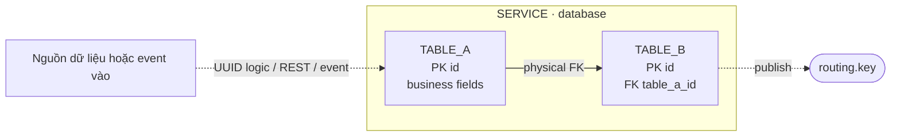

# Detailed Service ERD Implementation Plan

> **For agentic workers:** REQUIRED SUB-SKILL: Use superpowers:subagent-driven-development (recommended) or superpowers:executing-plans to implement this plan task-by-task. Steps use checkbox (`- [ ]`) syntax for tracking.

**Goal:** Bổ sung tám sơ đồ ERD–luồng dữ liệu theo service và Mục 2.3.9 ERD tổng quan toàn hệ thống, đồng thời giữ tám ERD vật lý làm nguồn đối chiếu với DDL.

**Architecture:** Mỗi bounded context có hai hình: ERD vật lý `02–09` mô tả PK/FK/UK thật và sơ đồ `18–25` mô tả UUID logic, REST validation, event vào/ra. Sơ đồ `26` tổng hợp tám bounded context; mọi đường xuyên database đều được ghi rõ là liên kết logic hoặc event.

**Tech Stack:** Markdown, Mermaid ER/flowchart, Pretty Mermaid CLI, SVG, `@resvg/resvg-js`, PowerShell.

---

## File map

Các đường dẫn rút gọn dưới đây nằm trong `docs/monitor_proj_progress/02-giai-doan-2-thiet-ke-giao-dien-tieu-chuan/`.

**Giữ và kiểm tra:** `assets/diagrams/src/02-erd-organization.mmd` đến `09-erd-report.mmd`.

**Tạo nguồn:**

- `assets/diagrams/src/18-erd-flow-organization.mmd`
- `assets/diagrams/src/19-erd-flow-patient.mmd`
- `assets/diagrams/src/20-erd-flow-clinical.mmd`
- `assets/diagrams/src/21-erd-flow-lab.mmd`
- `assets/diagrams/src/22-erd-flow-pharmacy.mmd`
- `assets/diagrams/src/23-erd-flow-billing.mmd`
- `assets/diagrams/src/24-erd-flow-notification.mmd`
- `assets/diagrams/src/25-erd-flow-report.mmd`
- `assets/diagrams/src/26-erd-system-overview.mmd`

**Tạo output cho từng basename `18–26`:** `assets/diagrams/svg/*.svg`, `assets/diagrams/word-svg/*.svg`, `assets/diagrams/png/*.png`.

**Sửa tài liệu:**

- `giai-doan-2-design.md:152-242`
- `README.md:7-10`
- `assets/diagrams/README.md:3-38`

---

### Task 1: Khóa baseline vật lý và hợp đồng luồng

**Files:**

- Verify: `docs/eproject_general_plan/backend-spec/01-organization.md` đến `08-report.md`
- Verify: eight existing ERD sources `02–09`

- [ ] **Step 1: Verify 25 physical tables**

Run:

```powershell
$spec = 'docs/eproject_general_plan/backend-spec'
$tables = Get-ChildItem $spec -File | Where-Object Name -Match '^0[1-8]-' | ForEach-Object {
  Select-String -LiteralPath $_.FullName -Pattern '^CREATE TABLE ([A-Z_]+)'
} | ForEach-Object { $_.Matches[0].Groups[1].Value }
$tables.Count
```

Expected: `25`.

- [ ] **Step 2: Verify physical ERD entity counts**

```powershell
$src = 'docs/monitor_proj_progress/02-giai-doan-2-thiet-ke-giao-dien-tieu-chuan/assets/diagrams/src'
Get-ChildItem $src -Filter '0[2-9]-erd-*.mmd' | ForEach-Object {
  "$($_.Name): $((Select-String $_.FullName -Pattern '^\s{4}[A-Z][A-Z_]+ \{').Count)"
}
```

Expected by service: Organization `3`, Patient `1`, Clinical `3`, Lab `3`, Pharmacy `6`, Billing `3`, Notification `2`, Report `4`. Do not add external pseudo-entities to these eight physical ERDs.

- [ ] **Step 3: Use the exact flow contract**

| Service | Owned tables | Input | Output |
|---|---|---|---|
| Organization | `DEPARTMENT`, `STAFF`, `ACCOUNT` | CRUD commands | `department.created`, `staff.created`, `staff.department.changed` |
| Patient | `PATIENT` | CRUD commands | `patient.created`, `patient.updated` |
| Clinical | `APPOINTMENT`, `MEDICAL_RECORD`, `DIAGNOSIS` | REST Patient/Organization; `lab.result.created`; `prescription.filled` | `appointment.created`, `appointment.status.changed`, `medicalrecord.created`, `diagnosis.added` |
| Lab | `LAB_TEST`, `LAB_RESULT`, `PROCESSED_EVENT` | `medicalrecord.created`; `payment.completed` | `lab.request.created`, `lab.result.created` |
| Pharmacy | `DRUG`, `PRESCRIPTION`, `PRESCRIPTION_LINE`, `DISPENSE_SLIP`, `STOCK_RESERVATION`, `PROCESSED_EVENT` | prescription command; `payment.completed` | `prescription.created`, `prescription.filled`, `prescription.dispense.failed`, `stock.low` |
| Billing | `FEE`, `INVOICE`, `PROCESSED_EVENT` | `medicalrecord.created`, `lab.result.created`, `appointment.status.changed`, `prescription.created`, `prescription.filled`, `prescription.dispense.failed` | `invoice.created`, `payment.completed`, `payment.failed` |
| Notification | `NOTIFICATION`, `PROCESSED_EVENT` | `patient.created`, `appointment.created`, `lab.result.created`, `prescription.filled`, `payment.completed`, `payment.failed` | `notification.sent` |
| Report | `DAILY_VISIT_REPORT`, `MONTHLY_REVENUE_REPORT`, `DRUG_STATISTIC`, `PROCESSED_EVENT` | `medicalrecord.created`, `lab.result.created`, `prescription.filled`, `payment.completed`, `payment.failed`, `staff.department.changed` | none |

- [ ] **Step 4: Confirm the pre-existing user files remain outside scope**

```powershell
git status --short
git diff --check
```

Expected: no whitespace error. Do not stage Stage 1 files, Word documents, temporary Office files, `.changelog/entries.jsonl`, or `06-erd-pharmacy-font-test.png`.

---

### Task 2: Author the eight service flow ERDs

**Files:** Create `assets/diagrams/src/18-erd-flow-organization.mmd` through `25-erd-flow-report.mmd`.

- [ ] **Step 1: Verify the new sources are absent**

```powershell
$src = 'docs/monitor_proj_progress/02-giai-doan-2-thiet-ke-giao-dien-tieu-chuan/assets/diagrams/src'
18..25 | ForEach-Object { Get-ChildItem $src -Filter "$($_)-*.mmd" }
```

Expected: no output.

- [ ] **Step 2: Apply one diagram grammar consistently**

Every file starts with `flowchart LR` and contains three zones:



Use solid links only between owned tables. Use dotted links for UUID, REST and event paths. Every dotted link must include one of the labels `UUID logic`, `REST validation`, `consume`, `publish`, `dedupe`, `success`, or `failure/compensation`.

- [ ] **Step 3: Author Organization and Patient**

Use these exact owned relationships and external routes:

```text
18 Organization
DEPARTMENT 1:N STAFF
STAFF 1:0..1 ACCOUNT
STAFF 0..1:0..1 DEPARTMENT.department_head_id
Clinical -> STAFF/DEPARTMENT: REST validation, doctor_id, department_id
STAFF -> staff.created, staff.department.changed
DEPARTMENT -> department.created
staff.department.changed -> Report

19 Patient
PATIENT is the only owned entity
Clinical -> PATIENT: REST validation
Lab, Pharmacy, Billing, Notification -> PATIENT: patient_id UUID logic
PATIENT -> patient.created, patient.updated
patient.created -> Notification
```

- [ ] **Step 4: Author Clinical and Lab**

```text
20 Clinical
APPOINTMENT 1:0..1 MEDICAL_RECORD
MEDICAL_RECORD 1:N DIAGNOSIS
Patient/Organization -> APPOINTMENT and MEDICAL_RECORD: REST validation + UUID logic
lab.result.created and prescription.filled -> planned V2 PROCESSED_EVENT -> planned V2 ATTACHED_RESULT
APPOINTMENT -> appointment.created, appointment.status.changed
MEDICAL_RECORD -> medicalrecord.created
DIAGNOSIS -> diagnosis.added
ATTACHED_RESULT and PROCESSED_EVENT must visibly say “planned V2”; they are not counted as V1 physical tables.

21 Lab
LAB_TEST 1:N LAB_RESULT
PROCESSED_EVENT -> LAB_TEST: dedupe
Clinical/Patient/Organization -> LAB_TEST: record_id, patient_id, requesting_department_id UUID logic
medicalrecord.created -> PROCESSED_EVENT: optional order
payment.completed -> PROCESSED_EVENT: mark paid
LAB_TEST -> lab.request.created
LAB_RESULT -> lab.result.created
```

- [ ] **Step 5: Author Pharmacy and Billing**

```text
22 Pharmacy
PRESCRIPTION 1:N PRESCRIPTION_LINE; DRUG 1:N PRESCRIPTION_LINE
PRESCRIPTION 1:0..1 DISPENSE_SLIP
PRESCRIPTION 1:N STOCK_RESERVATION; DRUG 1:N STOCK_RESERVATION
PROCESSED_EVENT -> DISPENSE_SLIP: dedupe payment
Clinical/Patient/Organization -> PRESCRIPTION: record/patient/staff/department UUID logic
payment.completed -> PROCESSED_EVENT
PRESCRIPTION -> prescription.created
DISPENSE_SLIP -> prescription.filled or prescription.dispense.failed
DRUG -> stock.low

23 Billing
INVOICE 1:N FEE
PROCESSED_EVENT -> FEE and INVOICE: dedupe
Clinical/Patient/Pharmacy -> FEE/INVOICE through UUID logic
six subscribed events from Task 1 -> PROCESSED_EVENT
INVOICE -> invoice.created, payment.completed, payment.failed
The route prescription.created → INVOICE → payment.completed → Pharmacy and prescription.dispense.failed → compensation must be visible.
```

- [ ] **Step 6: Author Notification and Report**

```text
24 Notification
Six subscribed routing keys -> PROCESSED_EVENT -> NOTIFICATION
PATIENT -> NOTIFICATION: patient_id / local contact projection
NOTIFICATION -> Email, SMS, In-app channel
All final channel states -> notification.sent
event_id is labelled dedupe key, never external FK

25 Report
Six subscribed routing keys -> PROCESSED_EVENT
PROCESSED_EVENT -> DAILY_VISIT_REPORT, MONTHLY_REVENUE_REPORT, DRUG_STATISTIC
Organization -> three projections: department_id dimension
Pharmacy -> DRUG_STATISTIC: drug_id dimension
Three projections -> read-only report APIs
No outbound event and no REST call to source services
```

- [ ] **Step 7: Validate all eight sources with Pretty Mermaid**

```powershell
$skill = 'C:/Users/VIP/.codex/skills/pretty-mermaid'
$src = Resolve-Path 'docs/monitor_proj_progress/02-giai-doan-2-thiet-ke-giao-dien-tieu-chuan/assets/diagrams/src'
$tmp = Join-Path ([System.IO.Path]::GetTempPath()) 'mediflow-erd-check'
New-Item -ItemType Directory -Force -Path $tmp | Out-Null
18..25 | ForEach-Object {
  $f = Get-ChildItem $src -Filter "$($_)-*.mmd" | Select-Object -First 1
  node "$skill/scripts/render.mjs" --input $f.FullName --output (Join-Path $tmp "$($f.BaseName).svg") --theme zinc-light
  if ($LASTEXITCODE -ne 0) { throw "Render failed: $($f.Name)" }
}
```

Expected: eight `SVG diagram saved` messages.

- [ ] **Step 8: Commit the service sources**

```powershell
git add -- 'docs/monitor_proj_progress/02-giai-doan-2-thiet-ke-giao-dien-tieu-chuan/assets/diagrams/src/1[8-9]-*.mmd' 'docs/monitor_proj_progress/02-giai-doan-2-thiet-ke-giao-dien-tieu-chuan/assets/diagrams/src/2[0-5]-*.mmd'
git commit -m "docs: add detailed service data flow erds"
```

---

### Task 3: Author the system-wide logical ERD

**Files:** Create `assets/diagrams/src/26-erd-system-overview.mmd`.

- [ ] **Step 1: Verify the source is absent**

```powershell
Test-Path 'docs/monitor_proj_progress/02-giai-doan-2-thiet-ke-giao-dien-tieu-chuan/assets/diagrams/src/26-erd-system-overview.mmd'
```

Expected: `False`.

- [ ] **Step 2: Create eight bounded-context subgraphs**

Include exactly these core entities:

```text
Organization: DEPARTMENT, STAFF, ACCOUNT
Patient: PATIENT
Clinical: APPOINTMENT, MEDICAL_RECORD, DIAGNOSIS
Lab: LAB_TEST, LAB_RESULT
Pharmacy: PRESCRIPTION, PRESCRIPTION_LINE, DRUG, DISPENSE_SLIP
Billing: FEE, INVOICE
Notification: NOTIFICATION
Report: DAILY_VISIT_REPORT, MONTHLY_REVENUE_REPORT, DRUG_STATISTIC
```

Internal physical relationships use solid arrows. Cross-service UUID/REST routes use dotted blue arrows with explicit field labels. Event routes use dotted orange arrows with exact routing keys.

- [ ] **Step 3: Add the required cross-service routes**

```text
Logical UUID/REST:
Patient/Organization -> Clinical
Clinical/Patient/Organization -> Lab
Clinical/Patient/Organization -> Pharmacy
Patient/Clinical/Organization/Pharmacy -> Billing
Patient -> Notification
Organization/Pharmacy -> Report dimensions

Events:
Clinical -> Lab, Billing, Notification, Report
Lab -> Clinical, Billing, Notification, Report
Pharmacy -> Clinical, Billing, Notification, Report
Billing -> Pharmacy, Notification, Report
Organization -> Report
Patient -> Notification
```

Show only routing keys from Task 1. Group repeated notification/report event routes through labelled event-hub nodes when direct arrows become crowded.

- [ ] **Step 4: Add a visible legend**

The legend must contain these three exact labels:

```text
Quan hệ vật lý nội bộ
UUID/REST logic — không phải FK
Integration event qua RabbitMQ
```

- [ ] **Step 5: Render a syntax-check SVG**

Use the Task 2 validation command for basename `26-erd-system-overview`.

Expected: `SVG diagram saved`.

- [ ] **Step 6: Commit the overview source**

```powershell
git add -- docs/monitor_proj_progress/02-giai-doan-2-thiet-ke-giao-dien-tieu-chuan/assets/diagrams/src/26-erd-system-overview.mmd
git commit -m "docs: add system wide logical erd"
```

---

### Task 4: Expand Stage 2 report and indexes

**Files:**

- Modify: `giai-doan-2-design.md:152-242`
- Modify: `assets/diagrams/README.md:3-38`
- Modify: `README.md:7-10`

- [ ] **Step 1: Add the two-layer legend to Section 2.2**

Insert:

```markdown
#### Quy ước đọc hai lớp sơ đồ

- **Đường liền:** quan hệ PK–FK vật lý trong cùng database.
- **Đường nét đứt ghi “UUID logic” hoặc “REST validation”:** tham chiếu xuyên service, không phải foreign key.
- **Đường nét đứt ghi routing key:** integration event truyền qua RabbitMQ.
- **`PROCESSED_EVENT`:** sổ chống xử lý trùng cục bộ; `event_id` không tham chiếu một bảng trung tâm.
```

- [ ] **Step 2: Expand Sections 2.3.1–2.3.8**

Keep each physical ERD and add: owned tables, main inputs, main outputs, an explicit no-cross-database-FK note, the corresponding `18–25` PNG, and three links to Word SVG, PNG and Mermaid. Use the exact matrix from Task 1.

Clinical must include:

```markdown
> `ATTACHED_RESULT` và sổ khử trùng lặp trong sơ đồ luồng là phần mở rộng V2 đã được backend spec yêu cầu cho việc nhận kết quả ngoài. Chúng không được tính vào ba bảng vật lý V1 hiện hành.
```

- [ ] **Step 3: Add Section 2.3.9 before Section 2.4**

```markdown
#### 2.3.9. ERD tổng quan toàn hệ thống

Sơ đồ tổng quan đặt tám database trong tám bounded context riêng. Quan hệ liền chỉ tồn tại bên trong một database; các đường xuyên service là UUID/REST logic hoặc integration event và tuyệt đối không phải khóa ngoại vật lý.


[SVG dùng cho Word](assets/diagrams/word-svg/26-erd-system-overview.svg) · [PNG 2400 px](assets/diagrams/png/26-erd-system-overview.png) · [Nguồn Mermaid](assets/diagrams/src/26-erd-system-overview.mmd)
```

- [ ] **Step 4: Extend both indexes**

Append diagram rows 18–26 to `assets/diagrams/README.md`. Update the Stage 2 README from `17 sơ đồ` to `26 sơ đồ` and state that the package contains `8 ERD vật lý + 8 ERD–luồng dữ liệu + 1 ERD tổng quan` alongside the other diagrams.

- [ ] **Step 5: Commit the documentation**

```powershell
git add -- docs/monitor_proj_progress/02-giai-doan-2-thiet-ke-giao-dien-tieu-chuan/giai-doan-2-design.md docs/monitor_proj_progress/02-giai-doan-2-thiet-ke-giao-dien-tieu-chuan/README.md docs/monitor_proj_progress/02-giai-doan-2-thiet-ke-giao-dien-tieu-chuan/assets/diagrams/README.md
git commit -m "docs: document detailed service erd flows"
```

---

### Task 5: Render Word-safe SVG and PNG assets

**Files:** Create nine raw SVG, nine Word SVG and nine PNG files for basenames `18–26`.

- [ ] **Step 1: Render raw SVGs with Pretty Mermaid**

```powershell
$skill = 'C:/Users/VIP/.codex/skills/pretty-mermaid'
$base = Resolve-Path 'docs/monitor_proj_progress/02-giai-doan-2-thiet-ke-giao-dien-tieu-chuan/assets/diagrams'
18..26 | ForEach-Object {
  $f = Get-ChildItem (Join-Path $base 'src') -Filter "$($_)-*.mmd" | Select-Object -First 1
  node "$skill/scripts/render.mjs" --input $f.FullName --output (Join-Path $base "svg/$($f.BaseName).svg") --theme zinc-light --bg '#FFFFFF' --fg '#0F172A' --line '#2563EB' --accent '#0F766E' --muted '#64748B' --surface '#F0FDFA' --border '#0F766E' --font Arial --padding 32 --node-spacing 36 --layer-spacing 50
  if ($LASTEXITCODE -ne 0) { throw "Render failed: $($f.Name)" }
}
```

Expected: nine successful saves.

- [ ] **Step 2: Make Word SVGs self-contained**

Use Pretty Mermaid's `prepareSvgForPng` helper to remove font imports and resolve every CSS variable/color mix. Replace the remaining external mono-font stack with Consolas and write UTF-8 without BOM:

```powershell
$skill = 'C:/Users/VIP/.codex/skills/pretty-mermaid'
$base = Resolve-Path 'docs/monitor_proj_progress/02-giai-doan-2-thiet-ke-giao-dien-tieu-chuan/assets/diagrams'
$js = "import{readFileSync,writeFileSync}from'node:fs';import{prepareSvgForPng}from'file:///C:/Users/VIP/.codex/skills/pretty-mermaid/scripts/png.mjs';const s=process.argv[1],t=process.argv[2];let x=prepareSvgForPng(readFileSync(s,'utf8')).svg;x=x.replaceAll(\"'JetBrains Mono', 'SF Mono', 'Fira Code', ui-monospace, monospace\",\"'Consolas', monospace\");writeFileSync(t,x,'utf8');"
18..26 | ForEach-Object {
  $f = Get-ChildItem (Join-Path $base 'svg') -Filter "$($_)-*.svg" | Select-Object -First 1
  node --input-type=module -e $js $f.FullName (Join-Path $base "word-svg/$($f.Name)")
  if ($LASTEXITCODE -ne 0) { throw "Word SVG conversion failed: $($f.Name)" }
}
```

Required scan:

```text
starts with <svg
does not contain @import
does not contain fonts.googleapis.com
does not contain var(
does not contain color-mix(
```

- [ ] **Step 3: Render PNG fallbacks**

Use Pretty Mermaid's PNG renderer, which applies the same SVG preprocessing and `@resvg/resvg-js` conversion:

```powershell
$skill = 'C:/Users/VIP/.codex/skills/pretty-mermaid'
$base = Resolve-Path 'docs/monitor_proj_progress/02-giai-doan-2-thiet-ke-giao-dien-tieu-chuan/assets/diagrams'
18..26 | ForEach-Object {
  $f = Get-ChildItem (Join-Path $base 'src') -Filter "$($_)-*.mmd" | Select-Object -First 1
  node "$skill/scripts/render.mjs" --input $f.FullName --output (Join-Path $base "png/$($f.BaseName).png") --format png --width 2400 --theme zinc-light --bg '#FFFFFF' --fg '#0F172A' --line '#2563EB' --accent '#0F766E' --muted '#64748B' --surface '#F0FDFA' --border '#0F766E' --font Arial --padding 32 --node-spacing 36 --layer-spacing 50
  if ($LASTEXITCODE -ne 0) { throw "PNG render failed: $($f.Name)" }
}
```

- [ ] **Step 4: Validate all 27 outputs**

Check raw SVG existence, Word SVG forbidden tokens, PNG signature `89 50 4E 47 0D 0A 1A 0A`, and PNG IHDR width `2400`.

Expected: `27 files valid; 9 PNG widths = 2400`.

- [ ] **Step 5: Inspect nine PNGs visually**

Acceptance: no clipping; technical names legible; solid and dotted routes distinguishable; Clinical labels planned V2; overview remains readable in landscape; arrowheads do not overlap nodes.

- [ ] **Step 6: Commit only production assets**

```powershell
git add -- docs/monitor_proj_progress/02-giai-doan-2-thiet-ke-giao-dien-tieu-chuan/assets/diagrams/svg docs/monitor_proj_progress/02-giai-doan-2-thiet-ke-giao-dien-tieu-chuan/assets/diagrams/word-svg docs/monitor_proj_progress/02-giai-doan-2-thiet-ke-giao-dien-tieu-chuan/assets/diagrams/png/18-erd-flow-organization.png docs/monitor_proj_progress/02-giai-doan-2-thiet-ke-giao-dien-tieu-chuan/assets/diagrams/png/19-erd-flow-patient.png docs/monitor_proj_progress/02-giai-doan-2-thiet-ke-giao-dien-tieu-chuan/assets/diagrams/png/20-erd-flow-clinical.png docs/monitor_proj_progress/02-giai-doan-2-thiet-ke-giao-dien-tieu-chuan/assets/diagrams/png/21-erd-flow-lab.png docs/monitor_proj_progress/02-giai-doan-2-thiet-ke-giao-dien-tieu-chuan/assets/diagrams/png/22-erd-flow-pharmacy.png docs/monitor_proj_progress/02-giai-doan-2-thiet-ke-giao-dien-tieu-chuan/assets/diagrams/png/23-erd-flow-billing.png docs/monitor_proj_progress/02-giai-doan-2-thiet-ke-giao-dien-tieu-chuan/assets/diagrams/png/24-erd-flow-notification.png docs/monitor_proj_progress/02-giai-doan-2-thiet-ke-giao-dien-tieu-chuan/assets/diagrams/png/25-erd-flow-report.png docs/monitor_proj_progress/02-giai-doan-2-thiet-ke-giao-dien-tieu-chuan/assets/diagrams/png/26-erd-system-overview.png
git commit -m "docs: render detailed service erd assets"
```

Never add the unrelated `06-erd-pharmacy-font-test.png`.

---

### Task 6: Final cross-check

**Files:** Verify all files in the file map.

- [ ] **Step 1: Check tracked production counts**

```powershell
$base = 'docs/monitor_proj_progress/02-giai-doan-2-thiet-ke-giao-dien-tieu-chuan/assets/diagrams'
@('src','svg','word-svg','png') | ForEach-Object {
  $tracked = git ls-files "$base/$_/*"
  "$_ = $($tracked.Count)"
}
```

Expected: 26 tracked files in each format folder.

- [ ] **Step 2: Check report structure and terminology**

```powershell
$report = 'docs/monitor_proj_progress/02-giai-doan-2-thiet-ke-giao-dien-tieu-chuan/giai-doan-2-design.md'
(Select-String $report -Pattern '^#### 2\.3\.[1-9]\.' ).Count
rg -n 'KHOA|NHAN_VIEN|TAI_KHOAN|BENH_NHAN|THONG_BAO|SU_KIEN_DA_XU_LY' docs/monitor_proj_progress/02-giai-doan-2-thiet-ke-giao-dien-tieu-chuan/assets/diagrams/src/2[0-6]-*.mmd docs/monitor_proj_progress/02-giai-doan-2-thiet-ke-giao-dien-tieu-chuan/assets/diagrams/src/1[8-9]-*.mmd
```

Expected: section count `9`; no legacy Vietnamese technical schema name.

- [ ] **Step 3: Resolve every local Markdown link**

Run:

```powershell
$root = Resolve-Path 'docs/monitor_proj_progress/02-giai-doan-2-thiet-ke-giao-dien-tieu-chuan'
$files = @(
  (Join-Path $root 'giai-doan-2-design.md'),
  (Join-Path $root 'README.md'),
  (Join-Path $root 'assets/diagrams/README.md')
)
foreach ($file in $files) {
  $text = Get-Content -Raw -LiteralPath $file
  [regex]::Matches($text, '\[[^\]]*\]\((?!https?://|#)([^)]+)\)|!\[[^\]]*\]\(([^)]+)\)') | ForEach-Object {
    $rel = if ($_.Groups[1].Value) { $_.Groups[1].Value } else { $_.Groups[2].Value }
    $target = Join-Path (Split-Path $file) $rel
    if (-not (Test-Path -LiteralPath $target)) { throw "Missing link: $file -> $rel" }
  }
}
```

Expected: no missing link.

- [ ] **Step 4: Verify repository cleanliness for this scope**

```powershell
git diff --check origin/master...HEAD
git status --short
git log --oneline --decorate -8
```

Expected: no diff-check error. Pre-existing Stage 1, Word, temporary, changelog and font-test files may remain unstaged and unchanged.

- [ ] **Step 5: Apply and commit only final report/index corrections if validation found any**

```powershell
git add -- docs/monitor_proj_progress/02-giai-doan-2-thiet-ke-giao-dien-tieu-chuan/giai-doan-2-design.md docs/monitor_proj_progress/02-giai-doan-2-thiet-ke-giao-dien-tieu-chuan/README.md docs/monitor_proj_progress/02-giai-doan-2-thiet-ke-giao-dien-tieu-chuan/assets/diagrams/README.md
git commit -m "docs: finalize detailed service erd documentation"
```

Do not push until the user explicitly asks to update the remote pull request.
